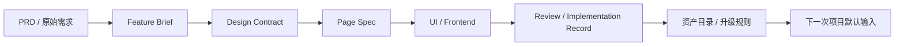

# AI 前端交付工程规范总览

## 定义

本体系定义的是`PRD -> UI -> Frontend` 的 AI 交付工程规范。

它不是单个项目的局部流程，也不是某个 AI 工具的使用说明，而是一套统一页面交付输入、执行、验证和资产沉淀的工程规范。

## 为什么它重要

这条链路决定了公司后续所有项目是否能够：

- 快速启动
- 稳定协作
- 可控交付
- 持续沉淀资产

如果没有统一规范：

- 每个项目都会重新解释需求
- 每个页面都会重新定义结构
- 每次 review 都会重新争论标准
- AI 只能局部提效，无法形成组织复利

如果有统一规范：

- 产品、设计、前端、AI 使用统一语义
- 新项目可以沿统一链路进入执行
- 评审和验收有固定对照物
- 每次交付都会转化为下一次项目的默认输入

## 规范在交付体系中的位置

## 规范的四个目标

本规范服务于以下四个长期目标：

1. 可执行：AI 和人都能按统一输入工作
2. 可复用：页面模式、规格模式、规则模式可复用
3. 可验证：阶段和交付结果可被检查
4. 可沉淀：每次交付都会留下组织资产

## 六类能力

本规范由六类能力组成：

1. 标准输入
2. 标准执行
3. 标准 AI 使用
4. 标准评审与验证
5. 标准沉淀
6. 标准资产升级

## 核心工件

本体系以五类执行工件为核心：

- `Feature Brief`
- `Design Contract`
- `Page Spec`
- `Implementation Record`
- `Review Checklist / Change Request`

## Source of Truth 分层

不同阶段的 truth 不应混淆：

- 业务 truth：`Feature Brief`
- 设计 truth：`Design Contract` + `Design System`
- 实现 truth：`Page Spec`
- 交付 truth：`Implementation Record`

Figma 负责视觉和交互呈现，不单独承担全部工程输入职责。

## 协作公式

本规范采用如下协作公式：

- 人负责判断
- AI 负责提效
- 规范负责约束
- 资产负责复利

## 推荐阅读顺序

第一次接触本体系时，建议按以下顺序阅读：

1. `./01-AI前端交付工程规范总览.md`
2. `./02-标准交付链路与核心原则.md`
3. `./03-角色、AI与评审规则.md`
4. `./10-快速上手.md`

## 非目标

本体系不替代：

- 产品判断
- 设计判断
- 技术架构判断
- 最终交付责任

AI 可以参与各阶段，但不能替代 owner 决策。

