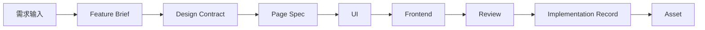

# 标准交付链路与核心原则

## 标准交付链路

页面交付默认采用以下链路：

`需求输入 -> Feature Brief -> Design Contract -> Page Spec -> UI -> Frontend -> Review -> Implementation Record -> Asset`

## 交付链路图

## 各阶段目标

| 阶段 | 目标 | 核心输出 |
| --- | --- | --- |
| 需求输入 | 汇总原始业务需求 | PRD / 原始材料 |
| Feature Brief | 形成结构化业务输入 | `Feature Brief` |
| Design Contract | 形成工程可执行的设计契约 | `Design Contract` |
| Page Spec | 形成实现规格 | `Page Spec` |
| UI | 形成可评审的界面表达 | 设计稿 / 原型 |
| Frontend | 形成工程实现 | 代码 |
| Review | 进行结构化评审 | `Review Checklist` + 证据 |
| Implementation Record | 回写实现与偏差 | `Implementation Record` |
| Asset | 沉淀可复用资产 | 资产候选 / 资产目录 |

## 阶段门槛

### 进入 Design Contract 前

至少应具备：

- 原始需求来源
- 已确认的 `Feature Brief`

### 进入 Page Spec 前

至少应具备：

- `Feature Brief`
- `Design Contract`

### 进入 Frontend 前

至少应具备：

- `Feature Brief`
- `Design Contract`
- `Page Spec`

### 进入 Review 前

至少应具备：

- 可运行实现
- `Review Checklist`
- `Implementation Record` 初稿
- 可复现证据

## 最小交接包

每次阶段交接时，至少应包含：

- 上游工件路径
- 当前阶段工件
- owner
- 待确认项
- 明确的签收人

## 核心原则

### 原则 1：先定义结构，再进入实现

工程化提效的关键不是先写代码，而是先定义目标、结构、状态、交互和规则。

### 原则 2：每个工件必须有 owner

允许 AI 起草和补全，不允许 owner 缺位。

### 原则 3：AI 必须先读规范，再执行

AI 缺少必要工件时，应先输出缺失项，不得直接生成最终 UI 或代码。

### 原则 4：评审必须对照 Contract 与 Spec

review 不能只看“像不像”，必须同时对照：

- `Design Contract`
- `Page Spec`

### 原则 5：偏差必须记录

实现与上游工件存在差异时，必须记录偏差、原因和裁决。

### 原则 6：资产沉淀是闭环的一部分

交付完成后，必须判断是否形成规格、组件、规则、示例或流程资产。

## 简化链路

在设计系统成熟、团队共识稳定的情况下，可采用简化链路：

`Feature Brief -> Page Spec -> Frontend -> Review -> Implementation Record`

但 `Design Contract` 的职责必须由设计系统规则或其他明确工件承接。

## 简化适用范围

以下场景可采用简化链路：

- 已有成熟页面模式复用
- 小范围迭代
- 结构稳定的标准列表页

以下场景不建议简化：

- 首次建设的关键业务页面
- 交互复杂的复合页面
- 多角色权限差异明显的页面

## 标准链路与简化链路对比

| 维度 | 标准链路 | 简化链路 |
| --- | --- | --- |
| 适用场景 | 新页面、关键页面、复杂页面 | 成熟模式复用、小迭代 |
| 设计约束表达 | `Design Contract` 明确承接 | 由设计系统或既有规则承接 |
| 风险控制 | 更强 | 依赖团队成熟度 |
| 执行成本 | 更高 | 更低 |

## 禁止事项

- 禁止直接从 PRD 进入最终生产代码
- 禁止只依赖 Figma 作为唯一工程输入
- 禁止跳过 `Page Spec`
- 禁止 review 后不回写 `Implementation Record`
- 禁止将资产沉淀视为可选动作

