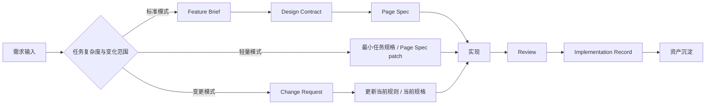

# 标准交付链路与核心原则

## 先看总原则

这套体系的重点不是让所有任务都走一条固定流程，而是：

- 根据任务复杂度选择合适模式
- 进入实现前先形成当前规则与当前规格
- 让 AI 执行器和人都消费同一套结构化上下文
- 在交付后完成回写和资产沉淀

## 三种链路

## 标准模式

适用：

- 新页面
- 关键页面
- 复杂页面
- 多方需要对齐的页面

默认链路：

`需求输入 -> Feature Brief -> Design Contract -> Page Spec -> Frontend -> Review -> Implementation Record -> Asset`

进入标准模式前，至少要确认：

- 这次需求不是简单局部改动
- 当前页面规则不能只靠旧页面经验或设计系统默认规则承接
- 需要更清楚的多方对齐与评审对照物

## 轻量模式

适用：

- 小需求
- 成熟页面模式复用
- 已有页面的局部功能调整
- 行为改动范围较小但仍需结构化回写

默认链路：

`需求输入 -> 最小任务规格 / Page Spec patch -> Frontend -> Review -> Implementation Record -> Asset`

进入轻量模式前，至少要确认：

- 当前页面规则已经稳定
- 当前行为规格可以通过 patch 或最小任务规格表达清楚
- review 仍然有可对照的依据

## 变更模式

适用：

- 已上线页面的后续改动
- 行为调整已发生，但规则或规格尚未同步
- 需要先判断该改规则、改规格，还是只改实现记录

默认链路：

`Change Request -> 判断影响层级 -> 更新当前规则或当前规格 -> Frontend -> Review -> Implementation Record`

## 三种模式对比

| 维度 | 标准模式 | 轻量模式 | 变更模式 |
| --- | --- | --- | --- |
| 适用任务 | 新页面、复杂页面 | 小需求、成熟模式复用 | 已有页面变更 |
| 页面规则表达 | 完整 `Design Contract` 或同等级表达 | 既有规则、设计系统规则或简化表达 | 先判断是否要更新 |
| 行为规格表达 | 完整 `Page Spec` | `Page Spec patch` 或最小任务规格 | patch、spec 更新或仅记录偏差 |
| 执行成本 | 高 | 中低 | 取决于变化范围 |
| 风险控制 | 最强 | 依赖既有稳定资产 | 依赖变更判断质量 |

## 进入实现前，必须具备什么

不管走哪种模式，进入实现前都必须具备三类东西：

1. 当前需求理解结果
2. 当前页面规则表达
3. 当前行为规格表达

它们未必都要以完整 `Feature Brief`、`Design Contract`、`Page Spec` 的形式显式出现；
但它们必须真实存在，且能被 AI 执行器和 review 使用方稳定读取。

## 最小上下文包

每次任务推进时，至少应包含：

- 原始输入来源或链接
- 当前页面规则表达
- 当前行为规格表达
- 默认确认人
- 待确认项
- 下一步主要消费方

如果上下文包不完整，AI 执行器应先指出缺失项，而不是直接产出最终代码。

## 核心原则

### 原则 1：先形成事实表达，再进入实现

工程化提效的关键不是先写代码，而是先形成当前任务的事实表达：

- 需求理解是什么
- 页面规则是什么
- 行为规格是什么

### 原则 2：每个关键结论都要有确认责任人

允许 AI 生成初稿和补全，但必须有人对关键结论负责确认。

### 原则 3：AI 执行前必须具备结构化上下文

AI 可以很快，但不能在上下文缺失时直接进入最终实现。

### 原则 4：Review 必须对照当前规则与当前规格

review 不能只看“像不像”，必须同时对照：

- 当前页面规则表达
- 当前行为规格表达
- 当前实现结果

### 原则 5：行为偏差必须记录

如果实现与当前规则或当前规格不一致，必须记录：

- 偏差点
- 原因
- 裁决结果
- 最终应更新哪一层事实表达

### 原则 6：资产沉淀不是可选动作

交付完成后，必须至少完成一次资产候选判断。

### 原则 7：协议稳定，工具可替换

可以更换 AI 工具，但不能放弃统一输入、统一规格、统一验证和统一回写。

## 禁止事项

- 禁止直接从原始需求跳到最终生产代码
- 禁止把设计稿或原型截图当成唯一工程输入
- 禁止在缺少当前行为规格的情况下直接进入实现
- 禁止 review 后不回写 `Implementation Record`
- 禁止把资产沉淀视为事后可选动作

