# 责任边界、AI 执行器与评审规则

## 先明确一个前提

AI 时代不再适合把体系建立在“谁必须写哪份文档”之上。

更稳定的做法是：

- 定义责任位
- 定义默认确认人
- 定义 AI 执行器可做什么、不可做什么
- 定义哪些结论必须被 review 和回写

## 四个责任位

### 1. 需求确认

负责：

- 明确业务目标
- 明确范围边界
- 明确成功标准
- 明确优先级与关键约束

常见承担方：

- 产品
- 业务负责人
- 最理解需求目标的人

默认确认工件：

- `Feature Brief` 或同等级需求理解结果

### 2. 页面规则确认

负责：

- 明确页面结构
- 明确组件状态
- 明确关键交互
- 明确响应式与内容约束
- 明确设计系统依赖

常见承担方：

- 设计
- 设计工程师
- 最理解页面规则的人

默认确认工件：

- `Design Contract` 或同等级页面规则表达

### 3. 实现与回写

负责：

- 形成当前行为规格
- 落地代码实现
- 维护行为与规格一致性
- 回写偏差、证据和资产候选

常见承担方：

- 前端
- 设计工程师
- 主要实现人

默认确认工件：

- `Page Spec`
- `Implementation Record`

### 4. 交付裁决

负责：

- 判断能否进入下一步
- 给出 review 结论
- 裁决偏差是否接受
- 判断是否升级资产

常见承担方：

- 交付负责人
- 模块负责人
- 评审主持人

## AI 执行器的职责

### AI 执行器负责什么

- 读取统一输入和项目上下文
- 起草或补全 `Feature Brief`、`Design Contract`、`Page Spec`
- 生成最小任务规格或 `Page Spec patch`
- 生成实现辅助内容
- 整理 review 证据和 `Implementation Record` 初稿
- 提示资产候选与相似历史模式

### AI 执行器不负责什么

- 代替确认责任人做最终判断
- 在事实表达缺失时直接给出最终结论
- 绕过 review 直接宣布交付完成
- 用某个工具自己的习惯替代统一工程协议

## AI 执行器的最小接入能力

任何 AI 工具，只要能满足下列 6 项能力，就可以接入这套体系：

1. 能读取统一输入
2. 能读取项目代码上下文
3. 能输出结构化任务理解
4. 能生成或更新当前行为规格
5. 能执行基础验证
6. 能输出回写记录

这套体系约束的是能力与协议，不锁定具体工具。

## 推荐读取顺序

AI 执行器参与任务时，推荐按以下顺序读取上下文：

1. 原始输入包或需求来源
2. `Feature Brief` 或同等级需求理解结果
3. `Design Contract` 或同等级页面规则表达
4. `Page Spec`、`Page Spec patch` 或最小任务规格
5. 设计系统 / 既有代码上下文 / 资产库
6. `Implementation Record`（如为迭代或变更）

## Review 与验证规则

### 最低 review 输入

进入 review 时，至少应具备：

1. 当前需求理解结果
2. 当前页面规则表达
3. 当前行为规格表达
4. `Review Checklist`
5. `Implementation Record` 初稿
6. 可复现证据

### 评审维度

- 规则一致性
- 规格一致性
- 实现质量
- 可追溯性
- 资产沉淀完整性

### 可接受证据

- 截图
- 录屏
- 测试结果
- 文件映射
- 对照清单
- spec diff / patch 记录

### 偏差处理

当实现与当前页面规则或当前行为规格不一致时，必须：

1. 记录偏差点
2. 记录原因
3. 记录裁决结果
4. 决定更新规则、更新规格，还是退回修改实现

### 通过条件

- 关键结构、状态、交互一致
- 必要偏差已记录并被接受
- `Implementation Record` 完整
- 资产候选已完成判断

### 驳回条件

- 缺少关键事实表达
- 关键结构或行为与规则/规格不一致
- 状态和交互明显缺失
- 偏差无记录
- 无法提供可复现证据

## 工件与确认关系

| 工件 | 默认确认人 | 常见主要使用方 |
| --- | --- | --- |
| `Feature Brief` | 需求确认人 | 页面规则确认人、实现方、AI 执行器 |
| `Design Contract` | 页面规则确认人 | 实现方、交付裁决人、AI 执行器 |
| `Page Spec` | 实现与回写负责人 | AI 执行器、交付裁决人、评审方 |
| `Implementation Record` | 实现与回写负责人 | 交付裁决人、后续接手人、资产维护人 |
| `Review Checklist` | review 发起人 | 交付裁决人、评审方 |

## 协作图

```mermaid
flowchart LR
    A[需求确认] -->|确认| B[Feature Brief]
    C[页面规则确认] -->|确认| D[Design Contract]
    E[实现与回写] -->|确认| F[Page Spec]
    F --> G[Frontend 实现]
    G --> H[Implementation Record]
    I[交付裁决] -->|签收 / 裁决| H
    J[AI 执行器] -.辅助生成.-> B
    J -.辅助生成.-> D
    J -.辅助生成.-> F
    J -.辅助实现.-> G
    J -.辅助回写.-> H
```

