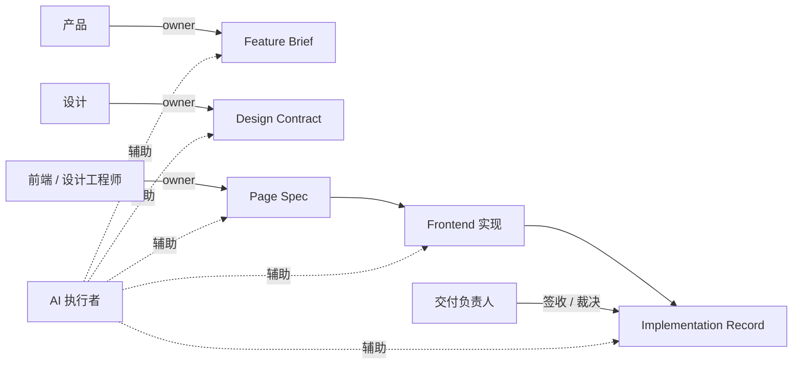

# 角色、AI 与评审规则

## 角色与职责边界

### 产品

负责：

- 需求目标
- 用户场景
- 范围边界
- 成功标准
- 优先级

owner：

- `Feature Brief`

### 设计

负责：

- 页面结构
- 组件状态
- 关键交互
- 响应式策略
- 内容约束
- 设计系统依赖

owner：

- `Design Contract`

### 前端 / 设计工程师

负责：

- 页面实现规格
- 数据、状态、权限、tracking 定义
- 页面与组件工程实现
- 偏差记录与回写

owner：

- `Page Spec`
- `Implementation Record`

### AI 执行者

负责：

- 读取标准输入
- 起草工件初稿
- 生成实现辅助内容
- 整理 review 证据和记录初稿

不负责：

- 替代 owner 做最终判断
- 绕过规范直接产出最终结论

### 交付负责人 / 模块 owner

负责：

- 阶段准入判断
- review 结论
- 偏差裁决
- 资产升级判断

## AI 使用规则

### 标准读取顺序

AI 参与任务时，默认按以下顺序读取上下文：

1. `Feature Brief`
2. `Design Contract`
3. `Page Spec`
4. `Design System` / 既有代码上下文
5. `Implementation Record`（如为迭代或变更）

### 各阶段允许 AI 做的事

- `Feature Brief`：整理原始需求、生成结构化初稿、列出缺失项
- `Design Contract`：整理结构、状态、交互初稿
- `Page Spec`：生成结构化 spec 初稿、统一字段命名
- `Frontend`：基于 spec 和代码库上下文生成实现辅助
- `Review / Record`：整理 checklist、汇总证据、起草记录

### 各阶段禁止 AI 做的事

- 禁止直接从 PRD 生成最终生产代码
- 禁止把 Figma 截图当成唯一工程输入
- 禁止缺少 `Page Spec` 时直接生成最终实现
- 禁止修改实现后不更新记录
- 禁止代替评审方做最终通过判断

## Review 与验证规则

### 最低交付包

进入 review 时，至少应具备：

1. `Feature Brief`
2. `Design Contract`
3. `Page Spec`
4. `Review Checklist`
5. `Implementation Record` 初稿
6. 可复现证据

### 评审维度

- 合约一致性
- 规格一致性
- 实现质量
- 可追溯性

### 评审证据

可接受的证据包括：

- 截图
- 录屏
- 测试结果
- 文件映射
- 对照清单

### 偏差处理

当实现与 `Design Contract` 或 `Page Spec` 不一致时，必须：

1. 记录偏差点
2. 记录原因
3. 记录裁决结果
4. 决定是更新上游工件还是退回修改实现

### 通过条件

- 关键结构、状态、交互一致
- 必要偏差已记录并被接受
- `Implementation Record` 完整
- 资产候选已完成判断

### 驳回条件

- 缺少关键工件
- 关键结构与 contract/spec 不一致
- 状态和交互明显缺失
- 偏差无记录
- 无法提供可复现证据

## 签收关系

| 工件 | owner | 主要签收方 |
| --- | --- | --- |
| `Feature Brief` | 产品 | 设计、前端 |
| `Design Contract` | 设计 | 前端、交付负责人 |
| `Page Spec` | 前端 / 设计工程师 | 设计、交付负责人 |
| `Implementation Record` | 前端 | 交付负责人 |
| `Review Checklist` | review 发起人 | 交付负责人 |

## 角色协作图

