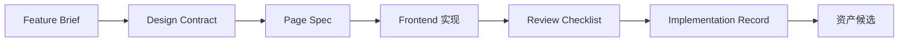

# 首个试点页面执行包模板

## 作用

本模板用于AI 前端交付工程规范的首个单页试点。

目标不是一次性做全项目，而是为一个真实页面准备一套可直接执行的最小闭环材料。

## 执行包包含什么

首个试点页面的执行包至少应包含以下五项：

1. `Feature Brief`
2. `Design Contract`
3. `Page Spec`
4. `Review Checklist`
5. `Implementation Record`

建议再附带：

- 原始需求输入
- 页面链接或设计稿入口
- 试点 owner 清单

## 推荐试点页面类型

优先级建议如下：

1. 后台列表页
2. 详情页
3. 中等复杂度表单页

推荐条件：

- 目标明确
- 结构稳定
- 状态完整
- 交互可描述
- 能形成复用模式

不推荐：

- 强品牌营销页
- 首页型大聚合页面
- 跨多个业务域的大型复合页面

## 一、试点页面基本信息卡

```md
# 试点页面基本信息

- 页面名称：
- 所属项目：
- 页面类型：
- 产品 owner：
- 设计 owner：
- 前端 owner：
- 交付负责人：
- 试点目标：
- 预期完成时间：
```

## 二、Feature Brief 空白实例

```md
# Feature Brief

## Feature Name
<页面 / 功能名称>

## Goal
<本次页面要解决的问题>

## Users
<目标用户>

## User Scenarios
1. <场景 1>
2. <场景 2>

## Core Features
- <核心功能 1>
- <核心功能 2>

## Success Metrics
- <成功标准 1>
- <成功标准 2>

## Scope
### In Scope
- <本次范围内内容>

### Out of Scope
- <本次明确不做内容>

## Constraints
- <约束 1>

## Open Questions
- <待确认问题，可为空>
```

## 三、Design Contract 空白实例

```md
# Design Contract

## Page
<页面名称>

## Goal
<页面在用户流程中的作用>

## Layout
<页面结构与区域划分>

## Components
- <组件 1>
- <组件 2>

## Component Contracts
### Component: <组件名>
#### Purpose
<组件职责>

#### Props
- <关键输入>

#### States
- loading
- empty
- error
- ready

#### Interactions
- <触发 -> 结果 -> 反馈>

#### Responsive Rules
- <桌面 / 移动规则>

#### Content Constraints
- <内容约束>

## Page States
- loading
- empty
- error
- ready

## Key Interactions
- <关键交互链路 1>

## Responsive Strategy
<整体响应式策略>

## Design System Dependencies
- <依赖的设计系统组件 / token / 模式>

## Notes
- <补充说明，可为空>
```

## 四、Page Spec 空白实例

```json
{
  "page": "<page-name>",
  "route": "<route-path>",
  "layout": "<layout-type>",
  "permissions": ["<permission-key>"],
  "states": ["loading", "empty", "error", "ready"],
  "dataSources": [
    {
      "name": "<data-name>",
      "api": "<method path>",
      "responseFields": ["<field-1>", "<field-2>"],
      "required": true,
      "notes": ""
    }
  ],
  "sections": [
    {
      "type": "<section-type>",
      "title": "<optional-title>",
      "dataSource": "<optional-data-source>",
      "fields": [],
      "actions": [],
      "states": ["ready"],
      "responsive": {
        "desktop": "<rule>",
        "mobile": "<rule>"
      }
    }
  ],
  "interactions": [
    {
      "name": "<interaction-name>",
      "trigger": "<trigger>",
      "result": "<result>",
      "feedback": "<optional-feedback>",
      "fallback": "<optional-fallback>"
    }
  ],
  "tracking": ["<event-name>"],
  "notes": []
}
```

## 五、Review Checklist 空白实例

```md
# Review Checklist

## 基本信息
- 需求名称：
- 页面 / 模块：
- 评审人：
- 评审日期：
- 对应 Feature Brief：
- 对应 Design Contract：
- 对应 Page Spec：
- 对应 Implementation Record：

## 一、输入工件是否齐备
- [ ] `Feature Brief` 已齐备
- [ ] `Design Contract` 已齐备
- [ ] `Page Spec` 已齐备
- [ ] `Implementation Record` 已开启
- [ ] 评审证据已准备

## 二、对照 Design Contract
- [ ] 页面整体结构一致
- [ ] 关键组件列表一致
- [ ] 组件状态覆盖完整
- [ ] 关键交互链路一致
- [ ] 响应式规则已验证
- [ ] 设计系统依赖按要求复用

## 三、对照 Page Spec
- [ ] `page` / `route` / `layout` 一致
- [ ] `sections` 一致
- [ ] `dataSources` 一致
- [ ] `states` 一致
- [ ] `interactions` 一致
- [ ] `permissions` 已处理
- [ ] `tracking` 已处理或有说明

## 四、状态与交互检查
- [ ] loading 状态已实现
- [ ] empty 状态已实现
- [ ] error 状态已实现
- [ ] ready 状态已实现
- [ ] 关键交互具备反馈
- [ ] 异常路径已验证

## 五、工程质量检查
- [ ] 组件边界清晰
- [ ] 无明显重复实现
- [ ] 文件映射清晰
- [ ] 偏差项已记录

## 六、资产与沉淀检查
- [ ] 资产候选已判断
- [ ] 候选资产已登记
- [ ] 如需升级，已进入资产流程

## 七、评审结论
- 评审结果：
- 主要问题：
- 后续动作：
```

## 六、Implementation Record 空白实例

```md
# Implementation Record

## Feature
<功能名称>

## Related Specs
- Feature Brief:
- Design Contract:
- Page Spec:

## Pages
- <页面 1>

## Components
- <组件 1>
- <组件 2>

## Technical Decisions
- <关键技术决策>

## API
- <接口使用情况>

## File Mapping
- <页面 / 组件 -> 文件路径>

## State and Interaction Notes
- <关键状态与交互实现说明>

## Deviations
- <偏差项 / 原因 / 裁决>

## Review Evidence
- <截图 / 录屏 / 测试 / 对照结果>

## Asset Candidates
- <候选资产 / 类型 / 是否建议升级 / 维护人>

## Notes
- <补充说明>
```

## 七、首轮试点执行顺序

建议按以下顺序执行：

1. 产品完成 `Feature Brief`
2. 设计完成 `Design Contract`
3. 前端完成 `Page Spec`
4. AI / 前端基于 `Page Spec` 实现页面
5. 使用 `Review Checklist` 进行 review
6. 回写 `Implementation Record`
7. 判断并登记资产候选

## 执行顺序图



## 八、首轮试点完成标准

首轮试点完成，至少意味着：

- 五项核心工件齐备
- 页面已完成一轮 review
- 偏差已被记录
- 至少产出 1 项资产候选
- 能明确下一轮工具化优先级


