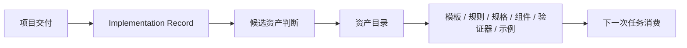

# 资产升级规则

## 目标

本规则用于将项目交付中的有效做法升级为共享默认输入、默认规则、默认规格或默认代码资产。

## 先记住一句话

没有消费机制的沉淀，不算资产。

所以资产升级一定要同时回答两件事：

- 这次值得沉淀什么
- 下次怎么被默认使用

## 什么情况下考虑升级

出现以下任一情况时，应考虑资产升级：

- 出现可重复的页面结构
- 出现可复用的组件模式
- 出现更稳定的规格写法
- 暴露出应固化的 review 或 validator 规则
- 出现可复用的 `Page Spec patch` 模式
- 出现 AI 执行器稳定可用的上下文组织方式

## 什么值得升级

- 高质量 `Feature Brief` / `Design Contract` / `Page Spec`
- 稳定组件模式
- 稳定 section 模式
- review 规则
- validator 规则
- AI 执行器上下文约束
- 完整端到端案例

## 候选资产通常从哪里来

推荐优先从以下位置提取：

1. `Implementation Record`
2. `Page Spec` 与 patch
3. PR / 代码 diff
4. review 结论
5. 同类页面的重复模式

## 升级标准

一个候选资产至少满足以下条件：

1. 在真实项目中使用过
2. 不是一次性特例
3. 适用边界清楚
4. 维护人明确
5. 消费入口明确

## 升级流程

1. 在 `Implementation Record` 中登记候选资产
2. 判断层级：`L1 / L2 / L3`
3. 决定落点：模板、规则、规格、组件、示例或验证器
4. 更新 `资产目录`
5. 如会影响后续交付，回写到上游规范或 schema
6. 明确下次任务如何自动或半自动消费

## 资产升级闭环图

## 版本与淘汰

资产升级后，还需要考虑：

- 是否需要版本号
- 是否与旧资产冲突
- 旧资产是否进入废弃状态
- AI 执行器下次默认应优先加载哪一版

## 推荐节奏

每次试点或需求结束后，用 10 到 15 分钟完成一次资产小结，而不是把资产沉淀拖到事后。

