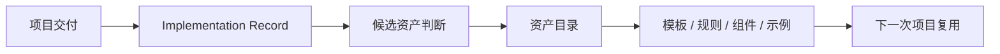

# 资产升级规则

## 目标

本规则用于将项目交付中的有效做法升级为团队共享默认输入。

## 什么情况下考虑升级

出现以下任一情况时，应考虑资产升级：

- 出现可重复的页面结构
- 出现可复用的组件模式
- 出现更稳定的规格写法
- 暴露出应固化的评审或 AI 使用规则

## 什么值得升级

- 高质量 `Feature Brief` / `Design Contract` / `Page Spec`
- 稳定组件模式
- review 规则
- AI 执行约束
- 完整端到端案例

## 升级标准

一个候选资产至少满足以下条件：

1. 在真实项目中使用过
2. 不是一次性特例
3. 适用边界清楚
4. 维护人明确

## 升级流程

1. 在 `Implementation Record` 中登记候选资产
2. 判断层级：`L1 / L2 / L3`
3. 决定落点：模板、规则、组件、示例或流程
4. 更新 `资产目录`
5. 如会影响后续交付，回写到上游规范

## 资产升级闭环图

## 推荐节奏

每次试点或需求结束后，用 10 到 15 分钟完成一次资产小结，而不是把资产沉淀拖到事后。

