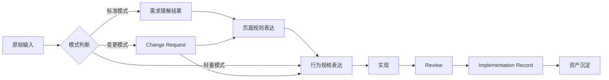

# 工程规范主流程梳理

## 作用

这份文档只做一件事：

- 把整套工程规范压成一条真正可执行的流程地图

如果前面的规范文档解决的是“规则是什么”，那这份文档解决的是：

- 任务到底应该怎么往下跑

## 一张图先看全局

## 流程总表

| 阶段 | 输入 | 默认确认人 | AI 可参与内容 | 输出 | 完成标准 | 主要消费方 |
| --- | --- | --- | --- | --- | --- | --- |
| 原始输入 | PRD / 原始需求 / 会议纪要 / 设计链接 | 最理解需求目标的人 | 整理需求要点、列缺失项 | 原始输入包 | 需求来源明确，可进入模式判断 | 需求确认人 / AI 执行器 |
| 需求理解结果 | 原始输入包 | 需求确认人 | 生成功能简报初稿、整理范围和成功标准 | `Feature Brief` 或同等级结果 | 页面规则确认人与实现方能看懂做什么、不做什么 | 页面规则确认人 |
| 页面规则表达 | 需求理解结果、设计稿 / 原型 | 页面规则确认人 | 补状态、交互、结构初稿 | `Design Contract` 或同等级表达 | 实现方能看懂页面结构、状态、交互 | 实现与回写负责人 |
| 行为规格表达 | 需求理解结果、页面规则表达 | 实现与回写负责人 | 生成 `Page Spec`、patch 或最小任务规格 | `Page Spec` / patch | AI 执行器或实现方可据此进入实现 | AI 执行器 / 实现方 |
| 实现 | 当前行为规格、代码上下文 | 实现与回写负责人 | 生成实现辅助内容、补状态和样板代码 | 页面实现 | 页面可运行，可进入 review | review 发起人 |
| Review | 实现结果、规则、规格、证据 | 交付裁决人 | 整理 checklist、汇总证据 | `Review Checklist`、评审结论 | 通过 / 驳回结论明确 | 实现与回写负责人 |
| 回写 | 评审结论、实现结果 | 实现与回写负责人 | 起草回写内容、整理文件映射 | `Implementation Record` | 偏差、证据、资产候选完整 | 交付裁决人 |
| 资产沉淀 | `Implementation Record` | 交付裁决人 | 汇总候选资产、辅助归类 | 资产候选 / 资产目录更新 | 本次经验可进入下次复用 | 团队 / AI 执行器 |

## 决策点 1：选模式

### 什么时候选标准模式

- 新页面
- 首次建设的关键页面
- 交互复杂
- 多方需要清晰对齐

### 什么时候选轻量模式

- 小需求
- 成熟页面模式复用
- 局部行为调整
- 当前规则已足够稳定

### 什么时候选变更模式

- 已有页面持续改动
- 设计、规格、实现三者之一已经变化
- 需要先判断该改哪一层事实表达

## 决策点 2：能不能进入实现

进入实现前至少检查：

- 当前需求理解结果是否存在
- 当前页面规则表达是否存在
- 当前行为规格表达是否存在
- 默认确认人是否明确

## 决策点 3：需不需要同步规格

不是所有改动都要重写整份 `Page Spec`，但只要影响页面可观察行为，就应同步当前行为规格。

至少判断这些变化：

- 结构是否变化
- 状态是否变化
- 交互是否变化
- 数据源是否变化
- 权限 / 埋点 / 路由是否变化
- 响应式是否变化

## 决策点 4：是否形成资产候选

交付完成后至少检查：

- 是否出现可复用的页面结构
- 是否出现可复用的组件模式
- 是否出现更稳定的规格写法
- 是否暴露出值得固化的 review 或 validator 规则

## 三种典型路径

### 路径 A：标准模式

`原始输入 -> Feature Brief -> Design Contract -> Page Spec -> 实现 -> Review -> Implementation Record -> 资产沉淀`

### 路径 B：轻量模式

`原始输入 -> 最小任务规格 / Page Spec patch -> 实现 -> Review -> Implementation Record -> 资产沉淀`

### 路径 C：变更模式

`Change Request -> 更新规则或规格 -> 实现 -> Review -> 回写`

## 最容易卡住的地方

- 原始输入太散，缺少目标和范围
- 页面规则只有视觉，没有状态和交互
- `Page Spec` 不够结构化，AI 执行器和实现方拿不起来
- 小改动做了，但行为规格没同步
- review 只看效果，不看当前规则和当前规格

## 最小落地建议

如果你现在只想先把流程跑起来，先抓住这 5 个动作：

1. 先判断采用哪种模式
2. 一定先形成需求理解结果
3. 一定先形成当前页面规则表达与行为规格表达
4. review 一定要用评审清单
5. 做完一定要回写实现记录并判断资产候选

做到这五步，整套流程就已经具备工程化雏形。

