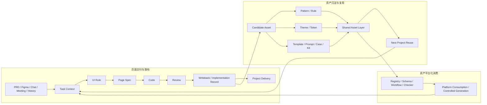
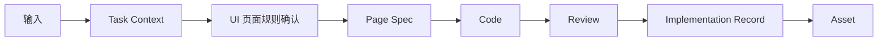
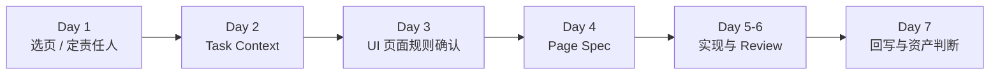
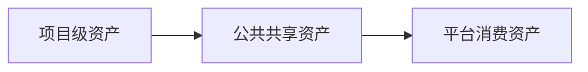

# UI -> Frontend AI工程化方案

## 背景

随着需求频率上升、页面越来越复杂，传统 `UI -> Frontend` 交付方式越来越依赖很多“没有被统一收口”的信息。

一个页面要做对，团队常常需要同时依赖：

- 产品文档中的目标和范围
- Figma 中的页面结构和视觉稿
- 聊天记录里的补充说明
- 会议中临时达成的口头结论
- 熟悉业务成员脑中的默认规则

这会带来几个很现实的问题：

- 信息散落在很多地方，团队每次都要重新整理一遍
- 很多关键规则没有写清楚，只掌握在少数人脑子里
- 前端经常在实现阶段一边开发、一边补信息、一边追问
- 很多问题要等代码写完后，才在 review 阶段靠经验发现

这套方式在 AI 时代面临两个直接挑战：

1. 难以规模化，边际协作成本持续升高
2. 难以稳定接入 AI，也难以沉淀可复用资产

这里的“边际协作成本持续升高”，可以简单理解为：每多做一个页面，团队都还要继续花很多时间在找资料、问人、补规则、对齐理解和返工上，而这些额外成本并没有随着经验积累明显下降。

当前要建设的不是“前端补更多文档”，而是一套能够让 UI、PRD、Frontend 与 AI 共同消费、共同执行、共同校验、共同沉淀的工程化交付体系。

## 现状

当前 `UI -> Frontend` 链路中的典型问题主要集中在以下几个方面：

- 输入分散：目标、结构、交互和约束分布在多个来源中，没有统一收口
- 事实漂移：产品、设计、前端、评审方往往各自维护一版理解，最后很容易不一致
- 实现跳跃：页面在事实尚未收敛时就直接进入代码实现
- review 被动：很多问题不是提前说清楚，而是写完代码后再靠 reviewer 经验指出来
- 回写缺失：代码变更后，规则、规格和记录没有同步更新
- 资产沉淀不足：一次交付结束后，难以转化为下一次任务可以直接复用的输入

这些问题会直接削弱 AI 的可用性。AI 要想真正提高效率，前提不是“生成得更快”，而是输入能被收敛、规则能被表达、规格能被校验、结果能被回写。

| 当前方式 | 主要问题 | 直接后果 |
| --- | --- | --- |
| 输入分散在 PRD / Figma / 聊天 / 会议 | 缺少统一事实层 | AI 和前端都要重复理解 |
| 事实主要靠人脑拼接 | 依赖资深成员经验 | 难复制、难规模化 |
| 页面直接进入实现 | 缺少规则和规格承接 | review 被动、返工增加 |
| 交付后缺少回写 | 经验无法进入资产层 | 下次仍从零开始 |

## 目标

### 短期目标

- 先用真实页面把这套方法跑通，形成最小闭环
- 让 AI 不只参与写代码，也真正进入输入收敛、规则整理、Spec 起草、review 和回写
- 从试点过程中稳定积累第一批共享资产

### 长期目标

- 把共享资产逐步升级为团队可以持续复用的组织底座
- 支撑模板选择、页面模式复用、规则组合和受控生成
- 为后续平台化和自动化 workflow 提供企业级资产基础

| 维度 | 短期目标 | 长期目标 |
| --- | --- | --- |
| 交付 | 跑通页面级试点闭环 | 建立稳定的组织交付底座 |
| AI | 进入收敛、Spec、review、回写 | 支撑受控生成与资产消费 |
| 资产 | 从项目中稳定积累 | 形成平台可消费资产体系 |
| 组织 | 降低单次返工和协作损耗 | 降低长期边际协作成本 |

## 方案

本方案的重点，不是“让设计稿直接生成代码”，而是先把 `UI -> Frontend` 交付过程拆成一条可被团队和 AI 共同消费的主链路：

`Input -> Spec -> Code -> Review -> Writeback -> Asset`

如果把“页面开发、页面落地、资产沉淀、资产复用、平台化”放在同一张图里，当前阶段更适合按下面这条完整链路理解：

阅读提示：

- 上半段看“页面怎样从输入走到交付”
- 中间看“交付后哪些内容会被提炼成资产”
- 下半段看“资产怎样回流到下一个项目，并最终进入平台消费”

对应到页面级交付，可进一步展开为：

这条链路想解决的是：

- 页面不再从碎片输入直接跳到代码
- AI 不只在代码阶段介入，而是进入中间事实层
- review 和回写不再是补充动作，而是闭环的一部分
- 一次交付不只把页面做完，还要尽量留下后续可复用资产

当前阶段先按下面 4 个原则推进：

- 页面优先：以单页面作为最小实践单位
- AI 起草：由 AI 起草上下文、规则和 Spec，人负责确认与裁决
- 试点先行：先用真实页面验证闭环，不先做大平台
- 资产导向：每轮试点都必须形成资产判断

| 原则 | 含义 | 目的 |
| --- | --- | --- |
| 页面优先 | 首轮只选一个页面 | 控制复杂度 |
| AI 起草 | AI 先整理，人做确认 | 降低维护成本 |
| 试点先行 | 先跑真实页面再扩展 | 验证方法有效性 |
| 资产导向 | 每轮都做资产判断 | 保证长期复用 |

### 层级定义与对照关系

为了避免流程名字在变，但实际做法没有真正变化，当前阶段需要先把每一层分别负责什么、产出什么、哪些内容会进入资产层说清楚：

| 层级 | 作用 | 典型输出 | 是否直接作为共享资产 |
| --- | --- | --- | --- |
| Task Context | 收敛页面级业务上下文、目标、范围、角色与约束 | Context | 否，模板 / 字段集 / prompt 可沉淀 |
| UI Rule | 确认页面结构、状态、交互、展示、边界与适配规则 | Rule | 可抽象为规则资产 |
| Page Spec | 描述当前页面实例规格，优先引用已有 pattern / rule 并补充差异 | Spec | 通常否，模板 / schema / 写法可沉淀 |
| Pattern | 抽象多页面共性结构与规则 | Pattern | 是 |
| Theme / Token | 沉淀颜色、字号、间距、圆角、阴影、动效、品牌风格等设计基础值 | Theme / Token | 是 |
| Kit | 沉淀组件实现、样式封装、renderer 和端侧适配实现 | Kit | 是 |
| Review | 对照规则与规格检查实现差异 | Review Result | checklist / rule 可沉淀 |
| Writeback | 将实现差异回写并抽象为可复用对象 | Record / Patch | 否，本身是过渡层 |
| Asset | 进入共享复用的稳定对象 | Pattern / Rule / Theme / Token / Kit / Template / Prompt | 是 |

Pattern 是 UI Rule 中结构规则的标准化、可复用子集；UI Rule 保留页面级完整事实。

如果说 `Pattern / Rule / Spec` 主要解决的是“页面怎么被稳定实现”，那么 `Theme / Token / Kit` 主要解决的是“页面用什么视觉基础和组件基础来实现”。

这里可以先记住一条核心原则：

`单页 Page Spec 通常是实例；Pattern / Rule / Template / Prompt 才是主要共享资产`

`Review` 和 `Writeback` 的关系也需要明确：

- `Review = Code vs Rules + Spec`
- `Writeback = 将实现差异分别回写到 Spec、Pattern、Checklist、Theme、Kit、Template 或 Prompt`
- 当 `Page Spec` 与 `UI Rule` 冲突时，必须通过 `Review` 裁决并回写其中一方。

## 常见疑问

### 1. 这套流程如何真正驱动执行？

这套体系不是为了增加文档，而是为了让页面在进入实现之前，先形成统一任务事实、统一页面规则和统一实例规格。

它真正驱动执行的方式，不是“先写一堆说明”，而是通过统一工件和阶段门禁，避免页面重新退回到：

`碎片输入 -> 直接写代码 -> 最后靠 review 兜底`

对页面交付来说，`Task Context`、`UI Rule`、`Page Spec`、`Review`、`Writeback` 都不是留档动作，而是进入下一步之前必须存在、必须被确认的中间层。

### 2. 这些文档和规格是怎么生成的？

当前阶段主要采用：

`模板 + AI 起草 + 人确认`

的方式。

- 模板负责提供统一结构
- AI 负责根据 PRD、Figma、聊天记录、历史页面和规则输入生成初稿
- 人负责确认范围、裁决歧义、接受或拒绝偏差

当前阶段的重点，不是一开始就做成完全自动化平台，而是先验证哪些字段、规则和资产适合被 AI 稳定消费。

后续当共享字段、页面模式、规则和资产消费入口逐步稳定后，再进一步演进为 AI 驱动的自动化 workflow、checker 和受控生成能力。

### 3. 设计资产是否属于这套资产体系？

属于。

当前方案中的资产，不只包括页面交付相关的 `Pattern / Rule / Spec`，也包括设计基础资产和实现基础资产。

例如：

- `Theme / Token`：颜色、字号、间距、圆角、阴影、动效、品牌风格等基础设计值
- `Kit`：组件实现、样式封装、renderer 和端侧适配能力

这意味着，后续资产沉淀不应只覆盖页面结构和评审规则，也应逐步覆盖视觉基础和组件实现基础。

### 4. 资产沉淀在哪里，后续怎么复用？

当前阶段采用三层分治：

- `项目级资产`：保留在业务项目仓，保存单页执行包和真实上下文
- `公共共享资产`：沉淀在当前公共仓，承接跨项目可复用的 pattern、rule、template、prompt、case，以及后续的 theme / token / kit
- `平台消费资产`：在后续平台化阶段，进一步整理为 registry、schema、workflow、checker 等机器可消费对象

这意味着：

- 单页任务事实不应一开始全部抽进公共仓
- 稳定复用对象才升级到共享层
- 平台优先消费已经稳定的共享资产，而不是直接消费零散页面事实

## 试点

这条链路优先适用于那些需要长期维护、值得复用，或者本身交互比较复杂的页面；如果只是一次性页面，也允许采用 AI 直出模式，不强制进入完整流程。

当前阶段建议直接启动首轮 `P1` 页面试点，并优先从下面这类页面开始：

- 标准后台表格列表页

切入。

详情页和中等复杂度表单页，可以作为下一阶段的重点扩展方向。

首轮试点可以先按下面这组默认配置理解：

- 页面形态：标准后台表格列表页
- 终端范围：`PC / Pad / Mobile`
- 推荐模式：轻量模式优先，复杂页面再升级为标准模式
- 资产方向：围绕列表页同步沉淀页面模式、横切规则和 review 口径

如果要快速跑通第一轮，建议按下面这个节奏推进：

首轮试点最值得关注的，是下面 5 个结果：

1. `Task Context` 是否完整
2. UI 规则是否被结构化确认
3. `Page Spec` 是否生成并审核
4. review 和回写是否完成
5. 是否至少留下 1 个资产候选

如果这次内部对齐会需要快速形成决策，建议先只围绕下面 4 个问题讨论：

1. 方向是否确认：是否按 `UI -> Frontend` AI 工程化推进
2. 范围是否确认：首轮是否优先聚焦标准后台表格列表页
3. 机制是否确认：是否采用 AI 起草、人确认的执行方式
4. 试点是否确认：本周启动哪个页面、采用轻量还是标准模式、由谁负责

## 演进

当前不建议一上来就做平台，而是先把执行闭环和资产体系跑通，再进入平台化演进。

资产演进可以先按三层理解：

- 项目级资产：服务当前页面执行闭环
- 公共共享资产：服务跨项目复用
- 平台消费资产：服务未来 registry、workflow 与受控生成

这里也建议坚持一条主原则：

`项目里先验证，公共层再复用，平台层最后消费`

在当前仓库里，可以把下面这些文档理解为主要落地入口：

| 入口 | 作用 |
| --- | --- |
| `docs/playbook.md` | 说明执行步骤、角色分工、门禁与完成标准 |
| `docs/quickstart/README.md` | 说明首轮试点如何快速启动、需要产出什么 |
| `docs/backend-admin-roadmap.md` | 说明后台管理系统这条重点资产线如何分阶段沉淀 |
| `docs/assets/README.md` | 说明资产分层、升级规则与沉淀方式 |
| `docs/assets/registry.md` | 说明当前已登记的可复用资产与候选资产 |
| `docs/archive/` | 保留历史详细理论与扩展材料 |

## 结论

这套方案最终想做的，是把 `UI -> Frontend` 之间原本依赖人脑拼接、实现阶段补洞、末端 review 兜底的交付方式，升级为一套 AI 可稳定接入、团队可持续校验、组织可持续沉淀的工程系统。
