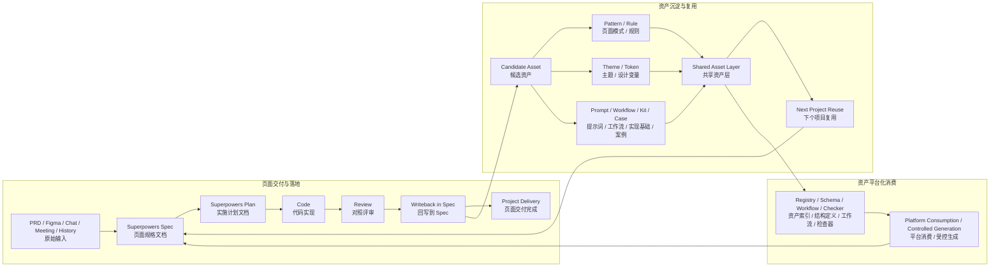
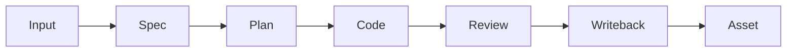

# UED 与前端协作的 AI 标准化交付方案

## 背景

随着页面复杂度上升、协作角色增多，以及 AI 开始进入日常交付流程，`UI -> Frontend` 之间开始需要一层更稳定的中间承接。

页面输入不再只是设计稿本身，还包括业务目标、页面规则、交互边界、review 关注点，以及实现后的回写和资产沉淀。  
当这些内容缺少统一承接时，页面很容易重新退回到：

`碎片输入 -> 直接实现 -> 末端 review 兜底`

因此，当前更需要的不是额外增加一套文档负担，而是一套能把输入收拢、把实现接住、把经验继续沉淀下来的工程化交付方式。

## 为什么现在要做

从基于 `superpowers skills` 的页面实践来看，spec、规则确认和 AI 协作已经能够明显提升交付效率和稳定性。

这意味着，团队现在已经有了一个可以继续放大的有效起点。  
下一步要做的，不是否定现有做法，而是把这套已经有效的工作方式继续工程化：让 spec、review、writeback 和资产沉淀形成更稳定的协作闭环。

## 目标

短期目标：

- 先在真实页面上跑通一次最小闭环
- 让 AI 不只参与写代码，也进入输入收敛、Spec 起草、review 和回写
- 用统一的 superpowers spec / plan 工作方式替代多套并行文档流
- 从试点过程中稳定积累第一批共享资产

长期目标：

- 把共享资产逐步升级为团队可持续复用的组织底座
- 支撑页面模式复用、规则组合和受控生成
- 为后续平台化和自动化 workflow 提供稳定基础

## 当前方案

当前方案的重点，不是“让设计稿直接生成代码”，而是先把 `UI -> Frontend` 交付过程收敛成一条可被团队和 AI 共同消费的主链路：

`Input -> Spec -> Code -> Review -> Writeback -> Asset`

当前阶段主要通过下面两类工件承接这条主链路：

- `docs/superpowers/specs/`
- `docs/superpowers/plans/`

其中：

- `specs` 负责承接任务上下文、页面规则、页面规格、review 重点和回写记录
- `plans` 负责承接任务拆分、实施顺序、风险和验证动作

## 全景图

如果把“页面开发、页面落地、资产沉淀、资产复用、平台化”放在同一张图里，当前更适合按下面这条完整链路理解：

如果只看页面级交付主链路，可以简化理解为：

这条链路想解决的是：

- 页面交付不再依赖从碎片输入直接跳到代码
- AI 不只在代码阶段介入，而是进入中间事实层
- review 和回写不再是补充动作，而是闭环的一部分
- 一次交付不只把页面做完，还要尽量留下后续可复用资产

## 当前落地方式

当前阶段主要按下面 4 个原则理解：

- 页面优先：以单页面作为最小实践单位
- superpowers-first：默认通过 `docs/superpowers/specs/` 和 `docs/superpowers/plans/` 执行
- AI 起草：由 AI 起草上下文、规则和 Spec，人负责确认与裁决
- 资产导向：每轮试点都必须形成资产判断

在这套方案里：

- spec 用于把页面讲清楚
- plan 用于把开发怎么做讲清楚
- review 用于对照规则和 spec 检查实现偏差
- writeback 用于把实现差异和结论回写到 spec
- asset 用于承接后续值得继续复用的对象

## 使用边界

当前阶段主要采用以下边界：

- `L1` 一次性 / 探索型页面，不强制进入完整 spec / plan 流程
- `L2 / L3` 正式页面，默认通过 superpowers-first 方式推进
- 页面级 spec / plan 使用稳定主文件命名；里程碑快照文件单独归档
- design token / variable 的真相源以 Figma Variables 和项目代码中的 theme / token 文件为主
- 共享资产优先沉淀为可直接使用的 `Starter（起步模板）`、`Kit（组件组合包）`、`Checklist（检查清单）`

这也意味着：

- spec 负责说明、引用和回写，不负责替代 Figma 或代码
- 单页 spec / plan 首先是项目级执行工件
- 只有被稳定复用、且能被新页面快速用上的对象，才继续升级为共享资产

## UI 参与点

在当前方案里，UI 不负责长期维护 spec / plan 主文件，但必须参与设计事实、页面规则和实现偏差的关键确认。

UI 主要参与 4 个环节：

1. 输入准备
   - 提供 Figma、标注、Variables、设计说明和关键页面意图
2. Spec 确认
   - 确认页面结构、信息层级、关键状态、交互方式和视觉边界
3. Review 判断
   - 对实现与设计之间的差异做接受 / 回改判断
4. Writeback / 资产判断
   - 参与判断哪些规则、token、模块样式值得继续沉淀为共享资产

UI 重点确认的内容包括：

- 页面有哪些区块，信息顺序和主次关系如何
- loading / empty / error / no-permission 等状态如何呈现
- CTA、卡片、FAQ、筛选等关键交互如何表现
- 哪些颜色、间距、字号、按钮层级必须复用
- 哪些视觉值是页面特例，哪些值得沉淀为共享 token

一句话说：

`UI 负责确认页面表达和设计规则；AI 与 FE 负责把这些事实收口到 spec / plan，并落到实现与回写。`

## 资产视角

这套方案不只是把页面做完，还希望每次交付后都能明确两件事：

- 当前页面是否被更稳定地实现了
- 有没有产出下一个页面可以直接复用的东西

对当前阶段来说，可以先把沉淀对象分成两类：

- `当前页面工件`
  - 包括 spec、plan、review 留痕和 writeback
  - 作用是把当前页面交付跑稳
- `共享资产`
  - 当前优先沉淀：
    - `Starter（起步模板）`：一个页面的可复用起手架
    - `Kit（组件组合包）`：一组经常一起复用的组件组合
    - `Checklist（检查清单）`：review 时直接对照使用的检查项列表
  - 作用是让新页面不必从零开始

如果这些共享资产后续持续复用，再进一步升级为平台可消费对象。

对小团队来说，当前更重要的不是“资产数量”，而是“复用率”。

因此，先坚持两条轻量规则：

- 没有复用两次以上，不正式沉淀为共享资产
- 新页面 5 分钟内用不上，不算当前优先资产

一句话说：

`先把页面做稳，再把真正被复用的东西沉淀成工具。`

## 试点口径

当前方案更适用于需要长期维护、值得复用，或者本身交互较复杂的页面。

如果从真实页面开始验证，标准后台表格列表页会是一个更容易收敛的起点。

当前阶段更关注的，不是一次写出完整平台，而是先验证下面几件事是否成立：

1. spec 是否完整承接了任务上下文、页面规则和页面规格
2. UI 规则是否被结构化确认
3. plan 是否明确了承接实施顺序、风险和验证动作
4. review 和回写是否真正发生
5. 是否至少留下 1 个可继续观察的资产候选

## 文档入口

当前仓库中，建议按下面的分工理解主要文档：

| 文档 | 作用 |
| --- | --- |
| `docs/README.md` | 对外说明方案背景、目标、边界和当前默认路径 |
| `docs/playbook.md` | 说明当前如何落地执行，包括门禁、角色、主文件和快照规则 |
| `docs/superpowers/README.md` | 说明 spec / plan 的目录约定、命名方式和主文件机制 |
| `docs/quickstart/README.md` | 说明首轮试点如何快速启动 |
| `docs/assets/README.md` | 说明资产分层、升级规则与沉淀方式 |
| `docs/assets/registry.md` | 记录当前已登记的可复用资产与候选资产 |
| `docs/archive/` | 保留历史详细理论、快照和扩展材料 |

## 结论

这套方案最终想做的，是把 `UI -> Frontend` 之间原本依赖人脑拼接、实现阶段补洞、末端 review 兜底的交付方式，升级为一套 AI 可稳定接入、团队可持续校验、组织可持续沉淀的工程化交付系统。
