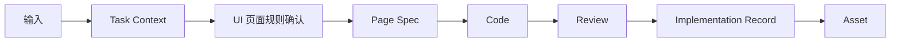
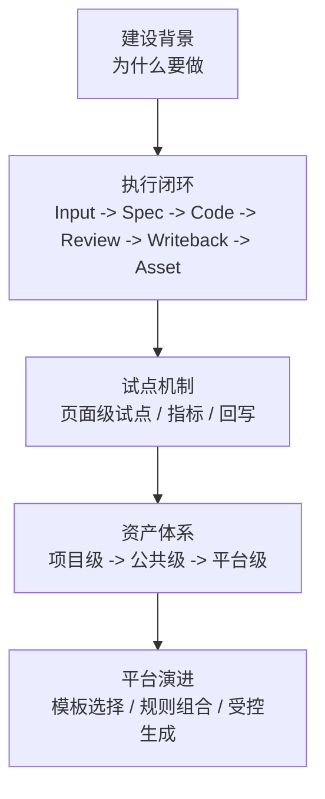

# UI -> Frontend AI工程化方案

## 建设背景

随着需求频率、页面复杂度和跨角色协作成本持续上升，传统 `UI -> Frontend` 交付方式已经越来越依赖：

- 分散在 PRD、Figma、聊天、会议中的碎片输入
- 资深成员对业务和页面事实的个人记忆
- 前端在实现阶段对缺失信息的被动补齐
- review 在末端对问题的经验性兜底

这种交付方式在 AI 时代面临两个核心问题：

1. 难以规模化，边际协作成本持续升高
2. 难以稳定接入 AI，也难以形成可复用资产

因此，当前需要建设的不是“前端补充更多文档”，而是一套能够让 UI、PRD、Frontend 与 AI 共同消费、共同执行、共同校验、共同沉淀的工程化交付体系。

## 现状研判

当前 `UI -> Frontend` 链路中的典型问题主要集中在以下几个方面：

- 输入分散：目标、结构、交互、约束分布在多个来源中
- 事实漂移：产品、设计、前端、评审方往往各自维护一版理解
- 实现跳跃：页面在事实尚未收敛时直接进入代码实现
- review 被动：评审更多依赖经验，而不是对照统一事实
- 回写缺失：代码变更后，规则、规格和记录不同步
- 资产沉淀不足：一次交付难以转化为下一次可复用输入

这些问题会直接削弱 AI 的可用性。  
AI 能提高效率的前提，是输入可收敛、规则可表达、规格可校验、输出可回写。

| 当前方式 | 主要问题 | 直接后果 |
| --- | --- | --- |
| 输入分散在 PRD / Figma / 聊天 / 会议 | 缺少统一事实层 | AI 和前端都要重复理解 |
| 事实主要靠人脑拼接 | 依赖资深成员经验 | 难复制、难规模化 |
| 页面直接进入实现 | 缺少规则和规格承接 | review 被动、返工增加 |
| 交付后缺少回写 | 经验无法进入资产层 | 下次仍从零开始 |

## 建设目标

### 短期目标

- 跑通页面级试点闭环
- 让 AI 真正进入输入收敛、规则起草、Spec 起草、review 和回写
- 从真实项目中稳定积累共享资产

### 长期目标

- 将共享资产升级为可持续复用的组织底座
- 支撑模板选择、页面模式复用、规则组合与受控生成
- 为未来平台化提供企业级资产基础

| 维度 | 短期目标 | 长期目标 |
| --- | --- | --- |
| 交付 | 跑通页面级试点闭环 | 建立稳定的组织交付底座 |
| AI | 进入收敛、Spec、review、回写 | 支撑受控生成与资产消费 |
| 资产 | 从项目中稳定积累 | 形成平台可消费资产体系 |
| 组织 | 降低单次返工和协作损耗 | 降低长期边际协作成本 |

## 方案定义

本方案的核心不是“设计稿直接生成代码”，而是将 `UI -> Frontend` 交付过程重构为以下主链路：

`Input -> Spec -> Code -> Review -> Writeback -> Asset`

对应到页面级交付，可进一步展开为：

这条链路的关键含义是：

- 页面不会直接从设计稿跳到代码
- AI 不只在代码阶段介入，而是进入中间事实层
- review 与回写是闭环的一部分
- 一次交付应当转化为后续可复用资产

## 方案框架

这张图用于会上解释一件事：

- 当前不是直接做平台
- 而是先把执行闭环和资产体系跑通

## 实施原则

当前阶段不追求一步到位的平台化建设，而采用以下实施原则：

- 页面优先：以单页面作为最小实践单位
- AI 起草：由 AI 起草上下文、规则和 Spec，人负责确认与裁决
- 试点先行：先用真实页面验证闭环，不先做大平台
- 资产导向：每轮试点都必须形成资产判断

| 原则 | 含义 | 目的 |
| --- | --- | --- |
| 页面优先 | 首轮只选一个页面 | 控制复杂度 |
| AI 起草 | AI 先整理，人做确认 | 降低维护成本 |
| 试点先行 | 先跑真实页面再扩展 | 验证方法有效性 |
| 资产导向 | 每轮都做资产判断 | 保证长期复用 |

## 试点安排

当前阶段建议直接启动首轮 `P1` 页面试点，优先选择：

- 后台列表页
- 详情页
- 中等复杂度表单页

试点启动后，优先以 `quickstart` 中的模板和样例执行，不再从零组织材料。

首轮试点会上建议明确 4 个问题：

1. 选哪个 `P1` 页面
2. 谁负责 PRD / UI / FE / approver
3. 用轻量模式还是标准模式
4. 首轮结束后哪些内容进入项目资产，哪些准备升级为共享资产

## 文档结构

当前仓库保留 4 个主入口：

| 入口 | 用途 |
| --- | --- |
| `docs/README.md` | 方案总览、背景、目标与总体判断 |
| `docs/quickstart/README.md` | 试点启动说明、模板与案例 |
| `docs/playbook.md` | 角色、流程、门禁与执行规则 |
| `docs/assets/README.md` | 资产分层、升级与沉淀方式 |

历史详细文档统一保留在：

- `docs/archive/`

## 会议讨论焦点

如果本次会议目标是形成共识并进入执行，建议只围绕下面 4 个问题讨论：

1. 方向是否确认：是否按 `UI -> Frontend` AI 工程化推进
2. 范围是否确认：首轮是否只做页面级试点
3. 机制是否确认：是否采用 AI 起草、人确认的执行方式
4. 试点是否确认：本周启动哪个页面、由谁负责

## 结论

本方案的目标，是把 `UI -> Frontend` 之间原本依赖人脑拼接和末端兜底的交付方式，升级为一套 AI 可稳定接入、团队可持续校验、组织可持续沉淀的工程系统。
