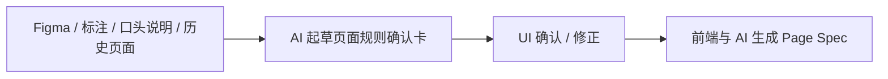

# UI页面规则确认卡模板

## 这份文档解决什么问题

很多团队一说“要规范 UI 输入”，很容易马上把事情做重：

- 让 UI 额外写一份长文档
- 让 UI 学习工程 schema
- 让 UI 自己维护复杂的组件树和状态机

这套做法通常推不动。

更适合长期执行的方式是：

`AI 先整理页面规则草稿，UI 只负责确认和修正关键规则`

所以这份文档的目标不是让 UI 多写，而是把 UI 需要确认的最小信息收敛成一张可执行的确认卡。

## 基本原则

UI 在这套体系里的核心职责，不是输出工程 Spec，而是确认页面规则。

也就是说，UI 主要负责回答下面这些问题：

- 页面由哪些关键区域组成
- 默认态、空态、加载态、异常态分别是什么
- 哪些交互是关键路径
- 哪些展示规则和限制不能错
- 哪些是本页特例，哪些沿用设计系统

而不是负责回答：

- 前端怎么拆文件
- 数据结构怎么建模
- 最终代码怎么实现
- JSON / YAML 该怎么写

## 推荐协作方式

推荐采用下面这条最省人力的协作链：



这条链路的关键价值是：

- UI 不需要从零写文档
- AI 不会跳过 UI 直接自由推断
- 前端拿到的是已确认的规则，而不是零散截图和聊天

## UI 最少只确认 6 类内容

| 类别 | UI 需要确认什么 |
| --- | --- |
| 页面结构 | 页面由哪些主区域组成，主次关系是什么 |
| 关键状态 | 默认态、加载态、空态、错误态、禁用态、权限态 |
| 关键交互 | 点击、切换、展开、提交、跳转、反馈 |
| 展示规则 | 排序、显隐、截断、格式、优先级 |
| 边界与例外 | 无数据、超长、异常、权限不足、特例 |
| 适配要求 | PC / Pad / Mobile 是否一致，哪些区块会折叠或降级 |

如果 UI 已经把这 6 类内容确认清楚，前端和 AI 就已经拥有了非常高质量的输入。

## UI 页面规则确认卡模板

```md
# UI 页面规则确认卡

## 页面信息
- 页面名称：
- 所属任务：
- 对应 Figma / 原型：
- 对应 PRD / 需求：

## 页面目标
- 这页主要帮助用户完成什么：
- 本轮改动重点是什么：

## 页面结构
- 主区域 1：
- 主区域 2：
- 主区域 3：
- 哪个区域是主操作区：

## 关键状态
- 默认态：
- 加载态：
- 空态：
- 错误态：
- 禁用 / 权限态：

## 关键交互
- 交互 1：触发 -> 结果 -> 反馈
- 交互 2：触发 -> 结果 -> 反馈
- 交互 3：触发 -> 结果 -> 反馈

## 展示规则
- 哪些字段必须展示：
- 哪些字段允许折叠 / 截断：
- 哪些内容有格式限制：
- 哪些信息有优先级要求：

## 边界与例外
- 无数据时：
- 异常失败时：
- 超长内容时：
- 特殊角色 / 权限差异：

## 适配要求
- PC：
- Pad：
- Mobile：

## 设计系统依赖
- 复用组件：
- 复用 token / theme：
- 本页特例：

## 本轮明确不做
- 不做内容 1：
- 不做内容 2：

## 待确认问题
- 问题 1：
- 问题 2：
```

## 更适合 AI 起草的输入来源

AI 在起草这张确认卡时，建议优先使用：

- Figma 页面 / 标注
- UI 口头说明或聊天纪要
- 历史相似页面
- 设计系统组件说明
- PRD 中与页面相关的目标和限制

AI 可以先把这些输入收敛成卡片初稿，再交由 UI 确认。

## UI 确认时只需要重点看什么

UI 不需要逐字审校全部内容，重点只看：

1. 页面结构是否被 AI 理解错
2. 状态是否缺失
3. 关键交互是否被遗漏或误解
4. 展示规则和例外是否被表达错
5. 哪些内容本轮其实不做

换句话说，UI 最重要的是“纠错和裁决”，而不是“从零书写”。

## AI 起草时的推荐提示方向

如果后续你要把它做成 workflow，可以把 AI 任务固定成下面这种口径：

> 根据 Figma、UI 标注、历史页面和 PRD 信息，生成“UI 页面规则确认卡”草稿。  
> 重点提取页面结构、关键状态、关键交互、展示规则、边界例外和适配要求。  
> 不要推断代码实现，不要输出技术方案；对不确定信息显式标记为待确认。

## 什么时候一张确认卡算合格

当 UI、前端、AI 看完这张卡后，至少都能回答：

- 这页最关键的区域是什么
- 什么状态和交互不能漏
- 哪些展示和边界规则不能错
- 哪些内容本轮不做
- 哪些点还需要继续确认

## 与相邻文档的关系

- `docs/05-页面规则表达规范.md`：定义“页面规则表达”这个工件本身
- `docs/18-Page-Spec-MVP模板.md`：定义规则确认之后，如何进入最小可执行 Spec

## 一句话结论

UI 规范化的关键，不是让 UI 写更多文档，而是让 AI 先起草、UI 再确认，把页面规则稳定沉淀成前端和 AI 都能消费的共享输入。
