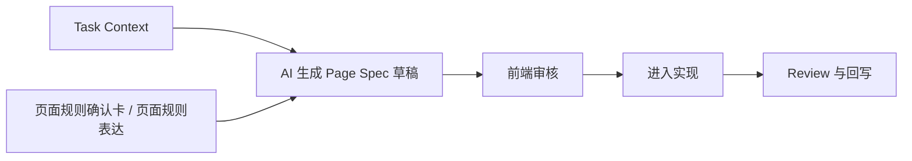

# Page Spec MVP 模板

## 这份文档解决什么问题

你现在已经明确了一条关键原则：

`Spec 不应该默认由人手工从零写，而应该默认由 AI 起草、人审核。`

这份文档就是把这件事落成最小可执行方案：

- `Page Spec` 最少包含哪些字段
- 哪些字段适合 AI 生成
- 哪些字段必须由前端或责任人审核
- 一份 MVP 级 Spec 怎么从页面规则进入实现

## 推荐结论

当前阶段最适合落地的，不是上来做重 schema，而是先做 MVP Spec。

MVP Spec 的目标不是“穷尽所有实现细节”，而是确保下面 4 件事成立：

- AI 和前端拿到的是结构化执行输入
- review 有可对照的行为事实
- 行为变化发生时有地方同步
- 相似页面的 Spec 写法可以复用

## 推荐生成方式

推荐固定为：



这条链路里，各角色分工如下：

- AI：负责起草 `Page Spec`
- 前端：负责确认字段是否可实现、是否缺失
- UI / 产品：只在关键差异点参与裁决

## MVP Spec 最少字段

当前阶段建议固定为 8 个主字段。

| 字段 | 作用 | 默认谁提供 |
| --- | --- | --- |
| `meta` | 页面标识、路由、目标、范围 | AI 起草，人确认 |
| `layout` | 页面主要区块结构 | AI 起草，UI / 前端确认 |
| `states` | 页面关键状态 | AI 起草，UI / 前端确认 |
| `interactions` | 关键交互链路 | AI 起草，人确认 |
| `displayRules` | 展示规则与显隐逻辑 | AI 起草，UI / 前端确认 |
| `constraints` | 本轮边界、例外、不做内容 | AI 起草，责任人确认 |
| `responsive` | 多端差异策略 | AI 起草，UI / 前端确认 |
| `acceptance` | 验收标准 | AI 起草，责任人确认 |

## 推荐 YAML 模板

```yaml
meta:
  page: user-list
  route: /users
  goal: 帮助运营查看、筛选并进入用户详情
  in_scope:
    - 用户列表展示
    - 按状态筛选
    - 搜索用户名
  out_of_scope:
    - 批量删除
    - 用户编辑

layout:
  sections:
    - id: page-header
      type: header
      purpose: 展示标题与页面说明
    - id: filter-bar
      type: filter-bar
      purpose: 提供搜索和筛选入口
    - id: user-table
      type: data-table
      purpose: 展示用户列表
    - id: pagination
      type: pagination
      purpose: 翻页

states:
  page:
    - loading
    - ready
    - empty
    - error
  sections:
    user-table:
      - loading
      - ready
      - empty
      - error

interactions:
  - id: search-user
    trigger: 输入关键字并提交搜索
    result: 刷新列表结果
    feedback: 列表更新
    fallback: 请求失败时展示错误提示
  - id: filter-status
    trigger: 切换状态筛选项
    result: 按状态过滤列表
    feedback: 当前筛选项高亮
    fallback: 无结果时进入空态
  - id: click-row
    trigger: 点击表格行
    result: 进入用户详情页
    feedback: 页面跳转
    fallback: 无权限时提示不可访问

displayRules:
  - field: username
    rule: 必须展示
  - field: status
    rule: 使用标签展示
  - field: remark
    rule: 过长时截断并显示省略号

constraints:
  - 当前阶段不支持批量操作
  - 错误提示沿用全站默认反馈样式
  - 权限不足时不展示详情跳转入口

responsive:
  desktop:
    filter-bar: 横向展示
    table: 完整列展示
  mobile:
    filter-bar: 折叠为纵向结构
    table: 缩减为核心字段

acceptance:
  - 搜索与状态筛选可叠加使用
  - 空态有明确提示
  - 错误态可识别且可恢复
  - 移动端保留核心信息与关键动作
```

## 为什么推荐 YAML 而不是更重的 JSON Schema

当前阶段优先推荐 YAML / Markdown 混合表达，原因很现实：

- 更适合人阅读和修正
- 更适合 AI 起草和回写
- 不需要一开始就定义复杂 schema
- 未来如果成熟，再升级成更强约束的 schema 也不晚

先把高频字段跑通，比一开始把结构设计得极其完备更重要。

## AI 适合生成什么，不适合生成什么

### AI 适合生成

- 页面目标和范围摘要
- layout 区块结构
- 常规状态枚举
- 关键交互草稿
- 展示规则草稿
- 多端差异草稿

### AI 不适合单独裁决

- 是否接受业务特例
- 哪些交互本轮明确不做
- 权限和异常的最终策略
- 与历史实现冲突时应该以哪边为准

所以原则仍然是：

`AI 起草，责任人裁决`

## 前端审核时重点看什么

前端不需要把整份 Spec 从头重写，重点只看：

1. 是否缺少实现必须依赖的字段
2. layout / states / interactions 是否能直接映射实现
3. 哪些规则其实来自 UI 猜测，尚未被确认
4. 哪些 acceptance 不具备可验证性

如果只是局部问题，优先修 Spec，不要直接绕过 Spec 去写代码。

## 小需求变更怎么做

对小需求，不建议重写整份 Spec；建议使用 patch 机制。

推荐 patch 模板：

```yaml
changeSummary: 新增状态筛选项“冻结”
affectedSections:
  - filter-bar
  - user-table
affectedStates:
  - ready
affectedInteractions:
  - filter-status
decision: update-patch
updatedBy: frontend-owner
```

## 推荐 AI 生成提示方向

如果后续要把这件事做成标准 workflow，可以把 AI 任务固定成下面这类口径：

> 根据 Task Context、UI 页面规则确认卡、页面规则表达和历史相似页面，生成一份 Page Spec MVP。  
> 输出应覆盖 meta、layout、states、interactions、displayRules、constraints、responsive、acceptance。  
> 对不确定或存在冲突的地方显式标记，不要自行裁决业务边界。

## 与相邻文档的关系

- `docs/06-页面规格与变更同步规范.md`：定义 Page Spec 的角色和 patch 原则
- `docs/17-UI页面规则确认卡模板.md`：定义 Page Spec 之前的 UI 确认输入
- `docs/07-实现、评审与回写规范.md`：定义 Spec 进入实现后的 review 与回写

## 一句话结论

Page Spec 的最优落地方式，不是人工重写一份复杂规范，而是由 AI 先生成 MVP 级结构化草稿，再由前端和责任人审核，把它变成实现与评审都能直接消费的主输入。
