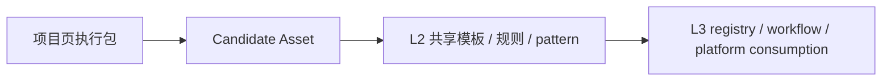

# 资产落库与目录分层建议

## 这份文档解决什么问题

很多团队走到“要沉淀资产”这一步时，会马上遇到一个非常现实的问题：

- 页面执行包放哪里
- 公共模板放哪里
- 平台以后要消费的资产放哪里
- 当前这个 docs 仓到底扮演什么角色

如果这些问题不先说清楚，后续最容易出现两种失控：

- 所有东西都堆在项目仓，无法共享
- 所有东西都提前搬进公共仓，结果脱离真实项目

所以这份文档的目标，就是把“资产放哪里”这件事先定成一套简单、可长期执行的分层方法。

## 分层结论

当前阶段最合理的做法不是“一仓统管一切”，而是明确三层：


对应关系如下：

- `L1 项目级`：放真实页面执行包和本项目上下文
- `L2 公共共享级`：放跨项目复用的规则、模板、pattern、case
- `L3 平台消费级`：放未来平台、registry、在线选择和受控生成要消费的资产

## 为什么不能一开始就都放公共仓

因为当前阶段最重要的是保留真实项目语境。

如果一开始就把所有内容都抽进公共仓，会出现：

- 资产脱离原始上下文，难以理解为什么这么定义
- 大量只被用过一次的对象被误当成“共享资产”
- 公共仓快速膨胀，团队不知道到底该复用什么

所以最稳妥的规则是：

`先在项目里验证，再向公共层升级`

## L1：项目级落库

项目级资产应该放在业务项目仓内，服务当前交付闭环。

### 适合放什么

- 页面级 `Task Context`
- UI 页面规则确认卡
- 页面规则表达
- `Page Spec` / patch
- `Review Checklist`
- `Implementation Record`
- 本项目特有的 prompt / patch / case

### 为什么必须保留在项目里

因为这些内容和当前页面、当前任务、当前约束强绑定。

它们的主要价值是：

- 保证当前交付可追溯
- 保留资产升级前的原始证据
- 支撑 review、回写和后续复盘

### 推荐目录示例

```text
project-repo/
  docs/
    ai-delivery/
      pages/
        user-list/
          01-task-context.md
          02-ui-rule-card.md
          03-page-rules.md
          04-page-spec.yaml
          05-review-checklist.md
          06-implementation-record.md
```

## L2：公共共享级落库

公共共享级资产建议放在当前这类公共规范 / 资产仓中。

这也是你现在这个仓最合理的短中期角色：

`AI工程化规则仓 + 共享资产仓雏形`

### 适合放什么

- 通用页面 pattern
- `Page Spec` 模板 / schema 草案
- UI 页面规则确认卡模板
- review rule / checklist 模板
- AI prompt / workflow / checker
- 试点案例与反例
- 资产索引和升级记录

### 进入公共层的前提

至少满足下面一条：

- 在两个以上页面复用
- 已经被证明不是项目特例
- 已明确维护人和消费入口

### 推荐目录示例

```text
spec-driven-repo/
  docs/
    templates/
      ui-rule-card.md
      page-spec-mvp.yaml
      implementation-record.md
    patterns/
      list-page.md
      detail-page.md
      form-page.md
    rules/
      review-checklist.md
      ai-stop-rules.md
    cases/
      successful/
      anti-patterns/
    registry/
      asset-index.md
```

## L3：平台消费级落库

平台消费级不是当前阶段的重点，但方向要先定义。

### 适合放什么

- 机器可读取的资产 registry
- 模板选择与组合元数据
- pattern / spec / rule 的在线索引
- 供 workflow、CLI、平台 UI 消费的结构化资产

### 为什么现在不急着做

因为平台层真正成立的前提是：

- L1 已经有足够多真实执行包
- L2 已经沉淀出稳定共享资产
- 命名、字段、升级门槛和维护责任已经比较稳定

如果这些基础还没稳，过早做平台层只会把不稳定放大。

### 推荐目录方向

```text
platform-assets/
  registry/
    patterns.json
    specs.json
    rules.json
  prompts/
  workflows/
  validators/
  adapters/
```

## 当前这个 docs 仓到底该扮演什么角色

当前最合理的定位，不是“平台母仓”，也不是“所有项目实时执行仓”。

而应该是：

`规则定义 + 共享模板 + 共享资产 + 试点案例 + 升级入口`

也就是说，它主要回答的是：

- 规则怎么定义
- 模板怎么写
- 哪些资产值得共享
- 怎样从项目级升级到共享级

而不是直接承载所有项目的实时页面执行明细。

## 推荐升级路径



这条路径非常重要，因为它保证了：

- 资产来源于真实项目
- 共享层来源于已验证资产
- 平台层来源于稳定共享层

## 你现在最应该定下来的 3 条落库规则

### 规则 1：页面执行包留在项目里

凡是和单页任务强绑定的上下文、Spec、回写记录，都优先保留在业务项目仓。

### 规则 2：稳定复用对象再升到公共仓

凡是 pattern、模板、规则、prompt、checker 这类跨项目可复用对象，再沉淀到公共仓。

### 规则 3：平台只消费稳定资产，不直接消费零散页面事实

未来平台应优先消费 L2 已稳定的资产，而不是直接读取所有项目中的零散页面文档。

## 与相邻文档的关系

- `docs/10-资产沉淀与升级规则.md`：解释什么值得成为资产
- `docs/16-资产分级与升级门槛.md`：解释项目级、共享级、平台级的升级条件
- `docs/14-项目准入与试点运营清单.md`：解释项目级执行包如何在试点中产生

## 一句话结论

资产落库最稳妥的方式，不是把所有内容提前抽进公共仓，而是坚持“项目里验证、公共层复用、平台层消费”的三层分治。
