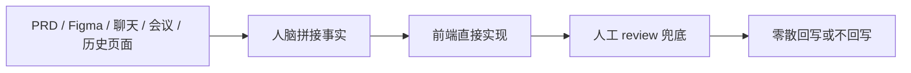
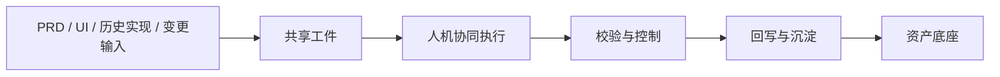
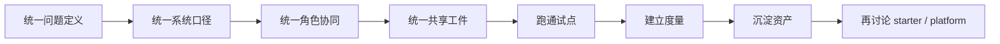

# AI工程化建设背景与目标

## 建设判断

我们现在要建设的，不是“前端多几份规范文档”，也不是“让 AI 帮忙多写一点代码”。

我们真正要建设的是一套面向 `UI -> Frontend` 的 AI 工程化交付系统：

- 让分散输入先被收敛
- 让交付事实先被表达
- 让 AI 在可控边界内进入执行
- 让一次项目交付沉淀成后续可复用资产

如果没有这层工程化能力，AI 在团队里很容易停留在零散试用层，无法真正进入交付系统。

## 四个核心问题

围绕这套方案，最值得优先确认的其实就 4 个问题：

1. `UI -> Frontend` 的 AI 工程化到底有没有价值，是否贴合未来场景
2. 短期目标和长期目标分别应该是什么
3. 这套流程怎样设计，才能不靠人力堆叠也能长期执行
4. 应该按什么实施策略推进，才不会做重、做偏、做空

后面整份文档，本质上就是围绕这 4 个问题展开。

## 为什么现在必须做

过去的 `UI -> Frontend` 协作，在项目数量少、人员熟、页面复杂度有限时，还可以靠经验和沟通勉强跑通。

但到了今天，这种方式已经越来越难支撑：

- 需求频率更高，页面类型更多，跨角色协作更重
- 关键事实分散在 PRD、Figma、聊天、会议和历史实现里
- 越来越依赖资深同学在脑中完成拼接、判断和兜底
- AI 虽然看起来很强，但缺少稳定输入时，输出反而更容易失真

所以问题已经不只是“效率不够高”，而是：

`当前交付方式本身，不适合 AI 时代的规模化协作`

## 现状真正卡在哪里

当前 `UI -> Frontend` 的问题，不是某个角色不认真，也不是某次交付不够努力，而是交付方式本身存在结构性损耗。

这条链路的典型问题包括：

- 输入分散：事实没有统一承载层
- 事实漂移：PRD、UI、前端、评审方各记一版理解
- 实现跳跃：任务还没收敛清楚就进入代码
- review 被动：更多只能靠经验兜底，而不是对照统一事实
- 回写缺失：代码变了，规则、规格和结论没同步
- 复用困难：相似页面反复重新理解、重新实现、重新踩坑

这些问题在 AI 时代只会被进一步放大。

## 为什么 AI 时代不能继续靠人力堆叠

很多团队过去能把事情做完，靠的是：

- 资深同学补足事实缺口
- 高频口头同步维持上下文
- 前端在最后阶段自行兜底
- review 靠强经验做最后防线

这种方式有 4 个根本局限：

| 局限 | 后果 |
| --- | --- |
| 不可规模化 | 需求一多，就只能继续堆人、堆沟通、堆 review |
| 不可复制 | 换团队、换新人、换 AI，都很难稳定接手 |
| 不可度量 | 大家都觉得累，但说不清到底卡在哪一层 |
| 不可沉淀 | 经验留在人脑里，进不了共享资产 |

AI 真正擅长的是读取、生成、比较、检查、回写；
但 AI 不会自动把混乱变成系统。  
如果输入本身不稳定，AI 只会更快地产生“像答案但不可靠”的结果。

## 为什么这条路贴合未来场景

`UI -> Frontend` 的 AI 工程化，不是一个短期噱头，而是非常贴合未来场景的建设方向。

因为未来真正会持续放大的，不是“单次生成页面”的能力，而是下面这些能力：

- 设计上下文和代码资产能否被统一消费
- AI 能否在共享工件和规则边界内稳定工作
- review 和回写能否被结构化、自动化地增强
- 一次交付是否能沉淀成后续任务可复用的资产

也就是说，未来拼的不是谁能更快出一段代码，而是谁能更稳定地把：

`输入 -> 规则 -> 规格 -> 实现 -> 校验 -> 资产`

组织成持续运转的系统能力。

从这个角度看，`UI -> Frontend` 恰恰是最适合先落 AI 工程化的一段链路：

- 输入天然丰富，但长期分散
- 页面交付可切成单页级试点
- 规则、Spec、回写都容易形成结构化资产
- 后续最容易向模板平台、资产平台、受控生成平台演进

## 我们要建设的到底是什么

我们要建设的，是一个 AI 和人都能共同消费、共同执行、共同校验、共同沉淀的工程系统。

它的核心不是：

- `Figma -> Code`

而是：

- `Input -> Spec -> Code -> Review -> Writeback -> Asset`

这里的关键变化是：

- 输入不再直接穿过人脑进入代码
- 共享工件开始承担事实承载层
- AI 不再只是最后写代码，而是进入收敛、生成、检查、回写
- 交付结果不再停留在页面完成，而是继续进入资产沉淀

## 目标状态应该长什么样

目标状态不是做一个“自动出页面”的黑盒，也不是把人完全拿掉。

更准确地说，目标状态是：

在这个系统里：

- 人负责目标确认、边界裁决、偏差接受和最终签收
- AI 负责收敛、生成、比较、检查、回写和提炼
- 共享工件负责承载事实
- review 与控制机制负责保证一致性
- 资产机制负责让系统越跑越稳、越跑越快

## 这套能力到底如何提效

它的提效，不是某一个页面生成更快，而是整条交付链路开始具备复用能力。

| 提效方向 | 真正发生的变化 |
| --- | --- |
| 减少重复理解 | 事实先进入共享工件，而不是每个人重新拼一遍 |
| 降低返工损耗 | 页面规则和 `Page Spec` 先收敛，再进入实现 |
| 提高 AI 可用性 | AI 建立在结构化输入和共享资产上工作 |
| 增强复用能力 | pattern、spec、rule、ai-asset 可以被后续任务直接借鉴 |
| 降低协作边际成本 | 做过一次的东西，不需要下次再从零解释 |

一句话说：

`提效的本质，不是这次更快写完，而是下一次不再从零开始。`

## 短期目标：从真实项目中积累资产

当前阶段最重要的，不是先做平台，而是先让真实项目成为资产生产器。

短期必须完成的事情是：

- 在真实页面中跑通共享工件驱动的交付闭环
- 让 AI 真正进入收敛、规格、检查、回写这些关键节点
- 在每次交付后判断并登记资产候选
- 用试点和台账证明这套体系不是“看起来合理”，而是“跑起来有效”

短期目标可以概括成一句话：

`先从项目推进中稳定积累资产`

## 长期目标：把资产升级成平台能力

长期目标不是“文档更多”，而是“资产能被平台和 AI 直接消费”。

未来真正值得形成的平台能力，至少包括：

- 在线选择页面模板、pattern 和规格骨架
- 在线选择或组合组件、规则、AI 约束
- 基于企业资产底座生成页面骨架、spec 和实现草稿
- 为类似 V0 的用户入口提供企业级、可控、可校验的生成底座

所以长期目标不是让 AI 裸生成，而是：

`让平台和 AI 都建立在企业资产底座之上工作`

## 为什么这套流程有机会长期执行

很多方案在理念上是对的，但执行几轮之后就散掉，原因通常不是价值不对，而是运行成本过高。

这套流程之所以有机会长期执行，前提是坚持下面 4 条：

### 1. AI 先起草，人做确认

不要让 UI、前端、产品都从零写文档。

更稳妥的方式是：

- AI 起草 `Task Context`
- AI 起草页面规则确认卡
- AI 起草 `Page Spec`
- 人只做确认、裁决和修正

### 2. 页面是最小实践单位

不要一开始以大业务域、大系统做实践单位。

以“单页面”作为最小单元，最容易形成可控闭环，也最容易比较投入产出。

### 3. 每一步都有门禁

长期执行靠的不是自觉，而是进入条件和退出条件清晰。

例如：

- 没有 `Task Context` 不进入实现
- 没有页面规则确认不允许 AI 直接从设计到代码
- 有行为变化必须同步 `Page Spec` 或 patch
- 没有回写和资产判断不算闭环

### 4. 资产必须有升级路径

如果一次交付结束后什么都不留下，这套系统就永远要从零启动。

所以必须坚持：

- 项目里先验证
- 共享层再复用
- 平台层最后消费

## 当前系统与未来平台是什么关系

这里非常容易被误解，所以必须说透：

当前建设的，是资产生产系统；  
未来可能建设的，是资产消费平台。

两者的关系是上下游，不是替代关系。

| 层级 | 作用 |
| --- | --- |
| 当前 AI 工程化交付系统 | 从真实项目中生产、校验、沉淀资产 |
| 未来类似 V0 的平台 | 消费这些资产，放大为更广泛用户可用的能力 |

这也是为什么现在不能直接跳去做平台：

- 没有底座，平台只会退化成自由生成
- 没有共享规则，平台资产无法稳定复用
- 没有回写闭环，平台能力也无法持续变强

## 这套方案对不同角色意味着什么

这不是只服务前端的方案，而是同时改变 UI、PRD、前端、评审和管理层的协作方式。

| 角色 | 最关心什么 | 这套方案带来的变化 |
| --- | --- | --- |
| 高层 / 管理层 | 值不值得投、能不能规模化 | 从人力堆叠转向系统能力和资产积累 |
| PRD / 产品 | 目标会不会更清楚、返工会不会减少 | 目标、范围、约束先进入共享上下文 |
| UI / 设计 | 设计规则会不会在实现中失真 | 页面规则表达成为设计到工程的承接层 |
| 前端 / 实现方 | 会不会只是多写文档 | 规格成为主输入，AI 帮忙收敛、检查、回写 |
| 评审 / 负责人 | 怎么控质量、怎么做偏差裁决 | review 不再只看效果，而是对照共享事实做判断 |

## 为什么值得现在就投入

从组织层面看，这件事的价值不只在于“前端更高效”，而是它同时解决了 4 类企业级问题：

- 交付稳定性：降低事实漂移、返工和隐性沟通成本
- AI 接入能力：让 AI 真正进入交付系统，而不是停留在边角试用
- 资产积累能力：把一次次真实交付升级成长期复用底座
- 平台演进基础：为未来模板平台、组件平台、受控生成平台保留真源

也就是说，公司投入的不是一套规范，而是一条未来可以持续降低边际成本的交付基础设施。

## 当前阶段的正确推进顺序

这条顺序非常关键，因为它说明：

- 不是先做平台
- 也不是先堆很多模板
- 而是先把最小闭环跑通，再让能力逐步长出来

## 实施策略应该怎么理解

当前最正确、最容易落地的实施策略，不是“全面铺开”，而是：

`轻启动、强闭环、慢平台化`

具体来说：

- 轻启动：先选 `P1` 页面试点，不一开始覆盖所有项目
- 强闭环：把 `Task Context -> 页面规则 -> Page Spec -> Review -> Writeback -> Asset` 跑完整
- 慢平台化：先积累真实资产，再判断哪些能力值得抽成平台

如果把顺序做反了，比如：

- 先做平台
- 先做全自动
- 先追求大而全规范

那大概率会把方向做偏。

## 一句话结论

这套方案的本质，不是给 `UI -> Frontend` 增加文档负担，而是把原本依赖人力堆叠、口头同步和人工兜底的交付方式，升级成一个 AI 时代可执行、可校验、可沉淀、可持续演进的工程系统。

## 执行决策入口

如果当前阶段的目标不是继续讨论，而是直接做决策，那么建议以 `docs/20-结论与首轮实践清单.md` 作为执行入口。

那份文档已经把下面 3 件事压缩成了最小可执行答案：

- 现在可以直接下的结论是什么
- 首轮试点应该怎么跑
- 本周最应该先做哪一步
