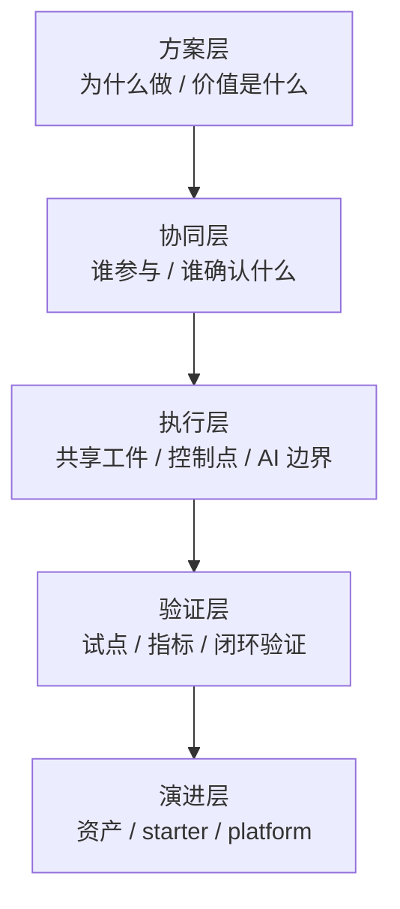
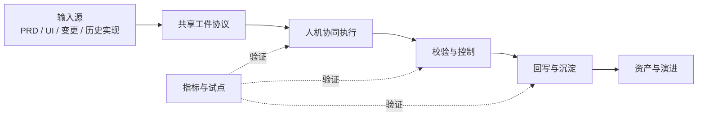
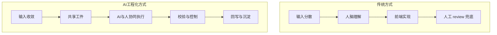

# AI工程化交付系统总览

## 系统定义

这不是模板合集，也不是流程说明书。

这份文档要做的，是把整套方案定义成一个完整的 AI 工程化交付系统，并讲清楚：

- 为什么它不是传统流程加文档
- 它由哪些层和哪些机制组成
- 它的关键原则、控制点和边界是什么
- 为什么 `Spec -> Code` 很重要，但仍然只是系统的一部分

## 从流程思维转向系统思维

如果只把这套方案理解成“UI 到前端的一条执行链路”，会很容易退回传统流程优化。

更准确的理解是：

这是一套 AI 工程化交付系统。

系统和流程的差异在于：

| 传统流程视角 | AI 工程化系统视角 |
| --- | --- |
| 关注顺序怎么走 | 关注顺序、协议、控制、度量、沉淀一起怎么成立 |
| 主要靠人理解和推进 | 人、AI、共享工件共同参与 |
| review 更多依赖经验 | review 对照共享工件和校验规则 |
| 沉淀多靠自觉 | 沉淀被纳入系统闭环 |

## 系统总公式

这套方案可以用下面这个公式来理解：

`AI工程化交付系统 = 共享工件协议 + 人机协同执行 + 校验与控制机制 + 试点与度量机制 + 资产沉淀与演进机制`

这 5 部分缺一不可。

## 4 个核心问题在系统里分别落到哪里

如果把整套方案压缩成管理视角，核心其实就是 4 个问题：

| 问题 | 在系统中的落点 |
| --- | --- |
| 这条方向有没有价值、是否贴合未来 | 方案层 + 演进层 |
| 短期目标和长期目标是什么 | 目标分层 + 资产演进层 |
| 操作流程如何长期执行 | 执行层 + 校验层 + 度量层 |
| 应该按什么策略推进 | 试点机制 + 资产升级机制 |

这张表想说明：

- 这 4 个问题不是附加讨论
- 它们本身就是系统设计的一部分

## 系统目标分层

如果只看执行闭环，很容易低估这套系统的目标。

更准确地说，它同时有短期和长期两层目标：

| 层级 | 目标 |
| --- | --- |
| 短期目标 | 在真实项目中跑通共享工件驱动的交付闭环，并持续积累资产 |
| 长期目标 | 把沉淀下来的资产升级成平台能力，支撑在线模板选择、组件选择和类似 V0 的生成能力 |

这张表想说明：

- 短期先解决“项目如何更稳地交付”
- 长期再解决“资产如何平台化并成为 AI 生成底座”

## 系统分层图

这张图想说明：

- 工程化不是只有执行层
- 如果没有方案层、验证层和演进层，系统就很容易退回传统流程优化

## 5 个工程化支柱

### 1. 共享工件协议

把原本散落在 PRD、Figma、会议和聊天里的事实，收敛到共享工件里。

核心工件包括：

- `Task Context`
- 页面规则表达
- `Page Spec`
- `Review Checklist`
- `Implementation Record`
- `Change Request`

### 2. 人机协同执行

AI 不只是最后帮忙写代码，而是参与：

- 输入收敛
- 任务理解
- 规则起草
- 规格生成
- 实现辅助
- review 辅助
- 回写与提炼

### 3. 校验与控制机制

系统必须能判断：

- 什么时候可以进入下一步
- 什么时候必须停下来补事实
- 什么时候需要人做裁决
- 什么时候实现与规格不一致

### 4. 试点与度量机制

系统不能只靠“感觉更顺了”证明价值，而必须通过试点和指标验证：

- 试点是否闭环
- 事实是否收敛
- 实现与规格是否一致
- 回写和沉淀是否形成

### 5. 资产沉淀与演进机制

每次交付都不是结束，而是下一轮能力建设的输入。

可沉淀的对象包括：

- pattern
- spec
- review rule
- case
- AI workflow 约束
- AI prompt 约束

## 提效机制不是单点效率，而是复用效率

这套系统的提效不是来自某一个模型更强，而是来自以下复用机制：

- 项目中的高频模式会被抽成共享资产
- 后续任务可以直接借鉴已有 pattern、spec、rule、ai-asset
- AI 可以建立在既有资产之上工作，而不是每次重新猜测

所以它真正提升的，是：

- 交付稳定性
- 复用速度
- AI 接入质量
- 组织边际效率

## 系统全景图

这张图想说明：

- 输入不是直接进代码
- AI 不是外挂，而是执行系统的一部分
- 工程化不是“多一份文档”，而是“多一层协议、控制和沉淀能力”

## 核心原则

### 原则 1：Figma 是重要输入源，不是唯一事实源

设计稿、原型、截图和 Dev Mode 很重要，但它们不能独自承担“页面结构定义”和“行为事实定义”。

### 原则 2：AI 的主输入应该是规格，不是设计稿

更稳定的方式是：

`输入源 -> 任务上下文 -> 页面规则表达 -> 页面规格 -> 代码`

而不是：

`Figma -> 代码`

### 原则 3：代码不是唯一事实源

如果实现变了，但规则、规格、实现记录没有同步，这不是系统完成了交付，而是系统失去了一致性。

### 原则 4：review 不只是看效果，而是看一致性

review 需要同时对照：

- 当前任务目标
- 当前页面规则
- 当前行为规格
- 当前实现结果

### 原则 5：AI 参与交付，但不替代确认责任

AI 可以辅助收敛、生成、检查、回写；
但目标确认、边界裁决、偏差接受、交付签收仍然必须由人承担。

## 这套方案与传统方式的根本差异

传统方式的问题不只是慢，而是无法稳定接入 AI。

AI 工程化方式的重点也不只是快，而是让系统能够：

- 被 AI 读取
- 被 AI 执行
- 被 AI 检查
- 被团队验证
- 被后续任务复用

## 当前阶段最重要的边界

为了避免方向失控，当前阶段需要明确 4 条边界：

1. 先跑通共享工件驱动的交付闭环，不先做大平台
2. 先证明 AI 可以稳定进入交付链路，不追求一步到位全自动
3. 先让 UI、PRD、前端在同一事实层协作，不把压力全部丢给前端
4. 先建立试点、校验、回写和沉淀，再讨论大规模推广

## 为什么它能长期执行，而不是只跑一轮

一套 AI 工程化方案要长期成立，不能靠“团队自觉坚持”，而必须靠系统内置的运行机制。

当前这套系统能够长期执行，依赖 4 个内置条件：

1. 共享工件明确，避免每轮重新定义输入和输出
2. AI 默认起草、人负责裁决，降低人力维护成本
3. 校验、回写、台账和资产判断被纳入闭环，而不是靠自觉补做
4. 资产有从项目层到共享层、再到平台层的升级路径

如果缺少其中任一条，系统都很容易退回：

- 只剩流程
- 只剩模板
- 或只剩一次性试点

## 建议阅读路径

如果你是不同角色，推荐这样读：

| 角色 | 推荐先读 |
| --- | --- |
| 高层 / 管理层 | `docs/13` -> `docs/00` -> `docs/01` -> `docs/09` -> `docs/11` |
| UI / PRD | `docs/00` -> `docs/02` -> `docs/03` -> `docs/04` -> `docs/05` |
| 前端 / AI 使用者 | `docs/01` -> `docs/03` -> `docs/04` -> `docs/08` -> `docs/14` -> `docs/15` |
| 评审 / 负责人 | `docs/01` -> `docs/02` -> `docs/07` -> `docs/09` -> `docs/10` -> `docs/16` |

这张表想说明：

- 文档不是要求所有人从头到尾一次读完
- 但所有角色最终都要回到同一套系统口径
- 如果是对齐汇报场景，优先先读 `docs/13-对齐汇报提纲.md`

如果是从“理论方案”进入“执行落地”阶段，建议继续阅读：

- `docs/14-项目准入与试点运营清单.md`
- `docs/15-试点台账与度量模板.md`
- `docs/16-资产分级与升级门槛.md`

## 为什么 `Spec -> Code` 是核心，但不是全部

`Spec -> Code` 很重要，因为它把 AI 和实现方的主输入从“碎片信息”切换成了“结构化规格”。

但如果只强调 `Spec -> Code`，还不够工程化。

因为在它前后还必须有：

- `Input -> Spec` 的收敛机制
- `Code -> Review` 的校验机制
- `Review -> Writeback` 的回写机制
- `Writeback -> Asset` 的沉淀机制

所以更完整的闭环应该是：

`Input -> Spec -> Code -> Review -> Writeback -> Asset`

## 一句话结论

这套方案的核心，不是把原来的交付流程写成文档，而是把 `UI -> Frontend` 的交付方式升级成一个 AI 可以真正参与、团队可以真正控制、公司可以持续沉淀的工程系统。

