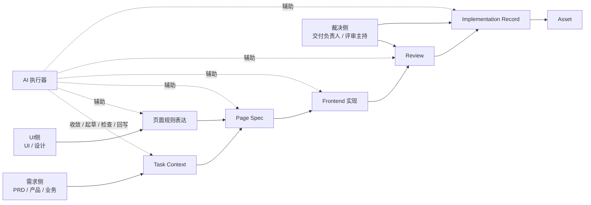

# 角色协同与责任边界

## 角色定位

这份文档讨论的不是“谁写哪份文档”，而是：

1. 在 `UI -> Frontend` 的 AI 工程化交付系统里，哪些角色共同参与
2. 各角色分别提供什么输入、确认什么事实、承担什么责任
3. AI 在这条链路里扮演什么角色，不扮演什么角色
4. 为什么这套方案不是给前端单边加负担，而是在重构协作方式

## 协同前提

AI 时代不再适合把交付系统建立在下面这些默认假设上：

- 产品把需求“讲清楚了”就结束
- UI 交完设计稿就结束
- 前端自己负责把所有事实拼起来
- 评审时再由资深同学兜底

更稳定的做法是：

- 用共享工件承接跨角色事实
- 用责任位定义谁确认什么
- 用 AI 辅助收敛、生成、检查和回写
- 用 review 和裁决机制保证最终一致性

## 这套系统里有哪些核心参与者

从系统视角看，至少有 5 类参与者：

- `需求侧`：PRD、产品、业务负责人
- `UI侧`：UI、设计师、设计工程师
- `实现侧`：前端、设计工程师、主要实现人
- `AI侧`：AI 执行器、AI 工作流、AI 检查器
- `裁决侧`：交付负责人、模块负责人、评审主持人

这些角色不一定对应 5 个独立岗位，但责任必须被覆盖。

## 角色协同总图

这张图想说明：

- 输入不是直接流向前端
- UI 和 PRD 都要参与前置事实收敛
- AI 是系统参与者，不是临时外挂
- 裁决责任不能被 AI 或默认流程替代

## 四个责任位

为了让系统可执行，需要把责任压缩成 4 个责任位。

### 1. 需求确认

负责：

- 明确业务目标
- 明确范围边界
- 明确成功标准
- 明确优先级和关键约束

常见承担方：

- 产品
- 业务负责人
- 最理解需求目标的人

默认确认工件：

- `Task Context`

### 2. 页面规则确认

负责：

- 明确页面结构
- 明确组件职责
- 明确关键状态和交互
- 明确响应式与内容约束
- 明确设计系统依赖

常见承担方：

- UI
- 设计工程师
- 最理解页面规则的人

默认确认工件：

- 页面规则表达（`Design Contract`）

### 3. 实现与回写

负责：

- 形成当前行为规格
- 落地代码实现
- 维护行为与规格一致性
- 回写偏差、证据和资产候选

常见承担方：

- 前端
- 设计工程师
- 主要实现人

默认确认工件：

- `Page Spec`
- `Implementation Record`

### 4. 交付裁决

负责：

- 判断能否进入下一步
- 给出 review 结论
- 裁决偏差是否接受
- 判断是否升级资产

常见承担方：

- 交付负责人
- 模块负责人
- 评审主持人

## 各角色到底提供什么

| 角色 | 主要提供什么 | 不应该独自承担什么 |
| --- | --- | --- |
| PRD / 产品 / 业务 | 目标、范围、约束、成功标准、变更原因 | 页面结构细节、实现事实定义 |
| UI / 设计 | 页面结构、组件职责、交互规则、视觉与内容约束 | 当前行为规格、最终代码事实 |
| 前端 / 实现方 | 行为规格、代码实现、偏差说明、回写记录 | 单独替代 PRD 或 UI 做事实确认 |
| AI 执行器 | 收敛、起草、补全、检查、回写辅助 | 最终确认、例外裁决、绕过 review |
| 裁决方 | 进入下一步判断、偏差裁决、交付签收 | 替代前置工件整理和实现工作 |

这张表想说明：

- 这不是“所有东西都压给前端”
- 也不是“谁都提一点，最后前端兜底”
- 而是每一类事实都有默认负责者

## AI 在这套系统里的定位

### AI 负责什么

- 读取统一输入和项目上下文
- 起草或补全 `Task Context`
- 起草或补全页面规则表达
- 生成或更新 `Page Spec`
- 生成实现辅助内容
- 生成 review 辅助内容
- 整理 `Implementation Record` 初稿
- 提示资产候选和相似历史模式

### AI 不负责什么

- 代替确认责任人做最终判断
- 在事实表达缺失时直接宣布结论
- 绕过 review 直接宣布交付完成
- 用工具自身偏好替代统一协议

### AI 什么时候必须停下

AI 遇到下面任一情况时，默认停止继续生成最终代码，先指出缺口并升级给确认人：

1. 缺少 `Task Context`、页面规则表达、`Page Spec` 或其等价物
2. 不同输入源对任务目标、页面结构或当前行为事实表达冲突
3. 影响页面可观察行为，但尚未确认是否更新页面规格
4. 无法判断本次应走标准模式、轻量模式还是变更模式
5. 需要替确认责任人做事实裁决

## 为什么这套方案不是给前端加流程

如果把这套方案理解成“前端多写几份文档”，会完全误解它的价值。

更准确的理解是：

- PRD 不再只交原始需求
- UI 不再只交设计稿
- 前端 不再直接从碎片输入跳到代码
- AI 不再只是最后一公里写代码
- review 不再只靠经验兜底

也就是说，这套方案重构的是整条协作链路，而不是前端局部动作。

## 工件与确认关系

| 工件 | 默认确认人 | 常见主要使用方 |
| --- | --- | --- |
| `Task Context` | 需求确认人 | UI、实现方、AI 执行器 |
| 页面规则表达（`Design Contract`） | 页面规则确认人 | 实现方、裁决方、AI 执行器 |
| 页面规格（`Page Spec`） | 实现与回写负责人 | AI 执行器、裁决方、评审方 |
| 实现记录（`Implementation Record`） | 实现与回写负责人 | 裁决方、后续接手人、资产维护人 |
| 评审清单（`Review Checklist`） | review 发起人 | 裁决方、评审方 |

## 最小组织怎么映射这四个责任位

责任位不等于岗位数量。

### 典型 4 角协作

- 产品或业务：需求确认
- UI：页面规则确认
- 前端：实现与回写
- 负责人：交付裁决

### 3 人团队

- 产品：需求确认
- UI 或前端：页面规则确认
- 前端负责人：实现与回写 + 交付裁决

### 2 人团队

- 产品或业务：需求确认
- 前端主责：页面规则确认、实现与回写、交付裁决

### 设计缺位时

如果没有独立 UI 角色，不代表可以跳过页面规则表达；而是应由最理解页面结构的人补出同等级规则表达，再进入实现。

## 一句话结论

这套 AI 工程化系统的关键，不是让某一个角色承担更多工作，而是让 PRD、UI、前端、AI 和裁决方在共享工件上协同工作，并把“谁确认什么事实”从隐含默契变成显式机制。

