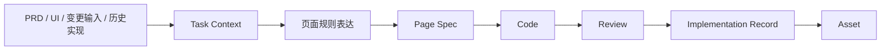
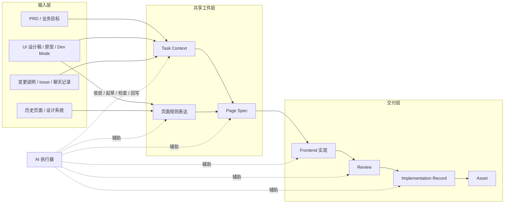
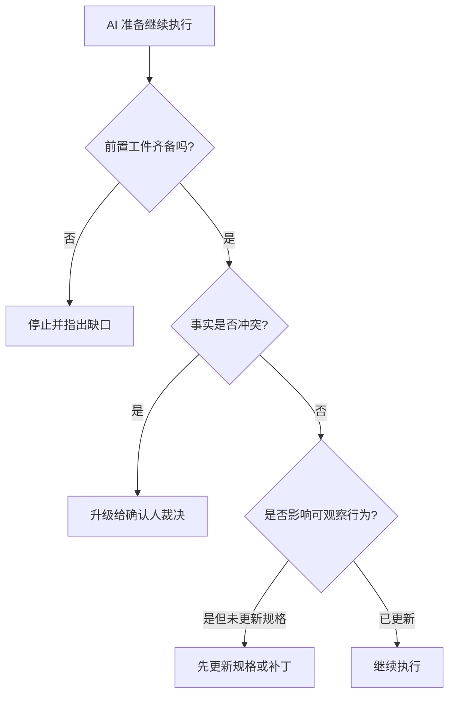

# UI到Frontend人机协同机制

## 机制定位

这份文档讨论的不是某一类模板怎么写，而是整条 `UI -> Frontend` 协同机制如何在 AI 时代运行。

它重点回答：

1. 一条真实任务从输入到代码如何流动
2. PRD、UI、前端、AI 和裁决方分别在什么节点参与
3. 共享工件如何逐层收敛事实
4. 哪些地方可以继续推进，哪些地方必须停下来校验

## 为什么必须先定义协同机制

如果没有一套清晰的人机协同机制，团队通常会退回到下面这种模式：

- PRD 和 UI 各自提供输入
- 前端自己把输入拼起来
- AI 从碎片里直接猜测
- review 再做最后兜底

这条路的问题不是大家不努力，而是系统没有定义“事实应该先落在哪，再怎么进入下一步”。

所以，AI 工程化的第一步不是自动化更多，而是先把链路定义清楚。

## 主链路总览

这条主链路表达的是一件事：

页面不会直接从设计稿跳到代码，而是必须经过共享工件的逐层收敛。

## 人机协同主流程图

这张图说明：

- 共享工件是系统的中间层
- AI 最重要的价值，不是在末端写代码，而是在中间层稳定参与
- review 和回写是闭环的一部分，不是附属动作

## 这条链路如何逐层收敛事实

### 第 1 层：输入层

输入层负责提供原始事实来源，包括：

- 业务目标和范围
- 设计结构和视觉参考
- 历史实现和设计系统约束
- 已上线页面的变更说明

输入层的问题是：事实多、格式杂、冲突多。

所以输入层不能直接成为 AI 和实现方的最终执行输入。

### 第 2 层：`Task Context`

`Task Context` 负责解决：

- 这次到底做什么
- 范围在哪里
- 哪些是约束
- 哪些还待确认

它是“任务事实层”。

### 第 3 层：页面规则表达

页面规则表达负责解决：

- 页面应该怎么组织
- 关键组件承担什么职责
- 关键状态、交互和响应式规则是什么

它是“页面规则层”。

### 第 4 层：`Page Spec`

`Page Spec` 负责解决：

- 当前页面有哪些 section
- section 用什么数据
- 状态和交互如何定义
- 当前行为事实是什么

它是“行为事实层”。

### 第 5 层：实现、review、回写

实现、review 和回写负责：

- 把规格变成代码
- 对照规则与规格做校验
- 把偏差、证据和资产候选回写系统

它是“交付闭环层”。

## 每一步的输入、输出、确认人与 AI 作用

| 阶段 | 主要输入 | 主要输出 | 默认确认人 | AI 作用 |
| --- | --- | --- | --- | --- |
| 输入收集 | PRD、UI、历史实现、变更说明 | 原始输入集合 | 需求侧 / UI 侧 | 归类、提取、整理 |
| 任务收敛 | 原始输入集合 | `Task Context` | 需求确认人 | 起草、补全、识别缺口 |
| 规则收敛 | `Task Context` + UI 输入 | 页面规则表达 | 页面规则确认人 | 起草、补全、结构化整理 |
| 规格形成 | `Task Context` + 页面规则表达 | `Page Spec` | 实现与回写负责人 | 生成、补全、patch 更新 |
| 实现 | `Page Spec` + 代码上下文 | Frontend 代码 | 实现与回写负责人 | 实现辅助、对照检查 |
| review | 规则、规格、实现、证据 | review 结论 | 交付裁决人 | 检查辅助、差异整理 |
| 回写 | review 结论 + 变更事实 | `Implementation Record` | 实现与回写负责人 | 初稿整理、资产候选提示 |

## 三种执行模式

### 标准模式

适用：

- 新页面
- 关键页面
- 复杂页面
- 多方需要清晰对齐的页面

链路：

`输入 -> Task Context -> 页面规则表达 -> Page Spec -> 实现 -> Review -> 回写`

### 轻量模式

适用：

- 小需求
- 成熟模式复用
- 局部功能调整

链路：

`输入 -> 任务摘要 / Spec patch -> 实现 -> Review -> 回写`

### 变更模式

适用：

- 已上线页面的后续改动
- 需要先判断影响的是规则、规格还是实现记录

链路：

`Change Request -> 影响层级判断 -> 更新对应工件 -> 实现 -> Review -> 回写`

## 进入实现前的控制点

工程化不是让链路一直流下去，而是让链路在关键节点被控制。

进入实现前，至少要满足：

1. 当前任务做什么、不做什么已明确
2. 当前页面结构和关键规则已有表达
3. 当前可观察行为已有规格表达或补丁表达
4. 默认确认人已明确

如果缺任何一项，默认停在规格整理阶段，不进入实现。

## AI 在链路中的停机点

这张图想说明：

- AI 不是“有输入就继续”
- AI 必须受控于共享工件和停机规则

## 这条链路为什么是 AI 工程化，而不是传统流程

关键差别不在于有没有流程图，而在于：

- 输入不再直接进前端
- 事实先进入共享工件
- AI 不再只在代码阶段参与
- review 和回写成为正式控制点
- 一次交付可以转化成长期可复用资产

如果缺少这些，就还只是传统流程加了一些说明文档。

## 一句话结论

`UI -> Frontend` 的 AI 工程化协同机制，本质上是用共享工件把输入、执行、校验和沉淀连接成一个可控制的系统，让 AI 和人都在同一事实层上协同工作，而不是继续依赖人脑拼接和人工兜底。

