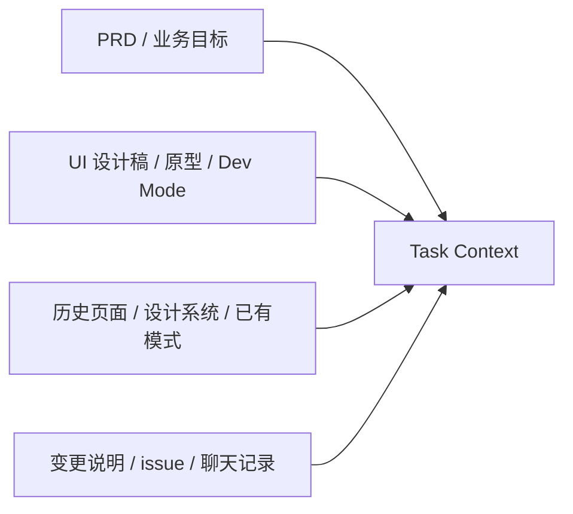

# 输入收敛与任务上下文规范

## 输入层定位

这份文档聚焦共享工件体系里的第一层问题：

1. 原始输入有哪些
2. 为什么原始输入不能直接成为实现输入
3. 如何把散乱输入收敛成 `Task Context`
4. `Task Context` 最少要表达什么、不能表达什么

## 为什么输入收敛是 AI 工程化的第一步

AI 的能力很强，但 AI 不是自动理解器。

如果原始输入仍然散落在：

- PRD
- Figma / 原型 / Dev Mode
- 会议纪要
- issue / 需求单
- 聊天记录
- 历史页面
- 已上线页面的变更说明

那么不管由人还是 AI 来执行，都会遇到同样的问题：

- 输入分散
- 事实冲突
- 目标和范围模糊
- 边界靠猜
- 后续 review 无法知道到底在对照哪一版事实

所以工程化的第一步，不是直接生成页面规则或代码，而是先把输入收敛成共享任务事实。

## 输入收敛总图



这张图想说明：

- 所有原始输入都要先进入 `Task Context`
- `Task Context` 是任务事实层，不是某个来源的复制品
- 输入收敛完成前，不应该直接进入页面规则表达、`Page Spec` 或代码实现

## 原始输入分层

| 输入源 | 主要提供什么 | 常见问题 |
| --- | --- | --- |
| PRD / 业务目标 | 目标、范围、成功标准、约束 | 结构和交互细节不足 |
| UI 设计稿 / 原型 | 页面结构、视觉参考、交互线索 | 行为事实和边界说明可能不足 |
| Dev Mode / 变量 | 组件、尺寸、样式线索 | 不适合单独承担页面规则定义 |
| 历史页面 / 设计系统 | 复用模式、已有实现、约束来源 | 容易被误当作本次需求事实 |
| 变更说明 / issue / 聊天 | 变更原因、特例、上下文补充 | 零散、口语化、容易漂移 |

## 什么是 `Task Context`

`Task Context` 是任务事实的第一层共享工件。

它的作用不是描述页面细节，而是让所有参与者先对下面几件事达成同一理解：

- 这次到底做什么
- 这次不做什么
- 影响哪些页面或模块
- 输入来源有哪些
- 本次关键变化是什么
- 约束和验收提示是什么
- 还有哪些待确认问题

## `Task Context` 负责什么，不负责什么

| `Task Context` 负责表达什么 | `Task Context` 不负责表达什么 |
| --- | --- |
| 任务目标 | 详细布局规则 |
| 范围边界 | 组件状态枚举细节 |
| 输入来源 | 最终文件结构 |
| 核心变化 | 技术实现方案 |
| 约束和验收提示 | 当前行为规格 |
| 待确认问题 | 具体 section 定义 |

## 最少字段

- `Task Name`
- `Goal`
- `Pages / Scope`
- `Input Sources`
- `Change Summary`
- `Scope`
- `Constraints`
- `Acceptance Hints`
- `Open Questions`（如有）

## 模板

```md
# Task Context

## Task Name
<任务名称>

## Goal
<本次要解决的问题与目标>

## Pages / Scope
- <页面或模块 1>
- <页面或模块 2>

## Input Sources
- PRD / 需求片段：
- Figma / 原型：
- 历史页面 / 设计系统：
- Issue / 需求单：
- 其他说明：

## Change Summary
- <本次核心变化 1>
- <本次核心变化 2>

## Scope
### In Scope
- <本次范围内内容>

### Out of Scope
- <本次不做内容>

## Constraints
- <业务约束 / 时间约束 / 合规约束>

## Acceptance Hints
- <验收提示 1>
- <验收提示 2>

## Open Questions
- <待确认问题，可为空>
```

## AI 在输入收敛阶段怎么参与

AI 可以参与：

- 提取原始输入中的目标、范围、约束和变化点
- 归类不同来源的信息
- 识别冲突、缺失和待确认项
- 生成 `Task Context` 初稿

AI 不应直接做：

- 代替需求确认人裁决冲突目标
- 在范围不清时跳过 `Task Context` 直接进入后续工件
- 把聊天记录中的口头说法直接视为最终事实

## 什么时候输入收敛算完成

看完 `Task Context` 后，参与者至少应能回答：

- 本次到底做什么、不做什么
- 哪些输入是主要来源
- 哪些页面或模块受影响
- 关键约束和验收提示是什么
- 还有哪些问题必须先确认

## 一句话结论

输入收敛不是把材料搬运成文档，而是把原始输入升级成共享任务事实；没有 `Task Context`，后续规则、规格、实现和 review 都没有稳定起点。


