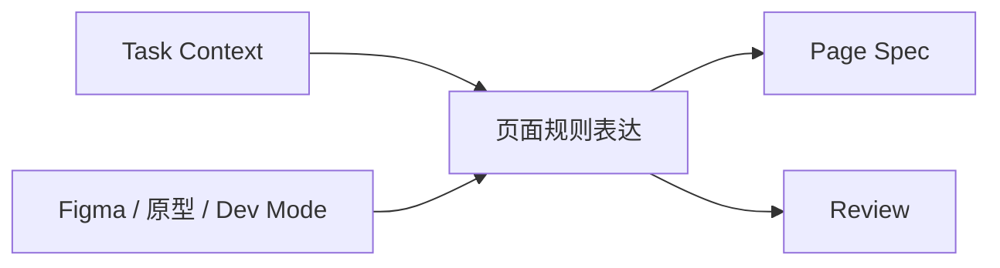

# 页面规则表达规范

## 规则层定位

这份文档聚焦共享工件体系里的第二层问题：

1. 页面规则表达是什么
2. 它和 Figma、`Task Context`、`Page Spec` 的关系是什么
3. 它最少要表达哪些规则
4. 为什么它是 UI 到 Frontend 之间的关键承接层

## 为什么不能让 Figma 直接承担页面规则定义

Figma 是重要输入源，但它不是唯一事实源。

Figma 可以很好地提供：

- 视觉参考
- 组件和变量线索
- 页面结构线索
- 交互提示

但 Figma 很难单独稳定承载：

- 组件职责边界
- 页面级与组件级状态划分
- 行为上的 through path / fallback 规则
- 响应式策略和内容约束
- 评审时可直接核对的工程规则

所以，在 AI 工程化体系里，UI 侧的重要输出不再只是“设计稿”，还包括“页面规则表达”。

## 页面规则表达在系统中的位置



这张图想说明：

- 页面规则表达承接任务事实和设计事实
- 它既服务 `Page Spec` 形成，也服务 review 对照
- 没有这一层，系统会退回“设计稿 -> 代码”的粗糙模式

## 页面规则表达负责什么

页面规则表达负责承接：

- 页面结构
- 关键组件职责
- 页面与组件状态
- 关键交互
- 响应式与内容约束
- 设计系统依赖

它也可以叫 `Design Contract`，重点不是名字，而是它必须能被实现和评审使用。

## 页面规则表达不负责什么

- 不负责表达任务背景和范围边界，那是 `Task Context` 的职责
- 不负责表达当前行为事实，那是 `Page Spec` 的职责
- 不负责表达最终代码结构和文件落点
- 不负责代替实现记录去解释偏差和证据

## 与其他共享工件的边界

| 工件 | 主要回答什么 |
| --- | --- |
| `Task Context` | 这次做什么、不做什么 |
| 页面规则表达 | 这个页面应该如何组织和运行 |
| `Page Spec` | 当前页面实际有哪些可观察行为 |
| `Implementation Record` | 最终怎么实现、有什么偏差 |

## 什么时候需要完整页面规则表达

建议显式产出完整页面规则表达的场景：

- 新页面
- 结构和交互较复杂
- 设计规则不能只靠设计稿默认理解
- 页面特例较多
- 需要 UI、前端、AI 和评审多人共同对齐

## 核心字段

| 字段 | 作用 |
| --- | --- |
| `Page` | 页面名称 |
| `Goal` | 页面目标 |
| `Layout` | 整体结构和区域划分 |
| `Components` | 关键组件 |
| `Component Contracts` | 组件职责、状态、交互和约束 |
| `Page States` | 页面级状态 |
| `Key Interactions` | 关键交互链路 |
| `Responsive Strategy` | 多端策略 |
| `Design System Dependencies` | 设计系统依赖 |

## 模板

```md
# 页面规则表达

## Page
<页面名称>

## Goal
<本页面在用户流程中的作用>

## Layout
<页面整体布局方式、区域划分>

## Components
- <组件 1>
- <组件 2>

## Component Contracts
### Component: <组件名>
#### Purpose
<组件职责>

#### Props
- <关键输入项>

#### States
- <loading / empty / error / ready / disabled ...>

#### Interactions
- <触发 -> 结果 -> 反馈>

#### Responsive Rules
- <不同端规则>

#### Content Constraints
- <文案长度 / 换行 / 截断 / 格式>

## Page States
- <页面级状态>

## Key Interactions
- <关键交互链路>

## Responsive Strategy
<桌面端 / Pad / Mobile 的整体策略>

## Design System Dependencies
- <依赖的设计系统组件 / token / 模式>
```

## AI 在页面规则表达阶段怎么参与

AI 可以参与：

- 从 Figma、原型和历史页面里提取规则线索
- 把设计线索整理成结构化规则表达
- 检查页面结构、组件职责、状态和交互是否完整
- 标记规则冲突和缺口

AI 不应直接做：

- 用设计稿像不像来替代规则表达
- 在页面规则未明确时直接生成最终代码
- 代替 UI 或确认责任人对规则做最终裁决

## 为什么当前更推荐“UI 页面规则确认卡”

如果直接要求 UI 输出完整页面规则表达，实际落地成本通常偏高。

当前阶段更推荐的做法是：

- AI 先基于 Figma、标注、口头说明和历史页面生成 `UI 页面规则确认卡`
- UI 只确认结构、状态、交互、展示规则、边界例外和适配要求
- 前端和 AI 再基于确认卡升级成更完整的页面规则表达

配套模板建议参考：

- `docs/17-UI页面规则确认卡模板.md`

## 页面规则表达完成后的判断标准

看完页面规则表达后，参与者至少应能回答：

- 页面结构是什么
- 关键组件分别负责什么
- 有哪些关键状态和交互
- 响应式和内容限制是什么
- 哪些规则来自设计系统，哪些属于页面特例

## 一句话结论

页面规则表达的价值，不是重复设计稿，而是把 UI 侧的页面理解转成 AI 和实现方都能稳定消费的工程规则。


