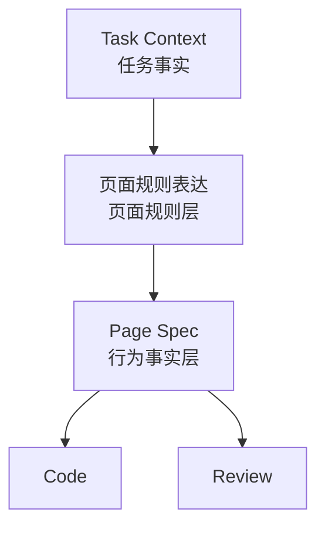
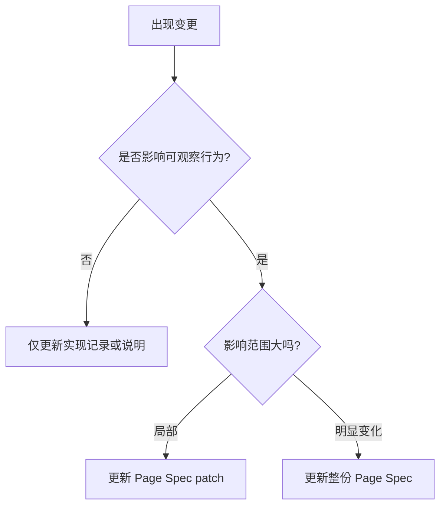

# 页面规格与变更同步规范

## 规格层定位

这份文档聚焦共享工件体系里的第三层问题：

1. `Page Spec` 是什么
2. 为什么它是 AI 和实现方的主执行输入
3. 它和页面规则表达的关系是什么
4. 页面变更后如何同步 `Page Spec` 或 patch

## `Page Spec` 在系统里的位置

在这套 AI 工程化系统里：

- `Task Context` 负责任务事实
- 页面规则表达负责页面规则
- `Page Spec` 负责当前可观察行为事实

也就是说，`Page Spec` 不是背景说明，也不是设计稿摘要；它是页面当前行为的标准表达。

## 规则层和规格层的关系



这张图想说明：

- 页面规则表达定义“应该如何组织”
- `Page Spec` 定义“当前有哪些行为事实”
- 实现和 review 都优先对照规格层，而不是对照碎片输入

## 为什么 AI 的主输入应该是 `Page Spec`

因为 AI 需要的是：

- 结构化
- 可对照
- 可检查
- 可更新

相较于设计稿或聊天记录，`Page Spec` 更适合作为 AI 和实现方的主执行输入，因为它能明确表达：

- 页面如何拆 section
- section 用什么数据
- 状态和交互如何定义
- 权限和 tracking 如何处理

## 谁来写 `Page Spec`

当前阶段最推荐的方式不是人工从零手写，而是：

`AI 生成 ` + `人审核`

更具体地说：

- AI 根据 `Task Context`、UI 页面规则确认卡、页面规则表达和历史资产生成 `Page Spec` 草稿
- 前端负责确认 Spec 是否可实现、是否缺字段
- 产品 / UI / 负责人只在关键差异点上做裁决

这样做的原因很现实：

- 人力有限，纯人工维护很难长期坚持
- `Page Spec` 本质上是结构化整理任务，天然适合 AI 起草
- 只要裁决责任仍然在人，系统就不会退化成自由生成

更适合当前阶段的模板建议参考：

- `docs/18-Page-Spec-MVP模板.md`

## 核心字段

| 字段 | 作用 |
| --- | --- |
| `page` | 页面唯一标识 |
| `route` | 页面路由 |
| `layout` | 页面布局类型 |
| `permissions` | 页面权限要求 |
| `states` | 页面级状态 |
| `dataSources` | 页面依赖数据源 |
| `sections` | 页面区块结构 |
| `interactions` | 页面关键交互 |
| `tracking` | 埋点事件 |

## 最少模板

```json
{
  "page": "<page-name>",
  "route": "<route-path>",
  "layout": "<layout-type>",
  "permissions": ["<permission-key>"],
  "states": ["loading", "empty", "error", "ready"],
  "dataSources": [],
  "sections": [],
  "interactions": [],
  "tracking": []
}
```

## section 最少要写什么

每个 section 至少建议有：

- `type`
- `title`
- `dataSource`
- `fields`
- `actions`
- `states`
- `responsive`

## interaction 最少要写什么

每条 interaction 至少建议有：

- `name`
- `trigger`
- `result`
- `feedback`
- `fallback`

## 什么时候需要完整 `Page Spec`

建议显式产出完整 `Page Spec` 的场景：

- 标准模式任务
- 新页面
- 当前行为变化较大
- 需要多人共同 review
- 需要 AI 稳定参与生成、检查和回写

## 小需求怎么同步

小需求不一定需要重写整份 `Page Spec`，但只要影响以下任一事实，就应同步行为规格：

- 页面结构
- section 增减或重排
- 数据源
- 字段展示规则
- 状态
- 交互
- 权限
- 埋点
- 路由
- 响应式规则

## `Page Spec patch` 最少字段

```json
{
  "changeSummary": "<这次改了什么>",
  "affectedSections": ["<section-type>"],
  "affectedStates": ["<state>"],
  "affectedInteractions": ["<interaction-name>"],
  "decision": "<更新整份 spec / 更新 patch / 仅记录实现偏差>",
  "updatedBy": "<确认人或执行器>"
}
```

## 变更判断图



## 当规则与规格冲突时怎么处理

不能直接靠实现结果裁决。

先判断冲突属于哪一层：

- 如果是页面如何组织、组件职责、交互规则冲突，先更新页面规则表达
- 如果是当前行为事实冲突，先更新 `Page Spec`
- 如果只是实现与规格不一致，优先修实现或记录偏差，不直接反向修改规则或规格

## 一句话结论

`Page Spec` 不是装饰性文档，它是这套 AI 工程化系统中的行为事实层；行为变了，规格就必须跟着变。


