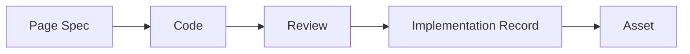

# 实现、评审与回写规范

## 闭环控制定位

这份文档聚焦共享工件进入交付闭环后的控制问题：

1. 什么时候可以进入实现
2. review 到底对照什么
3. 偏差如何处理
4. `Implementation Record` 为什么是闭环的一部分

## 闭环总图



这张图想说明：

- 代码不是闭环终点
- review 和回写不是附属动作
- 没有回写，这条链路就不能形成可复用能力

## 进入实现前的闸门

进入实现前，至少要满足：

1. 当前任务做什么、不做什么已明确
2. 当前页面结构和关键规则已有表达
3. 当前可观察行为已有规格表达或补丁表达
4. 默认确认人已明确

如果缺少其中任一项，默认停在规格整理阶段，不进入实现。

## 实现阶段应该怎么理解

实现阶段不是“前端自由发挥”，而是“基于共享工件落实当前行为事实”。

实现阶段重点回答：

- 如何让代码与 `Page Spec` 一致
- 如何处理规则和规格约束
- 发生偏差时如何记录而不是偷偷改写事实层

## review 到底对照什么

review 对照的，不应只是“设计稿像不像”，而应包括：

- 当前任务理解结果
- 当前页面规则表达
- 当前行为规格表达
- 当前实现结果
- 当前回写记录

## Review Checklist 模板

```md
# Review Checklist

## Basic Information
- 需求名称：
- 页面 / 模块：
- 评审人：
- 评审日期：
- 当前任务理解结果：
- 当前页面规则表达：
- 当前行为规格表达：
- 对应实现记录：

## 一、输入事实是否齐备
- [ ] Task Context 已齐备
- [ ] 页面规则表达已齐备
- [ ] 行为规格表达已齐备
- [ ] Implementation Record 已开启
- [ ] 评审证据已准备

## 二、对照页面规则
- [ ] 页面整体结构一致
- [ ] 关键组件列表一致
- [ ] 状态覆盖完整
- [ ] 关键交互链路一致
- [ ] 响应式规则已验证
- [ ] 设计系统依赖按要求复用

## 三、对照当前行为规格
- [ ] `page` / `route` / `layout` 一致
- [ ] `sections` 一致
- [ ] `dataSources` 一致
- [ ] `states` 一致
- [ ] `interactions` 一致
- [ ] `permissions` 已处理
- [ ] `tracking` 已处理或有说明

## 四、工程质量与回写
- [ ] 文件映射清晰
- [ ] 偏差项已记录
- [ ] 评审结论可追溯
- [ ] 资产候选已判断
```

## 通过条件和驳回条件

| 类型 | 条件 |
| --- | --- |
| 通过条件 | 关键结构、状态、交互一致；必要偏差已记录并被接受；Implementation Record 完整；资产候选已判断 |
| 驳回条件 | 缺少关键事实表达；关键结构或行为与规则/规格不一致；状态和交互明显缺失；偏差无记录；无法提供可复现证据 |

## 偏差处理

当实现与当前页面规则或当前行为规格不一致时，必须：

1. 记录偏差点
2. 记录原因
3. 记录裁决结果
4. 决定更新规则、更新规格，还是退回修改实现

## `Implementation Record` 的作用

`Implementation Record` 不是事后总结材料，而是交付回写工件。

它负责记录：

- 最终实现事实
- 偏差与裁决
- review 证据
- 资产候选

## `Implementation Record` 最少应包含

- `Feature`
- `Related Specs`
- `Pages`
- `Components`
- `Technical Decisions`
- `File Mapping`
- `State and Interaction Notes`
- `Deviations`
- `Review Evidence`
- `Asset Candidates`

## 模板

```md
# Implementation Record

## Feature
<功能名称>

## Related Specs
- Task Context：<路径或名称>
- 页面规则表达：<路径或名称>
- Page Spec：<路径或名称>
- Spec Patch: <如有>

## Pages
- <页面 1>

## Components
- <组件 1>
- <组件 2>

## Technical Decisions
- <关键技术决策 1>
- <关键技术决策 2>

## File Mapping
- <页面 / 组件 -> 文件路径>

## State and Interaction Notes
- <关键状态与交互实现说明>

## Deviations
- <偏差项 / 原因 / 裁决>

## Review Evidence
- <截图 / 录屏 / 测试 / 对照结果>

## Asset Candidates
- <候选资产 / 类型 / 是否建议升级 / 维护人>
```

## 变更申请在这层怎么使用

`Change Request` 是进入变更模式的统一入口。

当变更发生时，先判断影响的是：

- 任务目标
- 页面规则
- 行为规格
- 实现记录

再进入实现，而不是先改代码再补文档。

## 一句话结论

实现、review 与回写构成的是一个控制闭环：实现负责落地，review 负责校验，Implementation Record 负责把一次交付变成可追溯、可沉淀的系统事实。


