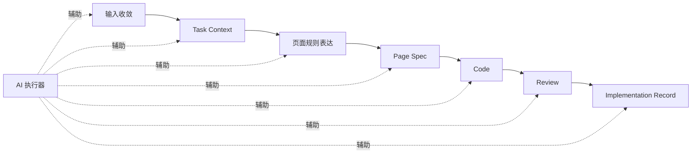
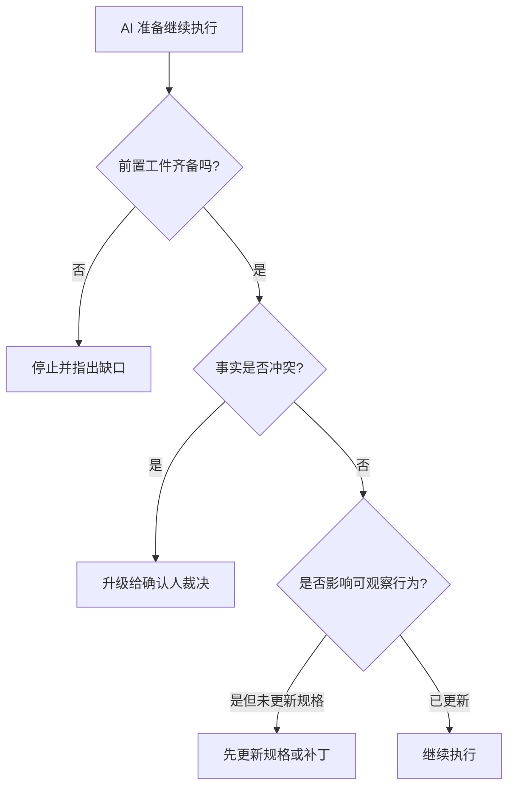

# AI执行器接入与工作边界

## AI接入定位

这份文档聚焦 AI 如何真正进入这套交付系统，而不是只做零散助手：

1. AI 在系统中的标准参与点是什么
2. AI 至少需要具备哪些能力
3. AI 什么时候可以继续推进，什么时候必须停下
4. AI 和人的边界在哪里

## AI 在系统中的位置

AI 在这套方案里不是外挂工具，而是标准参与者。

它参与的不是某一个步骤，而是整条链路中的多个环节：

- 输入收敛
- 任务理解
- 页面规则起草
- `Page Spec` 生成 / 更新
- 实现辅助
- review 辅助
- 回写辅助
- 资产候选提取

## AI 参与点总图

## AI 执行器至少需要具备什么能力

任何 AI 工具，只要能满足下面 6 项能力，就可以接入这套体系：

1. 能读取统一输入
2. 能读取项目代码上下文
3. 能输出结构化任务理解
4. 能生成或更新当前行为规格
5. 能执行基础验证
6. 能输出回写记录

这套体系约束的是能力和协议，不锁定具体工具。

## AI 的标准职责

AI 执行器负责：

- 读取统一输入和项目上下文
- 起草或补全 `Task Context`
- 起草或补全页面规则表达
- 生成或更新 `Page Spec`
- 生成最小任务规格或 `Page Spec patch`
- 生成实现辅助内容
- 整理 review 证据和 `Implementation Record` 初稿
- 提示资产候选与相似历史模式

## AI 不负责什么

- 代替确认责任人做最终判断
- 在事实表达缺失时直接给出最终结论
- 绕过 review 直接宣布交付完成
- 用工具自己的习惯替代统一工程协议
- 在没有裁决的情况下把实现结果反向写成系统事实

## AI 的推荐读取顺序

AI 执行器参与任务时，推荐按以下顺序读取上下文：

1. 原始输入包或需求来源
2. `Task Context`
3. 页面规则表达（`Design Contract`）
4. `Page Spec`、`Page Spec patch` 或最小任务规格
5. 设计系统 / 既有代码上下文 / 资产库
6. `Implementation Record`（如为迭代或变更）

## AI 的停机与升级规则

AI 执行器遇到下面任一情况时，默认停止继续生成最终代码，先指出缺口并升级给确认人：

1. 缺少 `Task Context`、页面规则表达、`Page Spec` 或其等价物
2. 不同输入源对任务目标、页面结构或当前行为事实表达冲突
3. 影响页面可观察行为，但尚未确认是否更新页面规格
4. 无法判断本次应走标准模式、轻量模式还是变更模式
5. 需要替确认责任人做事实裁决

## 停机决策图

## AI 如何与人协同，而不是替代人

| 场景 | AI 更适合做什么 | 人必须做什么 |
| --- | --- | --- |
| 输入散乱 | 提取、整理、归类、补草稿 | 确认目标和边界 |
| 页面规则复杂 | 结构化整理、补完整性 | 确认规则是否成立 |
| `Page Spec` 更新 | 生成 patch、检查遗漏 | 确认行为事实是否接受 |
| review | 整理差异、检查一致性 | 做签收和偏差裁决 |
| 回写 | 生成初稿、提炼资产候选 | 确认最终记录和沉淀结论 |

## 一句话结论

AI 执行器不是为了替代人，而是为了把原本依赖人力堆叠的收敛、检查、回写和提炼工作纳入系统能力；但边界确认、例外裁决和最终签收仍然必须由人负责。

