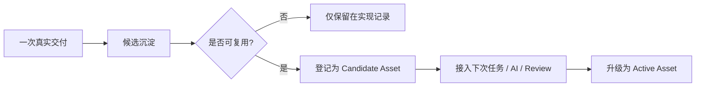

# 资产沉淀与升级规则

## 资产定位

这份文档聚焦：一次真实交付怎样转化成长期可复用的 AI 工程化能力。

它重点回答：

1. 什么才算资产
2. 哪些东西值得升级成资产
3. AI 工程化时代的资产类型有哪些
4. 资产升级后如何接入后续任务、AI 或 review

## 为什么资产化是工程化的一部分

如果每次交付都只结束在“页面做完了”，系统能力就不会增长。

AI 工程化的一个关键特征，是让一次真实交付形成后续可直接消费的沉淀对象。

所以，资产化不是附加动作，而是系统闭环的一部分。

## 为什么资产积累是最核心的提效方式

这套系统真正的提效，不是只靠本次任务更快完成，而是靠资产积累让后续任务越来越不需要从零开始。

资产积累带来的直接收益包括：

- 相似页面可以直接复用结构和规格写法
- AI 可以优先使用已验证的资产，而不是每次自由生成
- 评审可以直接对照既有规则和资产
- 团队可以用“借鉴已有资产”替代“重新理解一遍”

所以从长期看，提效的核心是：

`做一个项目 -> 积一批资产 -> 后续项目越来越快、越来越稳`

## 什么才算资产

先用这条判断：

没有明确消费入口、没有维护人、不能被下次任务继续用的沉淀，不算资产。

## 资产流转图

## AI 工程化时代有哪些资产类型

| 资产类型 | 用来放什么 |
| --- | --- |
| `pattern` | 页面结构、状态、交互骨架 |
| `spec` | 模板、schema、规格字段 |
| `theme` | 主题值、视觉值、品牌风格 |
| `adapter` | 同一 pattern 在不同端的映射关系 |
| `kit` | 组件实现、renderer、具体封装 |
| `rule` | review、lint、validator 规则 |
| `case` | 试点包、闭环案例、反例 |
| `ai-asset` | prompt 约束、workflow 约束、checker 规则、回写模板 |
| `registry` | 资产登记与消费入口 |

## 资产的消费方式应该是什么

资产不是放在目录里“供人翻阅”，而应该逐步形成可消费能力，例如：

- 项目执行时可直接选择高频模板和 pattern
- AI 执行时优先调用已验证的 spec、rule、ai-asset
- review 时自动对照既有规则和资产
- 平台化后可在线选择页面模板、组件组合和规则组合

## 资产应该先放哪里

当前阶段最稳妥的原则是：

`项目里先验证，公共层再复用，平台层最后消费`

也就是说：

- 页面执行包和单页上下文优先保留在项目仓
- 稳定复用后的模板、pattern、rule、case 再升级到公共仓
- 未来平台优先消费公共层已稳定资产，而不是直接消费零散项目事实

目录分层建议可参考：

- `docs/19-资产落库与目录分层建议.md`

## 哪些东西值得升级

满足下面任一情况，就可以进入候选：

- 多个页面反复出现同一种页面结构
- 多次出现同一种 `Page Spec` 写法
- 多个项目反复出现同一种 theme key
- 多个页面反复拼同一组组件组合
- review 反复出现同一条检查规则
- AI 反复依赖同一条 prompt 或 workflow 约束
- 同一种回写方式、patch 方式或检查器逻辑被多次证明有效

## 先判断它属于哪一层

| 如果差异主要是 | 应升级到 |
| --- | --- |
| 页面结构、状态、交互骨架 | `pattern` |
| 主题值、视觉值、品牌风格 | `theme` |
| 同一 pattern 在不同端的映射方式 | `adapter` |
| 组件实现、renderer、具体封装 | `kit` |
| 规格字段、模板、schema | `spec` |
| review、lint、validator 规则 | `rule` |
| 可复用案例 | `case` |
| AI 约束、workflow、checker | `ai-asset` |

## 资产升级流程

1. 在 `Implementation Record` 里登记候选
2. 判断它属于哪一类资产
3. 指定维护人和消费入口
4. 先在下一次任务或 AI workflow 中试消费
5. 复用稳定后再升级为 active

## 为什么还要继续做分级门槛

本篇解决的是“资产化意识”和“资产类型”；
如果要进入执行治理，还需要继续回答：

- 项目资产和共享资产怎么区分
- 谁在不同阶段拥有维护责任
- 什么时候才值得进入平台层

这些内容建议配合阅读：

- `docs/16-资产分级与升级门槛.md`

## 升级后必须做的事

资产升级后，还必须接一个消费入口：

- AI 生成时优先使用它
- review 时检查是否复用它
- 模板、CLI 或 workflow 默认加载它

如果没有消费入口，资产目录只会越堆越多。

## 推荐节奏

- 每次需求结束后：登记候选
- 每周：审一次候选
- 每月：清一次废弃资产和无人使用资产

## 一个最容易错的例子

如果两个后台列表页只是视觉风格不同：

- 保持一个 `list-page` pattern
- 拆成两套 `theme`
- 必要时按端拆 `kit`

不要因为换了一套皮肤，就复制两份列表 pattern。

## 一句话结论

资产沉淀的目标不是把目录堆大，而是让一次真实交付变成后续任务、AI 和 review 都能直接消费的系统能力。

