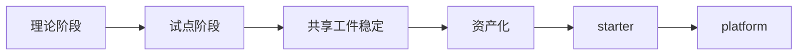

# 平台起步与后续演进

## 演进定位

这份文档聚焦：当这套 AI 工程化系统已经通过试点验证后，后续应该怎样逐步演进，而不是一开始就做成大平台。

它重点回答：

1. 为什么平台化一定要滞后于试点闭环
2. 什么时候值得做 starter
3. 什么时候值得做平台化目录和工具
4. 什么阶段不该做什么

## 与主系统的关系

这份文档不是当前阶段的执行起点。

默认顺序是：

1. 先用 `docs/00` 到 `docs/10` 跑通 AI 工程化交付系统
2. 再判断哪些共享工件、模板和规则已经稳定到适合沉淀成 starter 或平台资产

也就是说：

- 本文回答的是“系统跑通以后怎么长”
- 不是“系统还没跑通时就先按平台方式设计”

## 当前系统与未来平台的边界

当前阶段建设的是 AI 工程化交付系统；
长期阶段可能建设的是类似 V0 的资产消费平台。

两者不是同一个东西，但存在明确关系：

- 当前系统负责从真实项目中生产、校验和沉淀资产
- 未来平台负责消费这些资产，并把它们转化成更广泛用户可使用的生成能力

如果没有前者，后者很容易退化成：

- 没有企业约束的自由生成
- 没有共享规则的零散模板堆积
- 没有 review 和回写闭环的短期工具

## 演进成熟度图

## 为什么不能一开始就做大平台

因为在 AI 工程化早期，最不确定的不是目录结构，而是：

- 共享工件是否稳定
- AI 在哪些节点真正有效
- 哪些规则可以被复用
- 哪些资产值得长期维护

如果这些问题还没稳定，就先做大平台，通常会出现：

- 抽象过早
- 目录复杂但无人使用
- 平台资产与真实交付脱节
- 团队把平台化误解成额外负担

## 平台化前必须先稳定的对象

至少先稳定下面这些东西：

- `Task Context` 模板与输入收敛方式
- 页面规则表达的字段和表达方式
- `Page Spec` 的最少字段与 patch 规则
- review 和回写的默认结构
- 资产候选和消费入口的基本做法
- AI 的标准参与点和停机规则

## 第一阶段：最小 starter

当上面的对象已经被多个真实任务复用时，可以收敛成最小 starter。

最小 starter 只保留最有价值的共性对象，例如：

- 一份任务上下文模板
- 一份 `Page Spec` 模板或 schema
- 一组高频 pattern
- 一份资产登记入口

starter 的目标不是“看起来完整”，而是“今天就能帮助团队开始下一个真实任务”。

## 第二阶段：最小平台

当 starter 跑通后，再考虑形成最小平台结构。

这个阶段的目标是：

- 让 pattern、spec、rule、ai-asset 不再只停留在案例中
- 开始被多个真实任务稳定复用

## 第三阶段：补自动化与执行层能力

当共享工件和资产已经稳定，再补：

- validator
- checker
- workflow
- 轻量 CLI
- starter 同步机制

这个阶段的重点是让系统更自动，而不是让目录更复杂。

## 第四阶段：正式平台化

只有当下面这些信号同时出现，才值得进入正式平台化：

1. 已经不只一个团队在复用这套共享工件和资产
2. AI 接入方式、checker 和 workflow 已经相对稳定
3. 试点指标已经证明这套系统有持续价值
4. 资产维护责任已经明确

从执行上看，这 4 个信号本质上对应的是：

- `L1` 项目资产已经持续升级为 `L2` 共享资产
- `L2` 共享资产已经开始需要统一的 schema、版本和消费入口

具体分级与升级门槛建议参考：

- `docs/16-资产分级与升级门槛.md`

## 长期目标应该长成什么样

长期目标不是只做一个“资产目录”，而是把资产升级成真正的平台能力。

理想状态下，这些能力可以逐步出现：

- 在线选择页面模板和 pattern
- 在线选择或组合高频组件和规则
- AI 基于企业资产底座生成页面骨架、规格和实现草稿
- 为类似 V0 的生成体验提供企业级、可控、可校验的资产基础

也就是说，长期目标不是“平台里有资产”，而是：

`平台能消费资产，AI 也能消费资产`

## 长期平台能力的 4 个子能力

长期平台不必一开始就定义成单一产品，而更适合定义成一组能力集合：

| 能力 | 说明 |
| --- | --- |
| 资产选择能力 | 在线选择模板、pattern、组件、规则、ai-asset |
| 输入收敛能力 | 将自然语言需求、业务目标、草图输入收敛成结构化意图 |
| Spec 生成能力 | 基于资产组合生成结构化 spec 或页面骨架 |
| 受控生成能力 | 基于企业资产底座生成实现草稿，并受规则、checker、workflow 约束 |

这张表想说明：

- 长期目标不只是“做一个生成器”
- 而是“做一个建立在企业资产底座上的受控生成平台”

## 各阶段该做和不该做什么

| 阶段 | 该做什么 | 不该做什么 |
| --- | --- | --- |
| 理论阶段 | 明确建设目标、共享工件、角色边界 | 先做大平台 |
| 试点阶段 | 跑真实任务、记录指标、回写资产 | 追求全自动 |
| 资产化阶段 | 提炼 pattern/spec/rule/ai-asset，明确平台底座对象 | 过早抽象所有场景 |
| starter 阶段 | 固化最小高频对象 | 把所有能力塞进 starter |
| 平台阶段 | 增加在线模板选择、资产消费、validator/workflow/tooling | 用平台目录替代真实交付验证 |

## 一句话结论

平台化不是这套系统的起点，而是试点、共享工件、AI 参与方式和资产沉淀都已经稳定后的自然结果。

