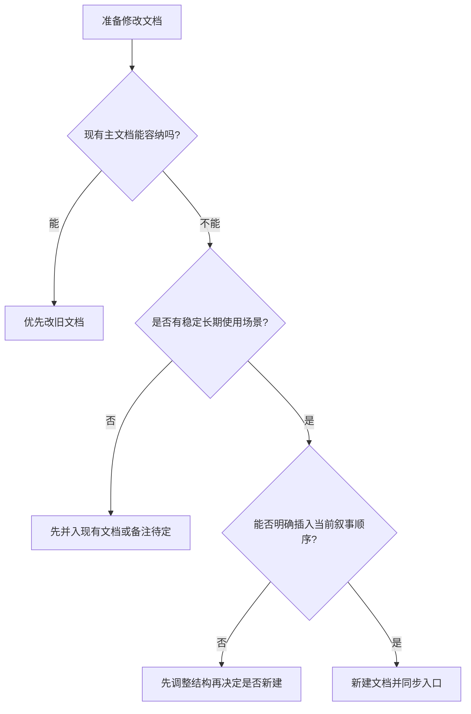

# 文档治理规则

## 治理定位

这份文档聚焦：当这套 AI 工程化系统持续演进时，docs 应该如何保持清晰、可执行、可讲解，而不是越写越散。

## 核心原则

1. 一个问题只保留一个主文档
2. 能并入旧文档就不新建
3. AI 可以起草，但边界和结论必须有人确认
4. 仓库入口必须唯一；当前以 `docs/00` 作为总起点
5. 图和表不是装饰，它们是讲解和对齐的一部分

## 文档分层

| 层级 | 代表文档 | 主要作用 |
| --- | --- | --- |
| 方案层 | `docs/00` - `docs/01` | 解释为什么做、系统是什么 |
| 协同层 | `docs/02` - `docs/03` | 解释谁协同、链路怎么运行 |
| 执行层 | `docs/04` - `docs/08` | 解释共享工件、控制点、AI 边界 |
| 演进层 | `docs/09` - `docs/11` | 解释试点、资产、平台演进 |
| 治理层 | `docs/12` | 解释如何维护整套文档 |
| 对齐层 | `docs/13` | 面向 UI / PRD / 高层做汇报和讲解提纲 |
| 运营层 | `docs/14` - `docs/20` | 解释试点执行、模板、资产落库和首轮实践 |

## 什么时候新建文档

只有同时满足下面 3 条，才建议新建：

1. 现有主文档装不下这部分内容
2. 新内容有稳定、独立的长期使用场景
3. 新内容能明确插入当前叙事顺序

否则优先改旧文档。

## 每篇文档至少应包含什么

为了便于对齐和讲解，建议每篇主文档至少包含：

- 一个开场定位段，说明这份文档主要解决什么
- 关键定义或边界
- 至少 1 张解释主问题的图
- 至少 1 个帮助比较或裁决的表
- 一句结论或行动建议

## 文档变更决策图

这张图想说明：

- 新建文档不是默认动作
- 文档治理的第一原则始终是保持叙事和执行口径稳定

## 图文使用原则

- 图优先解释结构、关系、控制点和演进路径
- 表优先解释职责、差异、字段、判断标准
- 每张图只解释一个问题
- 图下最好补一句说明，解释这张图的核心意图
- 高层看的图侧重价值和系统结构
- 执行层的图侧重工件、控制点和停机点

## 发布前最小检查

每次正式修改后，至少检查：

1. 是否改到了真正的主文档
2. 文档标题、编号和叙事顺序是否仍然成立
3. 是否影响图、表和核心口径的一致性
4. 是否影响共享工件、试点、资产或平台演进文档

## 变更分级

| 等级 | 典型变化 | 最小要求 |
| --- | --- | --- |
| `C0` | 错字、格式、死链 | 当前文件自检 |
| `C1` | 表述澄清、轻量精简 | 同步相关图表和引用 |
| `C2` | 字段、模板、检查清单、流程细节变化 | 同步相关执行层与演进层文档 |
| `C3` | 核心原则、责任边界、编号结构、平台方向变化 | 同步全套顶层口径 |

## 推荐复审节奏

- 每次试点后：补一次缺项和偏差
- 每周：清一次零散修订和死链
- 每月：查一次重复内容、过时内容和图表一致性
- 每季度：判断哪些文档该合并、归档或重组

## 归档规则

以下内容应优先归档：

- 已被主文档完全吸收的解释型文档
- 与现行系统脱节的旧模板
- 失去消费入口的历史案例
- 被新版系统设计替代的旧平台说明

归档时只做 3 件事：

1. 从主阅读顺序中移除
2. 在文档顶部标状态
3. 在替代文档里给出新的消费入口

## 一句话结论

文档治理的目标不是把文档越写越多，而是始终让这套 AI 工程化系统的叙事、协议、图文和执行规则保持同一口径。

