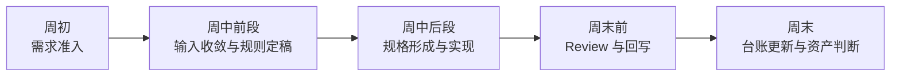

# 项目准入与试点运营清单

## 文档定位

这份文档不是再补一层“流程说明”，而是把这套 AI 工程化体系真正落到项目启动、协同执行和试点运营上。

如果 `docs/00` 到 `docs/13` 解决的是“为什么做、系统怎么定义、角色怎么协同”，那么这份文档解决的是：

- 什么样的项目适合先进入试点
- 一个试点应该以什么粒度启动
- 团队在执行时必须遵守哪些铁律
- UI、PRD、前端、AI 在每个固定节点上如何协同

## 默认实践单位：单页面

短期阶段最适合落地的最小实践单位，不是整条业务线，也不是完整系统，而是：

`一个真实页面`

原因很简单：

- 页面足够具体，便于把输入收敛成共享工件
- 页面足够完整，能够覆盖 UI 到 Frontend 的协同闭环
- 页面足够轻量，便于在有限周期内完成 review、回写和资产判断
- 页面粒度最适合比较“前后两次是否变得更快、更稳、更可复用”

如果一开始就以“一个复杂业务域”作为最小单位，系统很容易在试点阶段被跨团队协同成本拖垮。

## 为什么需要项目准入机制

AI 工程化不是“任何需求都能立即接入”的万能开关。

如果没有准入机制，团队很容易出现 3 类典型问题：

- 把输入极度模糊、边界不清的需求直接交给 AI 和前端，最后又回到人工救火
- 把高耦合、跨系统、大流程需求当成首批试点，导致试点无法证明方法本身
- 把“页面已经做完”误认为“工程系统已经跑通”，忽略回写和资产沉淀

所以项目准入的目的，不是增加门槛，而是保护试点质量。

## 三类项目分级

建议把进入体系的需求先分为 3 类：

| 分类 | 定义 | 是否纳入当前试点 |
| --- | --- | --- |
| `P1` 试点优先项目 | 输入相对清晰、页面边界稳定、中等复杂度、可在 1 个周期内闭环 | 是，优先 |
| `P2` 跟随项目 | 页面边界较清晰，但部分规则仍需补齐，适合轻量模式跟跑 | 是，次优先 |
| `P3` 暂不纳入项目 | 跨系统强耦合、目标频繁变化、输入严重缺失、无法明确签收人 | 否，先补输入 |

### `P1` 的推荐识别信号

优先选择下面这类任务进入首批试点：

- 后台列表页、详情页、中等复杂度表单页
- 新页面或稳定改版页
- UI、PRD、前端都能明确对应责任人
- 有清晰交付时间窗，便于形成完整回写

### `P3` 的典型信号

下面这些情况，建议暂时不要纳入体系试点：

- 页面结构和业务目标本周内仍在剧烈变化
- UI 尚未给出稳定页面框架或关键交互规则
- 需求横跨多个系统或多个团队，无法形成单一签收口径
- 团队当前只想“快点把代码写出来”，没有接受回写和资产判断的基础

## 试点运营六条铁律

这 6 条建议作为当前阶段的硬约束。

### 铁律 1：没有 `Task Context`，不进入实现

如果目标、范围、约束、依赖和签收标准还没有被收敛到共享工件，前端和 AI 都不应该直接进入实现。

### 铁律 2：没有页面规则表达，不允许 AI 直接从设计到代码

设计稿可以是重要输入，但不能跳过“页面规则表达”直接进入生成，否则 AI 会退回自由猜测。

### 铁律 3：任何可观察行为变化，都必须同步到 `Page Spec` 或 patch

实现不是唯一事实源。只改代码、不改规格，系统就失去一致性。

### 铁律 4：没有 `Review Checklist` 和 `Implementation Record`，交付不算完成

交付完成的标准不是页面上线，而是闭环成立。

### 铁律 5：每个试点都必须做资产候选判断

哪怕这轮最后没有可升级资产，也必须做判断；否则“资产化”永远不会发生。

### 铁律 6：AI 只能建立在共享工件之上工作，不能绕过共享工件

AI 的价值来自复用和受控，不来自跳过事实收敛。

## 固定协同节点

推荐把 `UI -> Frontend` 的执行链路固定为 6 个协同节点。

| 节点 | 主要动作 | 最低输出 | 主要责任人 |
| --- | --- | --- | --- |
| 需求准入 | 判断是否进入体系、采用哪种模式 | 页面信息卡、项目分级 | PRD / 前端负责人 |
| 输入收敛 | 整理 PRD、UI、历史实现、限制条件 | `Task Context` | PRD / AI / 前端 |
| 规则定稿 | 明确结构、状态、交互、异常与边界 | 页面规则表达 | UI / 前端 |
| 规格形成 | 把规则转成结构化页面规格 | `Page Spec` 或 patch | 前端 / AI |
| 实现与评审 | 基于规格实现并完成一致性评审 | 代码变更、`Review Checklist` | 前端 / Reviewer / AI |
| 回写与沉淀 | 记录偏差、形成资产候选、登记度量 | `Implementation Record`、资产候选、试点台账 | 前端负责人 / 架构负责人 |

## AI 允许参与的 6 类动作

AI 在当前阶段最适合参与的不是“全自动交付”，而是下面 6 类高价值、可控动作：

| AI 动作 | 典型输入 | 典型输出 | 必须停下来的场景 |
| --- | --- | --- | --- |
| 输入收敛 | PRD、原型、历史页面、聊天记录 | `Task Context` 草稿 | 目标或边界无法确认 |
| 规则整理 | UI 图稿、标注、口头说明 | 页面规则表达草稿 | 结构/交互存在多种解释 |
| 规格生成 | 页面规则表达、既有 schema | `Page Spec` 草稿 | 字段语义未定义 |
| 实现辅助 | `Page Spec`、共享资产、代码上下文 | 代码草稿 / diff 建议 | 规格缺失、共享资产不足 |
| 评审校验 | 规格、代码 diff、运行结果 | 差异清单、风险提示 | 是否接受偏差需要业务裁决 |
| 回写提炼 | review 结论、实现差异、复盘结论 | `Implementation Record`、资产候选草稿 | 是否升级为共享资产无法判断 |

## 推荐模式选择

不同项目，不需要一开始都跑同一种模式。

| 模式 | 适用场景 | 必要工件 |
| --- | --- | --- |
| 标准模式 | `P1` 试点优先项目 | `Task Context` + 页面规则表达 + `Page Spec` + `Review Checklist` + `Implementation Record` |
| 轻量模式 | `P2` 跟随项目 | 最小 `Task Context` + 页面规则表达 + `Page Spec patch` |
| 变更模式 | 已有页面改造 | `Change Request` + 影响判断 + patch + 回写记录 |

短期阶段的建议是：

- 首批试点优先用标准模式
- 后续在 `P2` 项目中验证轻量模式
- 不要一开始就把所有页面都压成同一套重流程

## 为什么这套流程有机会长期执行

如果一套流程需要 UI、前端、产品都额外写很多材料，它很难长期跑下去。

当前这套流程之所以更容易长期执行，是因为它遵循下面 4 条现实原则：

### 1. AI 默认起草

- AI 起草 `Task Context`
- AI 起草 UI 页面规则确认卡
- AI 起草 `Page Spec`
- AI 起草回写与资产候选

这样共享工件不是靠人工从零维护，而是靠 AI 先整理、人再确认。

### 2. 人只做高价值确认

- UI 重点确认结构、状态、交互、边界
- 前端重点确认 Spec 是否可实现
- 负责人重点裁决偏差和资产升级

人不负责低质量重复整理，而是负责高价值判断。

### 3. 页面级执行包天然轻量

单页面是最小实践单位，所以每轮试点的输入、输出、责任和回写都比较可控。

这比一开始从整业务域或全站层面推进，更容易形成可重复节奏。

### 4. 台账和资产升级形成正反馈

每跑完一个页面，不只是完成交付，还会留下：

- 一次闭环数据
- 一份回写记录
- 一批资产候选

这意味着系统不是每轮都从零开始，而是会越跑越轻。

## 试点启动前清单

项目进入执行前，建议至少完成下面这份检查：

| 检查项 | 通过标准 |
| --- | --- |
| 页面边界 | 能明确本轮只覆盖哪个页面 |
| 责任人 | PRD、UI、前端、签收方至少各有 1 位明确责任人 |
| 输入质量 | 有可收敛的 PRD / UI / 历史信息，不是完全从零口述 |
| 规则来源 | UI 能提供结构和关键交互规则说明 |
| 验收口径 | 本轮由谁最终签收，签收标准是什么 |
| 交付周期 | 能在一个固定周期内完成闭环 |
| 回写意愿 | 团队接受交付后补齐 `Implementation Record` 和资产判断 |

如果以上 7 项里有 2 项以上无法满足，建议不要把它当成当前阶段的样板试点。

## 推荐周节奏

建议节奏如下：

| 时间段 | 重点动作 | 关键产物 |
| --- | --- | --- |
| 周初 | 完成项目分级和模式判断 | 页面信息卡、责任人确认 |
| 周中前段 | 完成 `Task Context` 和页面规则表达 | 输入收敛工件 |
| 周中后段 | 生成 `Page Spec`、进入实现 | 页面规格、实现草稿 |
| 周末前 | 完成 review 和偏差裁决 | `Review Checklist` |
| 周末 | 完成回写、资产判断、台账登记 | `Implementation Record`、试点台账 |

## 试点结束后的强制动作

每个试点页面结束后，建议固定做 4 件事：

1. 更新试点台账，记录本轮闭环状态与指标
2. 在 `Implementation Record` 中明确偏差、原因和结论
3. 至少判断 1 次“是否产生资产候选”
4. 明确下一轮是继续扩大试点、补规则，还是暂停准入

## 与后续文档的关系

如果当前文档解决的是“项目怎么进、试点怎么跑”，那么后面 2 份配套文档分别解决：

- `docs/15-试点台账与度量模板.md`：怎么记录过程、指标和复盘结论
- `docs/16-资产分级与升级门槛.md`：资产如何分级、谁负责、什么条件下升级

如果要继续把试点变成可直接复制的执行包，建议再配合阅读：

- `docs/17-UI页面规则确认卡模板.md`
- `docs/18-Page-Spec-MVP模板.md`
- `docs/19-资产落库与目录分层建议.md`

## 一句话结论

AI 工程化在短期阶段最容易落地的方式，不是同时改造所有项目，而是以“单页面”为最小实践单位，通过准入分级、固定协同节点和试点运营铁律，把 `UI -> Frontend` 的闭环稳定跑通。
