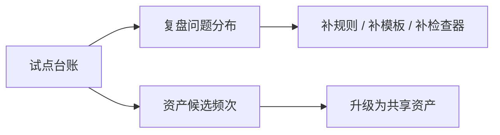

# 试点台账与度量模板

## 文档定位

试点如果只有过程记录，没有统一台账，最后很容易变成“大家都觉得有价值，但谁也说不清到底好在哪里”。

这份文档的作用，是把试点运行从经验判断变成可追踪、可复盘、可对齐的运营机制。

## 为什么试点必须先有台账

AI 工程化最容易被质疑的地方，不是理念是否成立，而是：

- 试点到底有没有真的减少返工
- AI 到底有没有进入关键节点
- 团队到底有没有留下共享资产
- 这件事是否值得继续投入

没有统一台账，上面这些问题都只能靠印象回答。

## 台账的最小记录单位

推荐把试点台账的最小记录单位固定为：

`一个页面 / 一次页面级变更`

原因是：

- 与当前阶段的最小实践单位一致
- 便于统计不同页面类型的试点结果
- 便于识别“哪些页面更容易沉淀 pattern / spec / rule”

不要把一整批页面压成一行记录，否则很难知道问题到底发生在哪个页面节点。

## 台账主表字段

建议每个试点页都至少记录下面这些字段：

| 字段 | 说明 |
| --- | --- |
| `pilot_id` | 试点编号，建议按日期或业务线编码 |
| `project_name` | 所属项目或业务域 |
| `page_name` | 页面名称 |
| `page_type` | 列表 / 详情 / 表单 / 运营页 / 其他 |
| `project_level` | `P1` / `P2` / `P3` |
| `mode` | 标准模式 / 轻量模式 / 变更模式 |
| `prd_owner` | PRD 责任人 |
| `ui_owner` | UI 责任人 |
| `fe_owner` | 前端责任人 |
| `approver` | 交付签收人 |
| `start_date` | 试点开始日期 |
| `end_date` | 试点结束日期 |
| `current_status` | 当前阶段状态 |
| `asset_result` | 无资产 / 候选资产 / 已升级共享资产 |
| `next_action` | 扩大试点 / 补规则 / 暂停 / 升级资产 |

## 过程状态字段

为了让台账真正体现闭环，推荐把状态拆成下面 7 个固定节点：

| 状态字段 | 判定标准 |
| --- | --- |
| `intake_status` | 是否完成准入判断与模式选择 |
| `context_status` | 是否形成 `Task Context` |
| `rule_status` | 是否形成页面规则表达 |
| `spec_status` | 是否形成 `Page Spec` 或 patch |
| `impl_status` | 是否完成基于规格的实现 |
| `review_status` | 是否完成 review 与偏差裁决 |
| `writeback_status` | 是否完成 `Implementation Record` 与资产判断 |

推荐状态值统一为：

- `todo`
- `in_progress`
- `done`
- `blocked`

这样后续不管是文档仓库、表格、轻量平台还是 BI 面板，都更容易统一。

## 推荐的试点台账模板

```markdown
| pilot_id | project_name | page_name | page_type | project_level | mode | prd_owner | ui_owner | fe_owner | approver | intake_status | context_status | rule_status | spec_status | impl_status | review_status | writeback_status | asset_result | next_action |
| --- | --- | --- | --- | --- | --- | --- | --- | --- | --- | --- | --- | --- | --- | --- | --- | --- | --- | --- |
| P-2026-001 | example | 用户列表页 | 列表 | P1 | 标准模式 | A | B | C | D | done | done | done | done | done | done | done | 候选资产 | 扩大试点 |
```

## 六个核心度量项

当前阶段不建议一开始就追求非常复杂的大盘，而是先抓住 6 个最能判断体系是否成立的指标。

| 指标 | 计算口径 | 想回答的问题 |
| --- | --- | --- |
| 输入收敛完整率 | 已形成 `Task Context` 的页面数 / 已启动试点页数 | 输入是否真的被收敛 |
| 规则到规格转化率 | 已从页面规则形成 `Page Spec` 的页面数 / 已有规则表达的页面数 | UI 规则是否能稳定进入规格层 |
| 规格同步率 | 有行为变化且已同步 spec/patch 的页面数 / 本轮发生行为变化的页面数 | 实现是否仍然受规格控制 |
| AI 辅助覆盖率 | AI 参与节点总数 / 全部可参与节点总数 | AI 是否真正进入链路 |
| 回写完成率 | 已完成 `Implementation Record` 的页面数 / 已完成实现页数 | 闭环是否成立 |
| 候选资产产出率 | 产生资产候选的页面数 / 已完成回写页数 | 项目是否在推动资产积累 |

## 推荐观察阈值

下面这组阈值适合作为短期试点阶段的观察线，而不是刚性的考核线：

| 指标 | 推荐观察线 |
| --- | --- |
| 输入收敛完整率 | 不低于 `90%` |
| 规则到规格转化率 | 不低于 `80%` |
| 规格同步率 | 目标为 `100%` |
| AI 辅助覆盖率 | 不低于 `4/6` 关键节点 |
| 回写完成率 | 目标为 `100%` |
| 候选资产产出率 | 每个完成试点页至少做 1 次资产判断 |

这里最重要的不是“AI 覆盖越高越好”，而是：

- AI 是否进入了真正高价值的节点
- 人工裁决是否还被保留在应该保留的位置

## 建议增加的辅助指标

如果团队已经跑了 2 到 3 轮试点，可以再加下面这些辅助指标：

| 指标 | 作用 |
| --- | --- |
| review 驳回原因分布 | 判断问题主要集中在输入、规则、规格还是实现 |
| 实现偏差率 | 判断代码与规格不一致的情况是否在下降 |
| 平均闭环周期 | 判断单页面从准入到回写的总耗时 |
| 资产复用率 | 判断已有资产是否真的被下轮任务消费 |

## 周度复盘模板

建议每周固定围绕下面 5 个问题复盘：

1. 本周进入试点的页面中，有多少完成了 `Task Context`
2. 有多少页面真正从页面规则表达进入了 `Page Spec`
3. AI 主要参与了哪些节点，替代了哪些重复劳动
4. review 驳回主要集中在哪一层
5. 本周新增了哪些资产候选，下周是否有复用机会

## 周度复盘表模板

```markdown
### 本周试点复盘

- 本周新增试点页：
- 本周完成闭环页：
- 输入收敛完整率：
- 规格同步率：
- AI 辅助覆盖率：
- 回写完成率：
- 候选资产产出：

### 本周最主要的 3 个问题

1.
2.
3.

### 下周动作

1.
2.
3.
```

## 向管理层汇报时怎么讲

如果管理层只关心“这件事值不值得继续做”，建议固定按下面顺序汇报：

1. 本周跑了多少真实页面
2. 闭环完成率如何
3. AI 进入了哪些关键节点
4. 哪些返工或认知损耗被减少了
5. 留下了什么资产，是否已出现复用信号

不要只汇报“AI 生成了多少代码”，因为那不是这套体系的核心价值。

## 台账与资产的关系

台账不是只记录过程，它还应该成为资产升级的前置证据。



也就是说：

- 台账告诉你系统哪里不稳
- 台账也告诉你哪些对象值得升级成资产

## 与相邻文档的关系

- `docs/14-项目准入与试点运营清单.md`：定义项目怎么进、节点怎么跑
- `docs/16-资产分级与升级门槛.md`：定义台账里记录出来的候选资产，后续如何升级

## 一句话结论

试点台账的本质，不是为了汇报好看，而是让 AI 工程化从“感觉有效”变成“过程可追踪、结果可解释、投入可判断”。
