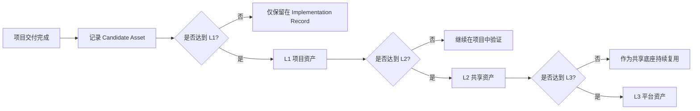

# 资产分级与升级门槛

## 文档定位

`docs/10` 已经回答了“什么是资产、为什么资产化是工程化的一部分”。

这份文档继续向前一步，解决 3 个更实操的问题：

- 资产应该按什么层级管理
- 资产什么时候可以升级
- 升级之后由谁维护、如何被消费

## 为什么必须做分级

如果没有分级，团队最容易掉进两个极端：

- 什么都叫资产，最后目录越来越大，但没人敢用
- 什么都不敢升级，资产永远只停留在项目记录里

所以分级的目的，不是做复杂治理，而是明确：

- 哪些对象只是项目经验
- 哪些对象已经值得跨项目复用
- 哪些对象已经足够稳定，可以进入平台底座

## 三层资产模型

当前阶段建议采用最容易落地的 3 层模型。

| 层级 | 名称 | 定义 | 维护责任 |
| --- | --- | --- | --- |
| `L1` | 项目资产 | 只在单项目或单页面试点中验证过的沉淀对象 | 业务前端负责人 |
| `L2` | 共享资产 | 已在多个项目 / 页面中复用，具备稳定消费入口 | 前端架构 / 平台负责人 |
| `L3` | 平台资产 | 已具备统一 schema、版本、消费接口，可被平台或在线系统直接调用 | 平台团队 / 架构团队 |

## 默认 ownership 模式

推荐采用“项目阶段归业务，升级阶段归平台”的双阶段 ownership。

### `L1` 阶段

- 资产首先由业务前端负责人维护
- 目标是快速验证它是否真的有复用价值

### `L2` / `L3` 阶段

- 一旦资产准备进入跨项目复用或平台接入，就需要转交平台或架构角色主导
- 否则会出现“人人都能复用，但没人真正维护”的状态

这也是当前阶段最稳妥、最容易落地的所有权模型。

## 不同层级分别适合沉淀什么

| 资产类型 | 更适合从哪层开始 |
| --- | --- |
| 页面 pattern | `L1` |
| `Page Spec` 模板 / schema | `L1` -> `L2` |
| review rule / checker | `L2` |
| theme token / adapter | `L1` -> `L2` |
| AI prompt 约束 / workflow 约束 | `L1` -> `L2` |
| 在线模板、组件选择器、平台 registry | `L3` |

## 升级门槛总表

| 升级路径 | 推荐门槛 | 关键判断 |
| --- | --- | --- |
| `L1 -> L2` | 至少在 `2` 个独立页面或项目中被验证可复用 | 是否已经不是单项目经验 |
| `L2 -> L3` | 已有稳定 schema / 版本 / 消费入口，且被多个团队持续使用 | 是否已经具备平台化条件 |

## `L1 -> L2` 的推荐门槛

一项候选资产要从项目资产升级为共享资产，建议至少满足下面 5 条里的 4 条：

| 判断项 | 说明 |
| --- | --- |
| 复用验证 | 已在至少 2 个页面或项目中被重复使用 |
| 表达稳定 | 命名、字段、边界和使用方式已基本稳定 |
| 责任明确 | 已明确共享维护人 |
| 消费入口明确 | 后续项目知道去哪里拿、怎么用 |
| 负反馈可控 | 没有明显造成额外理解成本或错误复用 |

## `L2 -> L3` 的推荐门槛

一项共享资产要继续升级为平台资产，建议至少满足下面 6 条里的 5 条：

| 判断项 | 说明 |
| --- | --- |
| 使用广度 | 不只一个团队或业务线在使用 |
| 使用频度 | 有持续复用，而不是一次性热点 |
| 结构标准化 | 已形成稳定 schema、字段和版本策略 |
| 接口清晰 | 能被在线平台、CLI、workflow 或 checker 明确调用 |
| 校验能力 | 有 validator / checker / review 规则配套 |
| 维护机制 | 已有明确 owner、升级流程和废弃策略 |

## 推荐升级流程

## 每一级升级后必须补齐什么

### 升级到 `L1`

至少补齐：

- 资产名称与类型
- 来源项目
- 使用场景
- 下一次推荐复用场景

### 升级到 `L2`

至少补齐：

- 共享命名
- 维护责任人
- 消费入口
- 使用说明
- 版本或变更策略

### 升级到 `L3`

至少补齐：

- 稳定 schema 或 registry 结构
- 平台调用方式
- 权限或适用范围
- 自动化校验机制
- 版本升级和废弃机制

## 资产消费优先级

AI 和人都不应该在每次任务里“从零构造答案”。

推荐消费优先级如下：

1. 优先选择 `L3` 平台资产
2. 平台层没有时，选择 `L2` 共享资产
3. 共享层没有时，参考 `L1` 项目资产
4. 三层都没有时，才允许创建新候选

这条规则非常重要，因为它决定了体系能否真正越跑越快。

## 平台化的触发信号

下面这些信号同时出现时，说明资产可能已经进入平台化窗口：

- 同一类资产反复被人工“复制、粘贴、改名”
- 团队已经开始询问“有没有统一入口可以选”
- 多个团队对 schema、模板、规则的命名出现收敛
- 手工同步资产的成本已经高于做最小平台能力的成本

这时就可以结合 `docs/11-平台起步与后续演进.md` 进入下一阶段判断。

## 降级与废弃规则

资产不是只升不降。

建议建立最小降级规则：

| 场景 | 动作 |
| --- | --- |
| 长期无人使用 | 标记为观察中或候选废弃 |
| 被新资产稳定替代 | 转入废弃流程 |
| 命名和结构频繁引起误用 | 从 `L2` 回退到 `L1` 继续验证 |
| 平台接口已不再兼容 | 从 `L3` 回退为 `L2`，重新整理 schema |

## 与相邻文档的关系

- `docs/10-资产沉淀与升级规则.md`：解释资产是什么、为什么要沉淀
- `docs/11-平台起步与后续演进.md`：解释什么时候从共享资产走向平台化
- `docs/15-试点台账与度量模板.md`：提供资产升级所需的试点证据来源

## 一句话结论

资产分级的目的，不是增加治理复杂度，而是让项目经验、共享底座和平台能力之间有一条明确、可执行、可升级的通道。
