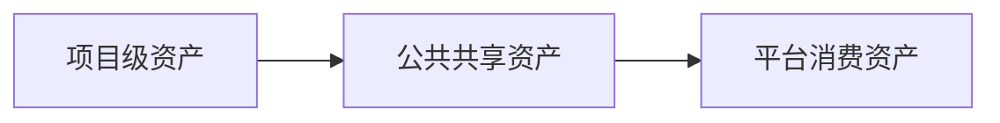

# 资产体系

## 资产定位

资产不是目录堆积，也不是交付结束后的被动存档。

在这套 `UI -> Frontend` AI 工程化方案里，资产的定义是：

`一次交付中被验证有效、能够被下一次任务、AI 协同和未来平台直接消费的稳定对象`

因此，资产体系要解决的不是“把资料存下来”，而是回答 3 个问题：

- 哪些对象值得沉淀
- 这些对象应放在哪一层管理
- 后续任务怎样直接复用这些对象

## 分层

当前阶段采用三层分治：

### 项目级资产

放在业务项目里，服务当前页面执行闭环。

典型对象包括：

- `Task Context`
- UI 页面规则确认卡
- 页面规则表达
- `Page Spec`
- review 清单
- 回写记录

这一层的重点是：

- 先支撑当前页面落地
- 先在真实交付中验证有效性
- 不要求一开始就抽象成公共规范

### 公共共享级

放在当前公共仓，服务跨项目复用。

典型对象包括：

- 模板
- pattern
- review rule
- prompt / workflow
- 试点案例

这一层的重点是：

- 让多个页面或项目复用同一套成熟写法
- 降低团队重复组织材料的成本
- 为后续平台消费准备稳定输入

### 平台消费级

供未来平台、registry、在线选择和受控生成使用。

典型对象包括：

- 结构化资产索引
- 可组合 pattern / spec / rule
- 供 workflow / 平台调用的稳定对象

这一层的重点是：

- 将公共共享资产进一步结构化
- 形成稳定命名、稳定 schema、稳定接口
- 支撑平台按规则组合和受控消费

## 升级规则

资产升级坚持一条主原则：

`项目里先验证，公共层再复用，平台层最后消费`

这意味着：

- 没有经过真实页面验证的对象，不急于升级为公共资产
- 没有形成稳定复用模式的对象，不急于进入平台层
- 平台化建立在复用稳定之后，而不是反过来推动真实执行

### L1 -> L2

从项目级升级到公共共享级，至少满足：

- 已在两个独立页面或项目中被验证可复用
- 有明确维护人
- 有明确消费入口

### L2 -> L3

从公共共享级升级到平台消费级，至少满足：

- 多团队持续使用
- 结构和命名稳定
- 已形成稳定 registry / schema / 接口

## 当前落地抓手

当前仓库优先承接公共共享级资产，主要抓手如下：

| 目录 / 文件 | 当前作用 |
| --- | --- |
| `docs/quickstart/templates/` | 提供首轮试点可直接复用的模板 |
| `docs/quickstart/examples/` | 提供完整闭环案例 |
| `docs/assets/registry.md` | 记录当前可复用资产与候选资产 |
| `docs/assets/rules/` | 存放可复用规则对象 |
| `docs/assets/prompts/` | 存放可复用 prompt / workflow |
| `docs/assets/patterns/` | 存放可复用页面模式 |
| `docs/assets/cases/` | 存放案例资产 |

## 管理原则

当前阶段的资产管理建议遵循以下原则：

- 先从真实页面中沉淀，不从抽象讨论中直接生造资产
- 先保证可复用，再追求命名和结构的完全平台化
- 先登记当前用途和下一步动作，再决定是否升级
- 每轮试点结束后，都要判断是否新增了资产候选

## 说明

资产体系的核心，不在于“留档”，而在于让下一次任务和 AI 协同能够直接复用今天验证有效的对象。
