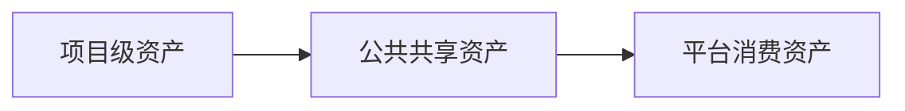
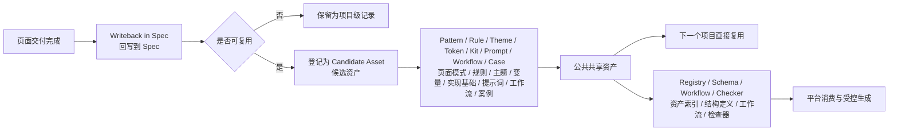

# 资产体系

## 资产定位

资产不是目录堆积，也不是交付结束后的被动存档。

在这套 `UI -> Frontend` AI 工程化方案里，资产的定义是：

`一次交付中被验证有效、能够被下一次任务、AI 协同和未来平台直接消费的稳定对象`

因此，资产体系要解决的不是“把资料存下来”，而是回答 3 个问题：

- 哪些对象值得沉淀
- 这些对象应放在哪一层管理
- 后续任务怎样直接复用这些对象

## 分层

当前阶段采用三层分治：

如果把资产从“交付结果”演进到“共享资产”，再演进到“平台资产”串起来看，可进一步理解为：

阅读提示：

- 左侧看“资产从哪里来”
- 中间看“哪些对象会进入共享层”
- 右侧看“共享资产如何一边服务下个项目，一边被平台消费”

### 项目级资产

放在业务项目里，服务当前页面执行闭环。

典型对象包括：

- `docs/superpowers/specs/` 中的页面 spec
- `docs/superpowers/plans/` 中的页面 plan
- review 记录
- spec 中的 writeback 与 asset candidates

这一层的重点是：

- 先支撑当前页面落地
- 先在真实交付中验证有效性
- 不要求一开始就抽象成公共规范

### 公共共享级

放在当前公共仓，服务跨项目复用。

典型对象包括：

- pattern
- rule
- theme / token
- kit
- prompt / workflow
- 试点案例
- schema / registry 草案

这一层的重点是：

- 让多个页面或项目复用同一套成熟写法
- 降低团队重复组织材料的成本
- 为后续平台消费准备稳定输入

### 平台消费级

供未来平台、registry、在线选择和受控生成使用。

典型对象包括：

- 结构化资产索引
- 可组合 pattern / spec / rule
- 供 workflow / 平台调用的稳定对象

这一层的重点是：

- 将公共共享资产进一步结构化
- 形成稳定命名、稳定 schema、稳定接口
- 支撑平台按规则组合和受控消费

## 升级规则

资产升级坚持一条主原则：

`项目里先验证，公共层再复用，平台层最后消费`

这意味着：

- 没有经过真实页面验证的对象，不急于升级为公共资产
- 没有形成稳定复用模式的对象，不急于进入平台层
- 平台化建立在复用稳定之后，而不是反过来推动真实执行

当前阶段的 superpowers spec / plan 更适合被理解为“项目级执行工件”，而不是共享资产本身。

在试点阶段：

- spec 负责承接统一上下文、统一规则和统一回写
- plan 负责承接统一实施顺序、风险和验证动作
- 真正进入共享层的，是从 spec / plan 中抽象出来的 pattern、rule、prompt、workflow、theme / token、kit 和 case

## 项目级 Theme / Token 的沉淀与升级

项目级 design token 不建议只停留在 md 里，也不建议一开始就直接升级为共享资产。

更合理的做法是分成 3 步：

### 第一步：先在页面 spec 中说明

在页面 spec 里记录：

- 当前页面复用了哪些已有 token / variable
- 当前页面新增了哪些临时色值、间距、字号、圆角、阴影或动效
- 这些值是页面特例，还是有机会变成共享 token

这一层的作用是：

- 先把视觉事实讲清楚
- 避免实现阶段靠人脑记忆补齐

但这里要注意：

- spec 不是 token 真相源
- spec 只负责引用、差异说明和候选登记

### 第二步：在项目代码里形成真实 token

真正可执行的项目级 token，应该沉淀在业务项目自己的主题文件、token 文件、样式变量或组件库变量中。

也就是说：

- md 负责说明和登记
- 项目代码负责真正落地和被页面消费
- Figma Variables 负责设计侧的变量真相源

### 第三步：复用稳定后再升级为共享资产

当一个项目级 token 已经满足下面信号时，就可以考虑升级：

- 不只服务一个页面
- 语义命名开始稳定
- UI 和 FE 都认可其复用边界
- 后续项目有直接复用价值

升级动作通常是：

1. 在 spec 的 `Writeback / Asset Candidates` 中登记
2. 在 `docs/assets/registry.md` 中标记为候选或正式资产
3. 进入 `docs/assets/themes/` 或 `docs/assets/tokens/`
4. 后续再视情况结构化为平台可消费对象

一句话理解：

`项目级 token 先在页面中被使用，再在项目内被落地，最后才升级为共享资产。`

### L1 -> L2

从项目级升级到公共共享级，至少满足：

- 已在两个独立页面或项目中被验证可复用
- 有明确维护人
- 有明确消费入口

### L2 -> L3

从公共共享级升级到平台消费级，至少满足：

- 多团队持续使用
- 结构和命名稳定
- 已形成稳定 registry / schema / 接口

## 当前落地抓手

当前仓库优先承接公共共享级资产，主要抓手如下：

| 目录 / 文件 | 当前作用 |
| --- | --- |
| `docs/superpowers/README.md` | 说明当前 spec / plan 的目录约定与推荐骨架 |
| `docs/superpowers/spec-template.md` | 提供当前 spec 的推荐结构 |
| `docs/superpowers/plan-template.md` | 提供当前 plan 的推荐结构 |
| `docs/assets/registry.md` | 记录当前可复用资产与候选资产 |
| `docs/assets/rules/` | 存放可复用规则对象 |
| `docs/assets/prompts/` | 存放可复用 prompt / workflow |
| `docs/assets/patterns/` | 存放可复用页面模式 |
| `docs/assets/themes/` | 存放可复用主题资产 |
| `docs/assets/tokens/` | 存放可复用设计基础值 |
| `docs/assets/kit/` | 存放可复用实现基础资产 |
| `docs/assets/cases/` | 存放案例资产 |

## 管理原则

当前阶段的资产管理建议遵循以下原则：

- 基础底座能力优先复用外部成熟 starter，不重复造成熟后台框架
- 先从真实页面中的 spec / plan 与 writeback 中沉淀，不从抽象讨论中直接生造资产
- 先保证可复用，再追求命名和结构的完全平台化
- 先登记当前用途和下一步动作，再决定是否升级
- 每轮试点结束后，都要判断是否新增了资产候选

## 说明

资产体系的核心，不在于“留档”，而在于让下一次任务和 AI 协同能够直接复用今天验证有效的对象。
