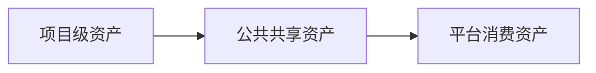

# 资产体系

## 资产定位

资产不是目录堆积，而是让一次交付能被下次任务、AI 和未来平台直接消费的系统对象。

当前阶段采用三层分治：

## 三层分治

### 项目级

放在业务项目里，服务当前页面执行闭环：

- `Task Context`
- UI 页面规则确认卡
- 页面规则表达
- `Page Spec`
- review 清单
- 回写记录

### 公共共享级

放在当前公共仓，服务跨项目复用：

- 模板
- pattern
- review rule
- prompt / workflow
- 试点案例

### 平台消费级

供未来平台 / registry / 在线选择 / 受控生成使用：

- 结构化资产索引
- 可组合 pattern / spec / rule
- 供 workflow / 平台调用的稳定对象

## 升级规则

坚持一条主原则：

`项目里先验证，公共层再复用，平台层最后消费`

### L1 -> L2

至少满足：

- 已在两个独立页面或项目中被验证可复用
- 有明确维护人
- 有明确消费入口

### L2 -> L3

至少满足：

- 多团队持续使用
- 结构和命名稳定
- 已形成稳定 registry / schema / 接口

## 当前目录

- `docs/assets/registry.md`
- `docs/assets/templates/`
- `docs/assets/patterns/`
- `docs/assets/rules/`
- `docs/assets/prompts/`
- `docs/assets/cases/`

## 说明

资产体系的核心不在于存档，而在于让资产在下一次任务中被直接消费。
