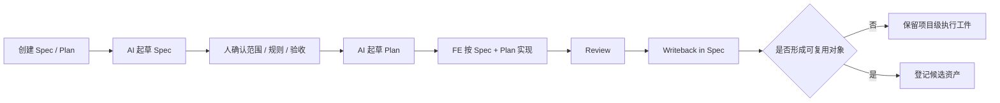

# 执行手册

## 手册目标

这份手册只回答一件事：

`如何以 superpowers-first 的方式，把一个正式页面稳定落到真实交付中。`

它不负责重复 README 的背景论证，只保留执行时必须讲清楚的内容：

- 哪些页面需要进入这套流程
- 当前默认工件是什么
- 谁负责什么
- 什么时候可以进入下一步
- 交付后怎样回写和判断资产

## 适用范围

当前固定以：

`一个页面`

作为最小执行单位。

模式边界如下：

- `L1` 一次性 / 探索型页面：允许 AI 直出，不强制完整 spec / plan
- `L2` 正式页面：默认进入轻量 spec + plan 流程
- `L3` 复杂 / 高风险 / 多人协作页面：在 `L2` 基础上加强规则确认、review 和回写

默认原则：

- 正式页面走 `L2 / L3`
- 生命周期很短、没有复用价值的页面，不建议为了流程补文档
- 首轮试点优先选择标准后台表格列表页

## 默认执行入口

当前默认执行入口已经统一到：

- `docs/superpowers/specs/`
- `docs/superpowers/plans/`

执行时的最小工件只有两类：

```text
docs/superpowers/specs/<page-name>-spec.md
docs/superpowers/plans/<page-name>-plan.md
```

一句话理解：

- `spec` 负责把页面讲清楚
- `plan` 负责把开发怎么做讲清楚

`docs/quickstart/templates/` 不再作为默认执行路径，只保留为历史逻辑参考。

## 主文件与快照

页面级 spec / plan 使用稳定主文件命名：

- `<page-name>-spec.md`
- `<page-name>-plan.md`

默认做法：

- 同一页面多次迭代时，持续更新同一份主文件
- 日常修改不按日期反复新建文件
- 文件历史由 git、writeback 和 decision 留痕承担

只有在里程碑节点，才额外创建快照文件，例如：

- 需求冻结
- UI 评审通过
- 开发启动前
- 上线前
- 大改版前

快照文件建议统一放在：

- `docs/archive/snapshots/<page-name>/`

## 角色分工

| 责任位 | 主要职责 | 默认承担方 |
| --- | --- | --- |
| 需求确认 | 明确目标、范围、验收口径 | PRD / 产品 / 业务负责人 |
| 页面规则确认 | 确认结构、状态、交互、边界 | UI / 设计 |
| 规格审核与实现 | 审核 spec、完成实现、记录偏差 | Frontend |
| 结构化评审 | 对照规则与 spec 输出 review 结论 | Reviewer |
| 交付裁决 | 对偏差接受、资产升级做决定 | 负责人 / 架构 |
| AI 辅助 | 起草 spec、plan、review、writeback | AI 执行器 |

角色边界：

- UI 负责设计事实和页面规则确认，不负责长期手工维护交付 md
- FE 负责把业务输入和设计输入收口为可实现的 spec / plan，并对实现结果负责
- AI 负责起草、整理、对照检查和回写辅助，不负责最终裁决
- 产品 / 业务负责人负责范围、验收口径和业务冲突裁决

### UI 在流程中的参与节点

在当前执行方式里，UI 不负责长期维护 spec / plan 主文件，但必须参与下面 4 个关键节点：

1. 输入准备
   - 提供 Figma、标注、Variables、设计说明和关键页面意图
2. Spec 确认
   - 确认页面结构、信息层级、关键状态、交互方式和视觉边界
3. Review 判断
   - 对实现与设计之间的差异做接受 / 回改判断
4. Writeback / 资产判断
   - 参与判断哪些规则、token、模块样式值得继续沉淀为共享资产

UI 重点确认的内容包括：

- 页面区块和主次顺序
- loading / empty / error / no-permission 等状态表达
- CTA、卡片、筛选、FAQ 等关键交互表现
- 哪些颜色、间距、字号、按钮层级必须复用
- 哪些视觉值只是页面特例，哪些值得升级为共享资产中的 token

## 真相源

为避免同一事实在多个工件里重复维护，当前建议按下面口径理解真相源：

- 业务目标与范围：PRD、Issue、验收口径
- 设计结构与视觉表达：Figma、标注、Variables、评论
- design token / variable 真相源：Figma Variables 与项目代码中的 theme / token 文件
- 页面实现主输入：确认后的 superpowers spec
- 实施安排与验证动作：确认后的 superpowers plan
- 共享资产入口：登记后的 pattern、rule、theme / token、kit、prompt、workflow 和 registry

这意味着：

- spec 不是 Figma 的替代品
- spec 也不是 design token / variable 真相源
- spec 的职责是收敛、说明、引用、回写

## 执行流程



推荐顺序：

1. 确认页面模式、责任人、输入来源
2. 创建 1 份 spec 和 1 份 plan
3. 由 AI 起草 spec 初稿
4. 由人确认范围、规则、验收口径
5. 由 AI 起草 plan
6. FE 按 spec + plan 实现
7. 完成 review、writeback 和资产判断

## 必须由人确认的内容

以下内容不能完全交给 AI 自行裁决：

- 页面目标、范围、验收口径
- 页面结构、关键状态、关键交互和边界规则
- spec 中是否存在关键歧义
- plan 中的风险判断和验证动作是否合理
- review 中发现的偏差是否接受
- 哪些对象继续保留在项目级执行工件中，哪些对象升级为共享资产

## Spec / Plan 最小结构

每份 spec 建议至少覆盖：

- `Task Context`
- `UI Rules`
- `Page Spec`
- `Review Focus`
- `Writeback / Asset Candidates`

每份 plan 建议至少覆盖：

- `Goal`
- `Inputs`
- `Work Items`
- `Risks`
- `Verification / Done Criteria`

如果页面涉及颜色、字号、间距、圆角、阴影、动效或主题差异，建议在 spec 中至少补充：

- `UI Rules -> Visual / Token Rules`
- `Page Spec -> Theme / Token Usage`

写法优先级建议是：

1. 语义 token 名称
2. Figma variable 名称
3. 项目代码 token 名称
4. 临时 raw value（仅在尚未沉淀 token 时使用，并标记为候选资产）

## 门禁

当前流程主要通过门禁驱动：

- 没有 spec，不进入实现
- spec 中没有页面规则确认，不进入实现
- 没有 plan，不建议进入正式开发
- 发生可观察行为变化，必须同步 spec 中的 writeback
- 没有 review 留痕和 asset candidate 判断，不视为闭环完成

这些门禁的目的，是保证页面始终围绕统一事实推进，而不是在实现阶段临时猜测和补洞。

## 资产判断

当前阶段的沉淀流转遵循三层分治：

- `项目级执行工件`：单页 spec、plan、review 和记要留在业务项目仓
- `共享资产`：优先沉淀 `Starter（起步模板）`、`Kit（组件组合包）`、`Checklist（检查清单）`，以及少量稳定复用的 theme / token
- `平台消费资产`：进一步整理为 registry、schema、workflow、checker 等机器可消费资产

项目级 design token 的推荐路径是：

1. 先在 spec 中说明当前页面使用了哪些 token / variable / 临时值
2. 在项目代码中形成真实可执行 token
3. 回写阶段判断是否跨页面复用
4. 复用稳定后，再升级到 `docs/assets/themes/` 或 `docs/assets/tokens/`

一句话说：

`spec 负责说明，项目代码负责落地，assets 负责登记和升级。`

当前阶段还建议坚持两条轻量规则：

- 没有复用两次以上，不正式沉淀为共享资产
- 新页面 5 分钟内用不上，不作为当前优先资产

## 完成标准

一个页面完成最小闭环，至少要满足下面 5 项：

1. spec 完整承接任务上下文、页面规则和页面规格
2. UI 规则被结构化确认
3. plan 明确了实施顺序、风险和验证动作
4. review 和回写完成
5. 至少留下 1 个资产候选，或明确说明本轮没有候选资产

## 入口链接

- 总览方案：`docs/README.md`
- 快速开始：`docs/quickstart/README.md`
- superpowers 执行入口：`docs/superpowers/README.md`
- 资产说明：`docs/assets/README.md`
- 历史材料与快照：`docs/archive/`
