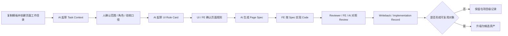

# 执行手册

## 手册目标

这份手册只解决一件事：

`怎么把 UI -> Frontend 的 AI 工程化方案稳定落到真实页面上`

它不展开背景论证，只保留执行时必须讲清楚的内容：

- 当前怎么做
- 由谁来做
- 每一步要产出什么
- 满足什么条件才能进入下一步

## 执行对象

当前阶段固定以：

`一个页面`

作为最小执行单位。

模式分流原则：

- 一次性 / 探索型页面，可采用 `L1：AI 直出模式`
- 正式页面默认进入 `L2：轻量 Spec 模式`
- 复杂 / 高风险 / 多人协作页面，再升级为 `L3：完整工程模式`

当前手册主要服务于 `L2` 与 `L3` 页面，不负责规范 `L1` 的一次性探索流程。

首轮优先选择：

- 标准后台表格列表页

后续扩展方向：

- 详情页
- 中等复杂度表单页

不建议首轮选择：

- 跨系统大流程
- 需求仍在频繁变化的页面
- 没有明确责任人的页面

## 角色分工

| 责任位 | 主要职责 | 默认承担方 |
| --- | --- | --- |
| 需求确认 | 明确目标、范围、验收口径 | PRD / 产品 / 业务负责人 |
| 页面规则确认 | 确认结构、状态、交互、边界 | UI / 设计 |
| 规格审核与实现 | 审核 Spec、完成实现、记录偏差 | Frontend |
| 结构化评审 | 对照规则与 Spec 输出 review 结论 | Reviewer |
| 交付裁决 | 对 review 结论、偏差接受、资产升级做决定 | 负责人 / 架构 |
| AI 辅助 | 起草上下文、规则、Spec、review、回写 | AI 执行器 |

AI 的边界是：

- 可以起草，不可以代替责任人做最终裁决
- 可以辅助 review，不可以绕过 review 宣布完成
- 可以补齐表达，不可以在规则缺失时直接宣布可实现

## 执行步骤总表

| 步骤 | 模式 | 关键动作 | 负责人 | 产出 | 完成标志 |
| --- | --- | --- | --- | --- | --- |
| 1. 任务收敛 | 必做 | 明确页面目标、范围、输入来源、验收口径 | PRD / FE / AI | `01-task-context.md` | 页面目标、范围、输入来源可被复述 |
| 2. 页面规则确认 | 必做 | 确认结构、状态、交互、展示规则、边界 | UI / FE / AI | `02-ui-rule-card.md` | UI 对关键页面事实完成确认 |
| 3. 规则工程化 | 仅标准模式 | 将页面规则整理为工程表达 | FE / AI | `03-page-rules.md` | 规则可用于生成或审核 Spec |
| 4. 规格生成 | 必做 | 生成实现主输入并审核可实现性 | FE / AI | `04-page-spec.yaml` | Spec 可被用于实现且无关键歧义 |
| 5. 对照评审 | 标准模式必做；轻量模式需留痕 | 对照规则和 Spec 检查实现差异 | Reviewer / FE / AI | `05-review-checklist.md` 或 `06-implementation-record.md` 中的轻量 review 记录 | review 结论明确，差异可追踪 |
| 6. 回写沉淀 | 必做 | 记录偏差、例外和资产候选 | FE / 负责人 / AI | `06-implementation-record.md` | 偏差、回写动作与资产判断完成记录 |

## 执行机制

阅读提示：

- 从左到右看，代表页面从启动到回写的实际执行顺序
- 带有“人确认”的节点，表示该阶段不能完全交给 AI 自行裁决
- 最后的分支，表示页面结束后要明确哪些内容只保留为记录，哪些内容进入资产候选



### 1. 页面文档如何启动

当前阶段不要求从零组织文档，默认从模板启动。

- 首轮试点优先复用 `docs/quickstart/templates/`
- 页面团队先确定模式、页面类型和责任人
- 然后将模板复制到当前页面工作目录，再进入内容起草

这一步的目标，是先统一工件结构，再开始生成内容。

### 2. 当前如何生成这些文档

当前阶段主要采用：

`模板 + AI 起草 + 人确认`

的方式。

- `Task Context`：由 AI 根据 PRD、需求片段、Issue、历史页面和其他上下文先起草
- `UI Rule Card`：由 AI 根据 Figma、标注、口头说明和历史页面先整理出规则草稿
- `Page Spec`：由 AI 在已确认的上下文和规则基础上生成实现主输入
- `Review / Writeback`：由 AI 辅助整理差异、补充记录和提炼资产候选

AI 的作用是帮助团队更快形成结构化草稿；最终范围确认、规则裁决、偏差接受和资产升级，仍由对应责任人完成。

### 3. 哪些内容由人确认

为了避免流程退化为自由生成，以下内容必须由人确认：

- 页面目标、范围、验收口径
- 页面结构、关键状态、关键交互和边界规则
- `Page Spec` 中是否仍存在关键歧义
- review 中发现的偏差是否接受
- 哪些对象只保留为记录，哪些对象升级为共享资产

AI 可以起草、补齐和对照检查，但不能替代责任人做最终裁决。

### 4. 流程如何进入下一步

当前流程主要通过门禁驱动，而不是通过“默认继续推进”驱动。

- 没有 `01-task-context.md`，不进入 `Page Spec` 生成或实现
- 没有 `02-ui-rule-card.md`，不允许直接进入实现
- 发生可观察行为变化，必须同步 `Page Spec`、patch 或回写记录
- 没有 review 留痕和 `06-implementation-record.md`，不视为闭环完成

这些门禁的目的，是保证页面始终围绕统一事实推进，而不是在实现阶段临时猜测和补洞。

### 5. 资产如何流转

当前阶段的资产流转遵循三层分治：

- `L1 项目级`：单页执行包、上下文、Spec、review 和记要留在业务项目仓
- `L2 公共共享级`：稳定复用后的 pattern、rule、template、prompt、case，以及后续的 theme / token / kit，升级到当前公共仓
- `L3 平台消费级`：进一步整理为 registry、schema、workflow、checker 等可被工具和平台直接消费的资产

当前阶段先保证真实页面闭环成立，再逐步把稳定对象升级为共享资产；自动化 workflow 和平台化消费建立在共享资产稳定之后，而不是反过来替代真实执行。

## 执行步骤说明

### 步骤 1：任务收敛

目标是让页面在进入规则确认前，先拥有统一任务事实。

产出：

- `01-task-context.md`

边界定义：

- `Task Context` 是页面级业务上下文实例
- 它不是 PRD，也不是完整页面规格
- 它用于收敛目标、范围、角色、约束和验收口径
- 它不直接描述页面布局和字段级展示细节

至少需要讲清：

- 这个页面要解决什么问题
- 用户或使用角色是谁
- 当前页面的范围是什么
- 输入来源有哪些
- 哪些内容明确不在本轮范围内
- 当前权限假设和关键约束是什么
- 最终由谁确认完成口径

### 步骤 2：页面规则确认

目标是让 UI、FE、AI 对页面事实形成同一版理解，而不是各自维护一版理解。

产出：

- `02-ui-rule-card.md`

规则类别建议按以下维度确认：

- 结构规则：页面由哪些区块构成
- 状态规则：页面在 loading / ready / empty / error 等状态下如何表现
- 交互规则：筛选、分页、排序、跳转、提交等行为如何发生
- 展示规则：字段、信息、提示、显隐和格式如何展示
- 边界规则：异常、无权限、空结果等情况如何处理
- 适配规则：`PC / Pad / Mobile` 下布局和能力如何表达

缺席处理机制：

- 如果 UI 未参与页面规则确认，不得直接进入 `Page Spec` 生成
- 若因排期原因必须推进，需由负责人明确指定规则代理人，通常为 FE
- 所有由代理确认的规则，必须在 `06-implementation-record.md` 中标记为“待 UI 复核”

至少需要确认：

- 页面结构
- 关键状态
- 关键交互
- 展示规则
- 边界与例外
- 多端适配要求

### 步骤 3：规则工程化

目标是把页面规则从“人能看懂”推进到“工程可消费”。

产出：

- `03-page-rules.md`

这一步适用于标准模式，主要用于：

- 统一规则口径
- 为 `Page Spec` 提供中间层表达
- 降低实现和 review 时的理解跳跃

如果当前页面已经存在共享 pattern，则这一阶段应优先引用 pattern，而不是从零定义同类规则。

### 步骤 4：规格生成

目标是形成前端实现和 AI 协同都可以直接消费的主输入。

产出：

- `04-page-spec.yaml`

边界定义：

- `Page Spec` 是当前页面的实例规格，不是共享资产本体
- `Page Spec` 应优先引用已有 pattern / rule
- `Page Spec` 主要补充当前页面的具体配置、字段、操作和差异
- 共享 pattern、template、schema 才是后续重点沉淀对象

直接输入原则：

- `Page Spec` 是实现阶段的唯一直接输入
- `UI Rule` 是 `Page Spec` 的来源与约束
- 当 `UI Rule` 与 `Page Spec` 冲突时，必须先裁决并回写，再进入实现

Spec 至少应覆盖：

- 页面目标与范围
- 页面布局与区块
- 页面状态
- 关键交互
- 展示规则
- 约束条件
- 多端适配要求
- 验收规则

### 步骤 5：对照评审

目标是把 review 从“经验兜底”变成“对照统一事实检查差异”。

产出：

- `05-review-checklist.md`

对照关系：

- `Review = Code vs Rules + Spec`

如果采用轻量模式，未单独产出 `05-review-checklist.md` 时，也必须将 review 结论、主要差异和处理结果记录进 `06-implementation-record.md`。

重点检查：

- 实现是否符合页面规则
- 实现是否符合 `Page Spec`
- 是否存在未回写的行为变化
- 是否存在需要责任人裁决的偏差

### 步骤 6：回写沉淀

目标是让本轮交付不仅完成页面，还留下后续可以复用的对象。

产出：

- `06-implementation-record.md`

回写原则：

- 行为差异优先回写到 `Page Spec` 或 patch
- 重复出现的页面结构和规则应抽象为 pattern / rule
- 稳定的检查口径应抽象为 checklist
- 稳定的表达方式可抽象为 template / prompt

`Implementation Record` 负责记录差异、裁决和抽象建议，本身不是最终共享资产。

至少需要记录：

- 规格与实现的差异
- 被接受的偏差与原因
- 未解决问题或后续事项
- 候选资产及其建议级别

回写最小标准：

- 至少 1 条“实现与 Spec 差异”
- 至少 1 条“潜在资产候选”，即使当前仍不成熟
- 明确本轮是否需要回写 `Spec`、`Pattern`、`Checklist` 或 `Template / Prompt`

如果以上信息缺失，不视为完成闭环。

Pattern 抽象触发条件：

- 同一页面结构在两个页面中重复出现
- AI 在多个页面中生成相似结构
- review 中反复出现同类问题
- 页面规则中出现稳定结构组合，如 `filter + table + pagination`

当满足以上任一条件时：

- 应在 `06-implementation-record.md` 中标记为 Pattern 候选
- 由负责人决定是否进入共享资产层

如果候选资产被负责人接受，还需要同步到项目资产台账；若进入当前公共仓共享层，则同步登记到 `docs/assets/registry.md` 并明确维护人。

## 模式选择

模式选择必须在启动阶段完成，并记录到 `01-task-context.md`。

默认由 FE 与 approver 在 Day 1 共同确认；若执行中页面复杂度变化，再补充模式切换说明。

### 轻量模式

适合：

- 首轮试点
- 成熟列表页 / 详情页
- 规则相对稳定的页面

固定 4 个文件：

```text
01-task-context.md
02-ui-rule-card.md
04-page-spec.yaml
06-implementation-record.md
```

### 标准模式

适合：

- 新页面
- 复杂交互页
- 多方需要强对齐的页面

固定 6 个文件：

```text
01-task-context.md
02-ui-rule-card.md
03-page-rules.md
04-page-spec.yaml
05-review-checklist.md
06-implementation-record.md
```

### 选择建议

| 场景 | 默认模式 |
| --- | --- |
| 首轮试点，且页面是标准后台表格列表页 | 轻量模式 |
| 新页面、复杂交互、多方需强对齐 | 标准模式 |
| 已上线页面小改动 | 轻量模式，必要时补 patch |

## 执行门禁

### 门禁 1：没有 `Task Context`，不进入实现

### 门禁 2：没有 UI 页面规则确认，不允许 AI 直接从设计到代码

### 门禁 3：发生可观察行为变化，必须同步 `Page Spec` 或 patch

### 门禁 4：没有回写和资产判断，不算完成闭环

这 4 个门禁的目的只有一个：

`防止团队重新退回“碎片输入 -> 直接写代码 -> 人工兜底”的旧模式`

## 完成标准

当前阶段先用以下 5 个信号判断试点是否跑通：

1. `Task Context` 是否完整
2. UI 规则是否被结构化确认
3. `Page Spec` 是否生成并审核
4. review 和回写是否完成
5. 是否至少留下 1 个资产候选

满足以上 5 项，才算这个页面完成了最小闭环。

## 入口链接

- 总览方案：`docs/README.md`
- 快速开始：`docs/quickstart/README.md`
- 资产说明：`docs/assets/README.md`
- 历史详细文档：`docs/archive/`
