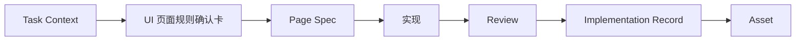

# 执行手册

## 手册目标

这份手册只解决一件事：

`怎么让 UI -> Frontend 的 AI 工程化在真实页面里稳定跑起来`

它不展开大段理论，只保留真正执行需要的规则。

## 执行概览

首轮试点可按以下 5 步启动：

1. 选 1 个 `P1` 页面
2. 明确 PRD / UI / FE / approver
3. 用 AI 起草 `Task Context` 和 UI 页面规则确认卡
4. 用 AI 生成 `Page Spec`，由 FE 审核后实现
5. 完成 review、回写和资产判断

上述 5 步跑通后，首轮试点即可形成最小闭环。

## 角色与责任

| 责任位 | 主要职责 | 默认承担方 |
| --- | --- | --- |
| 需求确认 | 目标、范围、验收口径 | PRD / 产品 / 业务负责人 |
| 页面规则确认 | 结构、状态、交互、边界 | UI / 设计 |
| 实现与回写 | 审核 Spec、实现、记录偏差 | Frontend |
| 交付裁决 | review 结论、偏差接受、资产升级判断 | 负责人 / 架构 |

AI 的默认职责是：

- 起草 `Task Context`
- 起草 UI 页面规则确认卡
- 生成 `Page Spec`
- 辅助实现
- 对照 Spec 做 review
- 起草 `Implementation Record`

## 主流程



## 最小试点单位

当前阶段固定为：

`一个页面`

优先选择：

- 后台列表页
- 详情页
- 中等复杂度表单页

不要首轮选择：

- 跨系统大流程
- 需求仍在频繁变化的页面
- 没有明确责任人的页面

## 两种执行模式

### 轻量模式

适合：

- 首轮试点
- 成熟列表页 / 详情页
- 规则相对稳定的页面

固定 4 个文件：

```text
01-task-context.md
02-ui-rule-card.md
03-page-spec.yaml
04-implementation-record.md
```

### 标准模式

适合：

- 新页面
- 复杂交互页
- 多方需要强对齐的页面

固定 6 个文件：

```text
01-task-context.md
02-ui-rule-card.md
03-page-rules.md
04-page-spec.yaml
05-review-checklist.md
06-implementation-record.md
```

## 模式选择规则

模式选择建议如下：

| 场景 | 默认模式 |
| --- | --- |
| 首轮试点，且页面是列表 / 详情 / 中等表单 | 轻量模式 |
| 新页面、复杂交互、多方需强对齐 | 标准模式 |
| 已上线页面小改动 | 轻量模式，必要时补 patch |

## 四个执行门禁

### 门禁 1：没有 `Task Context`，不进入实现

### 门禁 2：没有 UI 页面规则确认，不允许 AI 直接从设计到代码

### 门禁 3：发生可观察行为变化，必须同步 `Page Spec` 或 patch

### 门禁 4：没有回写和资产判断，不算完成闭环

这 4 个门禁的目的只有一个：

`防止团队重新退回“碎片输入 -> 直接写代码 -> 人工兜底”的旧模式`

## UI 的最小职责

UI 不负责写工程 Spec。

UI 只负责确认 6 类内容：

- 页面结构
- 关键状态
- 关键交互
- 展示规则
- 边界与例外
- 多端适配要求

## AI 的边界

AI 可以：

- 收敛输入
- 起草规则
- 生成 Spec
- 辅助 review
- 辅助回写

AI 不能：

- 代替责任人做最终裁决
- 在规则缺失时直接宣布可以实现
- 绕过 review 宣布完成

## 首轮试点节奏

### Day 1

- 选页
- 定责任人

### Day 2

- AI 起草 `Task Context`

### Day 3

- AI 起草 UI 页面规则确认卡
- UI 修正确认

### Day 4

- AI 生成 `Page Spec`
- FE 审核可实现性

### Day 5-6

- FE 实现
- AI 对照 Spec 做 review

### Day 7

- 更新 `Implementation Record`
- 做资产候选判断

## 首轮必要产物

首轮试点不要求一次覆盖全部扩展工件。

首轮只要确保下面 4 项一定存在：

- `Task Context`
- UI 页面规则确认卡
- `Page Spec`
- `Implementation Record`

其余如 `page-rules`、`review-checklist`，可在复杂页面或标准模式下补齐。

## 试点通过信号

首轮先只看 5 个结果：

1. `Task Context` 是否完整
2. UI 规则是否被结构化确认
3. `Page Spec` 是否生成并审核
4. review 和回写是否完成
5. 是否至少留下 1 个资产候选

## 入口链接

- 快速开始：`docs/quickstart/README.md`
- 资产说明：`docs/assets/README.md`
- 历史详细文档：`docs/archive/`

## 手册说明

本手册的作用，是确保任何一个页面都能按同一套规则稳定跑出闭环。
