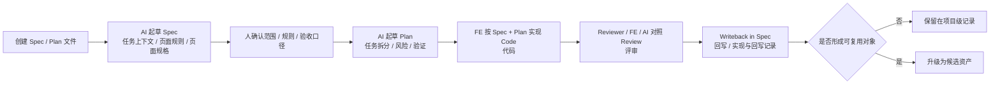

# 执行手册

## 手册目标

这份手册只解决一件事：

`如何以 superpowers-first 的方式，把 UI -> Frontend 的 AI 工程化方案稳定落到真实页面上`

它不展开背景论证，只保留执行时必须讲清楚的内容：

- 当前默认执行入口是什么
- 由谁来做
- 每一步要产出什么
- 满足什么条件才能进入下一步

## 当前默认执行入口

当前默认执行入口已经统一到：

- `docs/superpowers/specs/`
- `docs/superpowers/plans/`

执行时的基本规则如下：

- 每个真实页面至少产出 1 份 spec 和 1 份 plan
- spec 负责承接任务上下文、页面规则、页面规格、review 重点和回写记录
- plan 负责承接任务拆分、实施顺序、风险和验证动作
- `docs/quickstart/templates/` 不再作为默认执行路径，只保留为历史逻辑参考和未来结构化抽象参考

## 执行对象

当前阶段固定以：

`一个页面`

作为最小执行单位。

模式分流原则：

- 一次性 / 探索型页面，可采用 `L1：AI 直出模式`
- 正式页面默认进入 `L2：轻量 Spec 模式`
- 复杂 / 高风险 / 多人协作页面，再升级为 `L3：完整工程模式`

当前手册主要服务于 `L2` 与 `L3` 页面，不负责规范 `L1` 的一次性探索流程。

执行边界补充：

- `L1` 页面不强制要求完整 spec / plan
- 当前这套“主文件 + 回写 + 资产判断”机制，默认只用于 `L2 / L3`
- 如果页面生命周期很短、没有复用价值，不建议为了流程而补文档

首轮优先选择：

- 标准后台表格列表页

后续扩展方向：

- 详情页
- 中等复杂度表单页

不建议首轮选择：

- 跨系统大流程
- 需求仍在频繁变化的页面
- 没有明确责任人的页面

## 角色分工

| 责任位 | 主要职责 | 默认承担方 |
| --- | --- | --- |
| 需求确认 | 明确目标、范围、验收口径 | PRD / 产品 / 业务负责人 |
| 页面规则确认 | 确认结构、状态、交互、边界 | UI / 设计 |
| 规格审核与实现 | 审核 spec、完成实现、记录偏差 | Frontend |
| 结构化评审 | 对照规则与 spec 输出 review 结论 | Reviewer |
| 交付裁决 | 对 review 结论、偏差接受、资产升级做决定 | 负责人 / 架构 |
| AI 辅助 | 起草上下文、规则、spec、plan、review、回写 | AI 执行器 |

### 角色边界原则

- UI 负责设计事实和页面规则确认，不负责长期手工维护交付 md
- FE 负责将业务输入和设计输入收口为可实现的 spec，并对实现结果负责
- AI 负责起草、整理、对照检查和回写辅助，不负责最终裁决
- 产品 / 业务负责人负责范围、验收口径和业务冲突裁决

AI 的边界是：

- 可以起草，不可以代替责任人做最终裁决
- 可以辅助 review，不可以绕过 review 宣布完成
- 可以补齐表达，不可以在规则缺失时直接宣布可实现

### 真相源说明

为了避免同一事实在不同工件里重复维护，当前阶段建议按下面的真相源理解：

- 业务目标与范围：PRD、Issue、验收口径
- 设计结构与视觉表达：Figma、标注、Variables、评论
- design token / variable 真相源：Figma Variables 与项目代码中的 theme / token 文件
- 页面实现主输入：确认后的 superpowers spec
- 实施安排与验证动作：确认后的 superpowers plan
- 共享资产入口：登记后的 pattern、rule、theme / token、kit、prompt、workflow 和 registry

执行时不应要求 UI 或 FE 额外长期维护另一套与真相源重复的手工文档。

## 最小执行包

当前默认最小执行包只有两类工件：

```text
docs/superpowers/specs/<page-name>-spec.md
docs/superpowers/plans/<page-name>-plan.md
```

默认理解方式：

- spec 用于把页面讲清楚
- plan 用于把开发怎么做讲清楚
- 回写、review 重点和资产候选优先收敛到 spec 中，不再默认拆成多份并行模板

命名规则补充：

- 对真实页面，spec / plan 使用稳定文件名，不按日期为每次修改各建一份新文件
- 同一页面反复迭代时，持续更新同一份 spec / plan
- 如需保留阶段冻结版本，再额外做带日期的归档快照

快照目录建议：

- `docs/archive/snapshots/<page-name>/`

快照只建议在里程碑节点创建，例如：

- 需求冻结
- UI 评审通过
- 开发启动前
- 上线前
- 大改版前

日常小改动直接更新主文件，不建议每次修改都建快照。

## 执行机制

阅读提示：

- 从左到右看，代表页面从启动到回写的实际执行顺序
- 带有“人确认”的节点，表示该阶段不能完全交给 AI 自行裁决
- 最后的分支，表示页面结束后要明确哪些内容只保留在项目级，哪些内容升级为资产候选



### 1. 页面文档如何启动

当前阶段不要求从零组织多份模板，默认从 superpowers spec / plan 启动。

- 先确定页面模式、页面类型和责任人
- 创建 1 份 spec 和 1 份 plan
- 再由 AI 基于输入起草初稿

这一步的目标，是先统一执行入口，再开始生成内容。

### 2. 当前如何生成这些文档

当前阶段主要采用：

`superpowers spec / plan + AI 起草 + 人确认`

的方式。

- spec：由 AI 根据 PRD、Figma、历史页面和其他上下文先起草
- plan：由 AI 根据已确认的 spec 起草实施顺序、风险和验证动作
- review / writeback：由 AI 辅助整理差异、补充记录和提炼资产候选

AI 的作用是帮助团队更快形成结构化草稿；最终范围确认、规则裁决、偏差接受和资产升级，仍由对应责任人完成。

这里需要特别强调：

- UI 默认不作为这些 md 的主要维护者
- UI 的主要责任是确认设计事实和页面规则，而不是重复转写 Figma 内容
- FE 或系统负责把确认后的结果收口到 spec、plan 和回写记录中

### 3. 哪些内容由人确认

为了避免流程退化为自由生成，以下内容必须由人确认：

- 页面目标、范围、验收口径
- 页面结构、关键状态、关键交互和边界规则
- spec 中是否仍存在关键歧义
- plan 中的风险判断和验证动作是否合理
- review 中发现的偏差是否接受
- 哪些对象只保留为记录，哪些对象升级为共享资产

AI 可以起草、补齐和对照检查，但不能替代责任人做最终裁决。

## Spec 推荐结构

当前建议每份 `docs/superpowers/specs/*.md` 至少覆盖下面 5 个部分：

1. `Task Context`
   - 页面目标
   - 范围
   - 输入来源
   - 验收口径
2. `UI Rules`
   - 页面结构
   - 关键状态
   - 关键交互
   - 展示规则
   - 视觉变量 / token 规则
   - 多端要求
3. `Page Spec`
   - 布局
   - 字段 / 数据
   - 交互链路
   - 约束与复用说明
   - theme / token 使用说明
4. `Review Focus`
   - 最容易偏掉的点
   - review 必查点
5. `Writeback / Asset Candidates`
   - 实现差异
   - 被接受的偏差
   - 可沉淀资产候选

一句话理解：

`spec 负责把页面讲清楚。`

### 视觉变量 / Token 怎么写进 Spec

页面里如果涉及颜色、字号、间距、圆角、阴影、动效或主题差异，建议按下面顺序写：

1. 优先写语义名称
   - 例如：`color.text.primary`、`surface.card.default`
2. 如果 Figma 已有变量
   - 写清 Figma variable 名称
3. 如果项目代码已有 token
   - 写清对应代码 token 名称
4. 如果暂时还没有 token
   - 可以先记录临时色值 / 间距值，但必须标记为候选资产

建议口径是：

- `UI Rules` 写“页面应该遵守什么视觉规则”
- `Page Spec` 写“这个页面具体用了哪些 token / 变量 / 临时值”
- `Writeback / Asset Candidates` 写“哪些临时值已经值得升级为共享 token”

这里再强调一次边界：

- spec 不是 token 真相源
- spec 的作用是引用、说明差异、记录候选资产
- 真正长期被页面消费的 token，仍应落在 Figma Variables 和项目代码中

## Plan 推荐结构

当前建议每份 `docs/superpowers/plans/*.md` 至少覆盖下面 5 个部分：

1. `Goal`
2. `Inputs`
3. `Work Items`
4. `Risks`
5. `Verification / Done Criteria`

一句话理解：

`plan 负责把开发怎么做讲清楚。`

## 流程如何进入下一步

当前流程主要通过门禁驱动，而不是通过“默认继续推进”驱动。

- 没有 spec，不进入实现
- spec 中没有页面规则确认，不允许直接进入实现
- 没有 plan，不建议进入正式开发
- 发生可观察行为变化，必须同步 spec 中的 writeback
- 没有 review 留痕和 asset candidate 判断，不视为闭环完成

这些门禁的目的，是保证页面始终围绕统一事实推进，而不是在实现阶段临时猜测和补洞。

## 资产如何流转

当前阶段的资产流转遵循三层分治：

- `L1 项目级`：单页 spec、plan、review 和记要留在业务项目仓
- `L2 公共共享级`：稳定复用后的 pattern、rule、prompt、workflow、case，以及后续的 theme / token / kit，升级到当前公共仓
- `L3 平台消费级`：进一步整理为 registry、schema、workflow、checker 等可被工具和平台直接消费的资产

当前阶段先保证真实页面闭环成立，再逐步把稳定对象升级为共享资产；自动化 workflow 和平台化消费建立在共享资产稳定之后，而不是反过来替代真实执行。

### 项目级 Design Token 如何沉淀

当前建议按下面这条路径理解：

1. 页面阶段先在 spec 中记录
   - 当前页面实际使用了哪些 token / variable / 临时色值
2. 实现阶段在项目内形成真实可执行 token
   - 例如项目主题文件、token 文件、样式变量或组件库变量
3. 回写阶段判断是否跨页面复用
   - 如果只是首页特例，继续保留在项目级
   - 如果多个页面重复使用，登记为候选资产
4. 复用稳定后再升级到共享层
   - 进入 `docs/assets/themes/` 或 `docs/assets/tokens/`
   - 同步登记到 `docs/assets/registry.md`

一句话说：

`spec 负责说明，项目代码负责落地，assets 负责登记和升级。`

## 生产化使用建议

这套机制建议作为轻量工程控制层使用，而不是第二套庞大文档系统。

建议保留：

- 正式页面的稳定主文件
- 里程碑级快照
- writeback 和资产判断

建议避免：

- 所有页面一刀切上完整流程
- 每次修改都生成快照
- 在 md、Figma、代码三处同时手工维护同一套 token 明细

## 模式选择

模式选择必须在启动阶段完成，并写入 spec 的 Task Context 部分。

默认由 FE 与 approver 在 Day 1 共同确认；若执行中页面复杂度变化，再补充模式切换说明。

### 轻量模式

适合：

- 首轮试点
- 成熟列表页 / 详情页
- 规则相对稳定的页面

最低要求：

- 1 份 spec
- 1 份 plan
- spec 中包含最小 writeback

### 标准模式

适合：

- 新页面
- 复杂交互页
- 多方需要强对齐的页面

增强点：

- spec 中增加更完整的规则工程化表达
- review focus 更细
- writeback 更完整

### 选择建议

| 场景 | 默认模式 |
| --- | --- |
| 首轮试点，且页面是标准后台表格列表页 | 轻量模式 |
| 新页面、复杂交互、多方需强对齐 | 标准模式 |
| 已上线页面小改动 | 轻量模式，必要时补 writeback |

## 完成标准

当前阶段先用以下 5 个信号判断试点是否跑通：

1. spec 是否完整承接了任务上下文、页面规则和页面规格
2. UI 规则是否被结构化确认
3. plan 是否明确了实施顺序、风险和验证动作
4. review 和回写是否完成
5. 是否至少留下 1 个资产候选

满足以上 5 项，才算这个页面完成了最小闭环。

## 入口链接

- 总览方案：`docs/README.md`
- 快速开始：`docs/quickstart/README.md`
- superpowers 执行入口：`docs/superpowers/README.md`
- 资产说明：`docs/assets/README.md`
- 历史详细文档：`docs/archive/`
