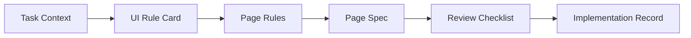

# 快速开始

## 适用场景

如果你准备启动首轮页面级试点，直接从本目录开始。

本目录不负责解释完整背景，只负责回答 3 个问题：

- 启动前先看什么
- 当前要产出什么
- 按什么顺序落地

## 启动前先看什么

启动前建议先阅读以下 2 份文档：

1. `docs/README.md`
2. `docs/playbook.md`

其中：

- `docs/README.md` 用于统一方向、目标与方案理解
- `docs/playbook.md` 用于明确执行步骤、责任与门禁

当前目录是默认试点启动入口。

## 最小执行包

本目录默认提供标准模式模板，完整产出为 6 个文件：

```text
01-task-context.md
02-ui-rule-card.md
03-page-rules.md
04-page-spec.yaml
05-review-checklist.md
06-implementation-record.md
```

如果页面较稳定，也可以按 `docs/playbook.md` 裁剪为轻量模式 4 文件；需要完整对齐时，直接使用下面这组 6 文件。

这 6 个文件的作用如下：

| 文件 | 作用 | 适合谁重点看 |
| --- | --- | --- |
| `01-task-context.md` | 收敛页面目标、范围、输入来源与验收口径 | PRD / FE |
| `02-ui-rule-card.md` | 确认页面结构、状态、交互、边界与多端要求 | UI / FE |
| `03-page-rules.md` | 将规则升级成工程可消费的表达 | FE / AI |
| `04-page-spec.yaml` | 作为实现主输入 | FE / AI |
| `05-review-checklist.md` | 对照规则和 Spec 做评审 | Reviewer |
| `06-implementation-record.md` | 记录偏差、例外与资产候选 | FE / 负责人 |

可以按两段理解这组工件：

- 前 4 个文件承接输入收敛、规则确认与规格生成
- 后 2 个文件承接评审对照与回写沉淀

## 推荐启动顺序

建议按以下顺序推进，不要从零组织材料：

1. 复制模板目录中的文件
2. 先完成 `01-task-context.md`
3. 再完成 `02-ui-rule-card.md`
4. 如采用标准模式，补齐 `03-page-rules.md`
5. 生成并审核 `04-page-spec.yaml`
6. 实现完成后补齐 `05-review-checklist.md`
7. 最后回写 `06-implementation-record.md`

对应关系如下：



## 模板清单

可直接复用以下模板：

- `docs/quickstart/templates/01-task-context.md`
- `docs/quickstart/templates/02-ui-rule-card.md`
- `docs/quickstart/templates/03-page-rules.md`
- `docs/quickstart/templates/04-page-spec.yaml`
- `docs/quickstart/templates/05-review-checklist.md`
- `docs/quickstart/templates/06-implementation-record.md`

建议做法是：

- 先复制模板
- 再按页面实际情况补充内容
- 最后对照案例检查表达是否足够清楚

## 参考案例

首轮试点可优先参考：

- `docs/quickstart/examples/p1-user-list/`

建议优先阅读顺序：

1. `docs/quickstart/examples/p1-user-list/01-task-context.md`
2. `docs/quickstart/examples/p1-user-list/02-ui-rule-card.md`
3. `docs/quickstart/examples/p1-user-list/04-page-spec.yaml`
4. `docs/quickstart/examples/p1-user-list/06-implementation-record.md`

如果要看完整闭环，再补看：

- `docs/quickstart/examples/p1-user-list/03-page-rules.md`
- `docs/quickstart/examples/p1-user-list/05-review-checklist.md`

## 启动建议

首轮试点建议遵循以下原则：

- 先选 1 个 `P1` 页面，不要同时开多个页面
- 先明确 PRD / UI / FE / approver，再开始生成文档
- 先形成最小工件包，再进入实现
- 首轮结束后，必须补齐回写和资产判断

一句话原则：

`首轮不要追求一次做大，先把一个页面的闭环跑通`
