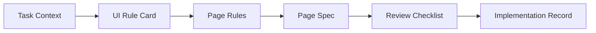

# 快速开始

本目录用于支撑首轮试点快速启动。

## 启动前置

启动前建议先阅读以下 2 份文档：

1. `docs/README.md`
2. `docs/playbook.md`

当前目录为默认执行入口。

## 最小执行包

首轮试点固定只产出 6 个文件：

```text
01-task-context.md
02-ui-rule-card.md
03-page-rules.md
04-page-spec.yaml
05-review-checklist.md
06-implementation-record.md
```

模板目录：

- `docs/quickstart/templates/01-task-context.md`
- `docs/quickstart/templates/02-ui-rule-card.md`
- `docs/quickstart/templates/03-page-rules.md`
- `docs/quickstart/templates/04-page-spec.yaml`
- `docs/quickstart/templates/05-review-checklist.md`
- `docs/quickstart/templates/06-implementation-record.md`



这组文件的关系是：

- 前 4 个文件承接输入与规格
- 后 2 个文件承接评审与回写

## 参考案例

首轮试点可优先参考：

- `docs/quickstart/examples/p1-user-list/`

这是一个 `P1` 列表页试点样例，覆盖完整 6 个文件。

| 文件 | 作用 | 适合谁重点看 |
| --- | --- | --- |
| `01-task-context.md` | 收敛任务目标与范围 | PRD / FE |
| `02-ui-rule-card.md` | 确认结构、状态、交互 | UI / FE |
| `03-page-rules.md` | 将规则升级成工程表达 | FE / AI |
| `04-page-spec.yaml` | 作为实现主输入 | FE / AI |
| `05-review-checklist.md` | 对照规则和 Spec 评审 | Reviewer |
| `06-implementation-record.md` | 记录偏差和资产候选 | FE / 负责人 |

## 实施顺序

### Day 1

- 选 1 个 `P1` 页面
- 明确 PRD / UI / FE / approver

### Day 2

- 用 AI 生成 `01-task-context.md`

### Day 3

- 用 AI 生成 `02-ui-rule-card.md`
- 由 UI 修正确认

### Day 4

- 生成 `03-page-rules.md`
- 生成 `04-page-spec.yaml`

### Day 5-6

- FE 按 Spec 实现
- AI 对照 Spec 做 review

### Day 7

- 更新 `06-implementation-record.md`
- 做资产候选判断

## 使用说明

首轮试点建议直接复制模板目录，并结合参考案例完成一个 `P1` 页面试点。
