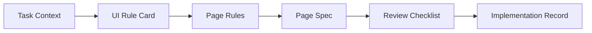

# 快速开始

## 适用场景

如果你准备启动首轮页面级试点，直接从本目录开始。

本目录不负责解释完整背景，只负责回答 3 个问题：

- 启动前先看什么
- 当前要产出什么
- 按什么顺序落地

## 模式选择判断

本体系不服务于所有页面，而优先服务于需要被维护、被复用、被持续演进的页面。

先判断当前页面属于哪一种模式：

### L1：AI 直出模式

适用：

- 一次性页面
- demo
- 临时活动页
- 纯探索验证

流程：

`Prompt -> Code -> 简单检查 -> Done`

说明：

- 允许直接生成
- 默认不要求 Spec
- 默认不进入共享资产沉淀

### L2：轻量 Spec 模式

适用：

- 大多数正式页面
- 需要后续维护的页面
- 标准后台列表、表单、详情页

流程：

`Task Context -> UI Rule -> Page Spec -> Code -> Record`

说明：

- 这是正式页面的默认模式
- 默认强制 pattern
- 默认保留最小回写

### L3：完整工程模式

适用：

- 复杂交互页
- 核心业务页
- 高风险变更页
- 多人强协作页面

流程：

`Context -> Rule -> Rule Engineering -> Spec -> Review -> Asset`

说明：

- 仅在复杂场景启用
- 不作为首轮默认模式

### 两步判断法

只回答下面两个问题：

1. 这个页面是不是一次性 / 探索型页面？
   - 是：使用 `L1`
   - 否：进入问题 2
2. 这个页面是不是复杂 / 高风险 / 多人协作页面？
   - 是：使用 `L3`
   - 否：使用 `L2`

默认规则：

- 一次性页面允许走 `L1`
- 正式页面默认走 `L2`
- 复杂页面再升级到 `L3`

## 默认启动入口

对当前公共仓的首轮试点而言，默认从 `L2：轻量 Spec 模式` 启动，并固定为：

- 页面类型：`List Page`
- 页面形态：标准后台表格列表页
- 终端范围：`PC / Pad / Mobile`
- 默认模式：轻量模式优先
- 默认 pattern 类型：`list-page-table`

当前若尚未拆出独立共享 pattern 文件，首轮可先以 `docs/quickstart/examples/p1-user-list/` 作为默认 pattern 参考来源。

只有在页面结构明显偏离默认列表页模式时，才允许不按默认 pattern 起步；此时必须在 `06-implementation-record.md` 中说明原因。

默认页面的 pattern 约束：

- 默认页面必须声明 pattern
- 未填写 pattern，不允许创建 `04-page-spec.yaml`
- 只有在明确偏离默认页面结构时，才允许填写 `pattern_deviation_reason`
- 所有 deviation 必须在 review 中被确认合理

## 启动前先看什么

启动前建议先阅读以下 2 份文档：

1. `docs/README.md`
2. `docs/playbook.md`

其中：

- `docs/README.md` 用于统一方向、目标与方案理解
- `docs/playbook.md` 用于明确执行步骤、责任与门禁

当前目录是默认试点启动入口。

## 最小执行包

本目录保留 6 个模板文件，但首轮标准后台表格列表页的默认成功路径，优先要求先跑通 4 个必做文件：

```text
01-task-context.md
02-ui-rule-card.md
04-page-spec.yaml
06-implementation-record.md
```

当页面复杂度上升，或需要更强的规则对齐与结构化评审时，再补齐完整 6 文件：

```text
01-task-context.md
02-ui-rule-card.md
03-page-rules.md
04-page-spec.yaml
05-review-checklist.md
06-implementation-record.md
```

默认理解方式：

- 4 个必做文件用于保证首轮能在 1 天内跑通一个页面闭环
- 额外 2 个文件用于增强规则工程化和结构化 review

这 6 个文件的作用如下：

| 文件 | 作用 | 适合谁重点看 |
| --- | --- | --- |
| `01-task-context.md` | 收敛页面目标、范围、输入来源与验收口径 | PRD / FE |
| `02-ui-rule-card.md` | 确认页面结构、状态、交互、边界与多端要求 | UI / FE |
| `03-page-rules.md` | 将规则升级成工程可消费的表达 | FE / AI |
| `04-page-spec.yaml` | 作为实现主输入 | FE / AI |
| `05-review-checklist.md` | 对照规则和 Spec 做评审 | Reviewer |
| `06-implementation-record.md` | 记录偏差、例外与资产候选 | FE / 负责人 |

可以按两段理解这组工件：

- 前 4 个文件承接输入收敛、规则确认与规格生成
- 后 2 个文件承接评审对照与回写沉淀

## 推荐启动顺序

建议按以下顺序推进，不要从零组织材料，也不要从零定义页面模式：

1. 先确定页面类型是否属于默认 `list-page-table`
2. 复制模板目录中的文件到当前试点目录
3. 参考 `docs/quickstart/examples/p1-user-list/`，先完成 `01-task-context.md`
4. 完成 `02-ui-rule-card.md`，确认 UI 是否参与；若未参与，先指定规则代理人
5. 满足前两步后，才能生成 `04-page-spec.yaml`
6. 如页面复杂，或需要强化规则复用与结构化 review，再补齐 `03-page-rules.md` 和 `05-review-checklist.md`
7. 实现完成后，必须回写 `06-implementation-record.md`

门禁式要求：

- 没有 `01-task-context.md`，不允许创建 `04-page-spec.yaml`
- 没有 `02-ui-rule-card.md`，不允许进入实现
- 没有 review 留痕，不允许将页面标记为完成
- 没有 `06-implementation-record.md`，不视为闭环完成

对应关系如下：



## 模板清单

可直接复用以下模板：

- `docs/quickstart/templates/01-task-context.md`
- `docs/quickstart/templates/02-ui-rule-card.md`
- `docs/quickstart/templates/03-page-rules.md`
- `docs/quickstart/templates/04-page-spec.yaml`
- `docs/quickstart/templates/05-review-checklist.md`
- `docs/quickstart/templates/06-implementation-record.md`

建议做法是：

- 先复制模板
- 再按默认 pattern 参考补充内容
- 最后对照案例检查表达是否足够清楚

PowerShell 参考命令：

```powershell
New-Item -ItemType Directory -Path '.\docs\quickstart\workspaces\p1-your-page' -Force
Copy-Item '.\docs\quickstart\templates\*' '.\docs\quickstart\workspaces\p1-your-page\' -Recurse -Force
```

关键提示：

- `01-task-context.md` 里先写清模式选择、页面类型和 pattern 来源
- `04-page-spec.yaml` 应优先引用已有 pattern，再补当前页面差异
- 如未引用默认 pattern，必须在 `06-implementation-record.md` 中说明偏离原因
- AI 在生成 `Page Spec` 时，必须优先引用已登记的 pattern / template；未引用时必须明确标注为 pattern 偏离

## 参考案例

首轮试点可优先参考：

- `docs/quickstart/examples/p1-user-list/`

建议优先阅读顺序：

1. `docs/quickstart/examples/p1-user-list/01-task-context.md`
2. `docs/quickstart/examples/p1-user-list/02-ui-rule-card.md`
3. `docs/quickstart/examples/p1-user-list/04-page-spec.yaml`
4. `docs/quickstart/examples/p1-user-list/06-implementation-record.md`

如果要看完整闭环，再补看：

- `docs/quickstart/examples/p1-user-list/03-page-rules.md`
- `docs/quickstart/examples/p1-user-list/05-review-checklist.md`

对首轮后台列表页来说，这个案例同时承担两种作用：

- 作为“第一周跑通”的完整示例
- 作为当前默认 `list-page-table` pattern 的参考样本

## 一天跑通路径

如果你要在第一周快速验证体系是否可用，建议只做下面这条路径：

1. 选一个标准后台表格列表页
2. 明确负责人、UI 是否参与、采用轻量还是标准模式
3. 完成 `01-task-context.md`
4. 完成 `02-ui-rule-card.md`
5. 生成 `04-page-spec.yaml`
6. 实现页面
7. 在 `06-implementation-record.md` 中留下 review 留痕、差异和资产候选

跑通这 7 步后，团队至少应当第一次看到：

- 页面闭环如何成立
- pattern 如何被引用或偏离
- 资产候选如何被记录

## 启动建议

首轮试点建议遵循以下原则：

- 先选 1 个 `P1` 页面，不要同时开多个页面
- 先明确 PRD / UI / FE / approver，再开始生成文档
- 先形成最小工件包，再进入实现
- 首轮结束后，必须补齐回写和资产判断
- 优先按默认 `list-page-table` pattern 启动，不从零定义同类页面

一句话原则：

`首轮不要追求一次做大，先把一个页面的闭环跑通`
